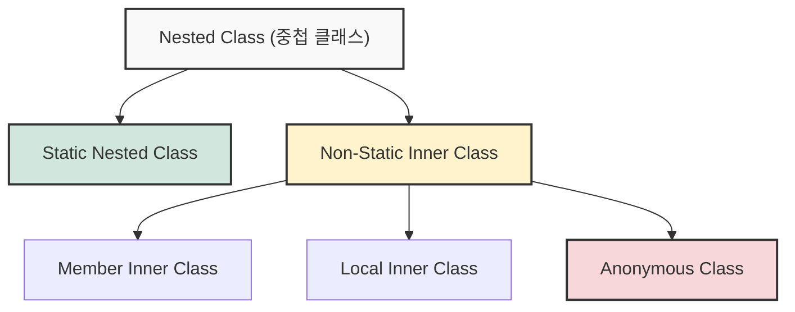
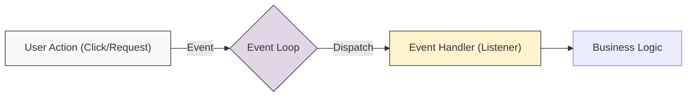

## 1. 개요: 캡슐화와 관계의 재정의

자바에서 클래스는 일반적으로 독립적인 파일(`.java`)로 존재하며 고유한 이름을 가진다. 그러나 설계적 관점에서 **두 클래스가 긴밀한 관계**를 맺고 있거나, 특정 클래스가 다른 클래스의 **구성 요소**로만 사용될 때, 클래스 내부에 또 다른 클래스를 선언할 수 있다. 이를 **중첩 클래스(Nested Class)**라고 한다.

이 문법은 단순히 코드를 위치시키는 것을 넘어, **캡슐화(Encapsulation)**를 강화하고 코드의 복잡성을 관리하기 위한 설계 기법이다[^1]. 특히 UI 프로그래밍이나 비동기 처리에서 필수적으로 사용되는 **익명 객체(Anonymous Object)**의 근간이 되는 중요한 개념이다.

## 2. 중첩 클래스의 분류와 구조

중첩 클래스는 선언 방식과 위치에 따라 크게 **Static(정적)**과 **Non-Static(비정적)**으로 나뉜다.



### 2.1 Static Nested Class (정적 중첩 클래스)

외부 클래스의 내부에 위치하지만, `static` 키워드가 붙음으로써 **외부 클래스의 인스턴스와 독립적으로 존재**한다.

* **특징**: 외부 클래스의 인스턴스 멤버(변수, 메서드)에 직접 접근할 수 없다.
* **용도**: 논리적으로만 묶여 있을 뿐, 사실상 다른 클래스와 다를 바 없는 '세입자'와 같은 관계다. 주로 빌더 패턴(Builder Pattern)이나 DTO 내부의 하위 구조를 정의할 때 사용된다.

### 2.2 Inner Class (내부 클래스)

`static` 키워드 없이 선언된 클래스로, **외부 클래스의 인스턴스에 종속**된다.

* **특징**: 외부 클래스의 `private` 멤버를 포함한 모든 자원에 자유롭게 접근할 수 있다.
* **생성 시점**: 반드시 외부 클래스의 인스턴스가 먼저 생성되어야 내부 클래스를 인스턴스화할 수 있다.

---

## 3. 내부 동작 원리와 메모리 누수 (Deep Dive)

단순한 문법적 포함 관계처럼 보이지만, 컴파일된 바이트코드와 런타임 메모리 구조를 살펴보면 중요한 차이점이 존재한다.

### 3.1 컴파일 결과 (`.class`)

자바 컴파일러(`javac`)는 내부 클래스를 별도의 클래스 파일로 컴파일한다.

- **Outer.class**: 외부 클래스
- **`Outer$Inner.class`**: 내부 클래스 (`$` 기호로 구분)
- **`Outer$1.class`**: 익명 클래스 (숫자로 구분)

### 3.2 숨겨진 참조 (`this$0`)

> **Deep Dive: 내부 클래스의 인스턴스 연결 매커니즘**
> 
> Non-Static Inner Class가 외부 클래스의 멤버에 접근할 수 있는 이유는 컴파일러가 **마법**을 부리기 때문이다.
> 1. 컴파일러는 내부 클래스 생성자에 **외부 클래스의 참조(Reference)**를 인자로 받는 코드를 몰래 추가한다.
> 2. 이 참조는 내부 클래스 내부에 `final` 필드(통상 `this$0`라 불림)로 저장된다.
> 3. 따라서 내부 클래스 인스턴스는 생명주기 내내 외부 클래스 인스턴스를 붙잡고 있게 된다.
{: .prompt-info }


```java
// 컴파일 전 (개발자가 작성한 코드)
class Outer {
    class Inner {}
}

// 컴파일 후 (바이트코드 역컴파일 근사치)
class Outer$Inner {
    final Outer this$0; // 외부 클래스에 대한 숨겨진 참조

    Outer$Inner(Outer outer) {
        this.this$0 = outer;
    }
}
```

> **위험: 메모리 누수 (Memory Leak) 주의**
> 
> 내부 클래스의 인스턴스가 외부 클래스보다 더 오래 생존하는 경우(예: 내부 클래스 객체만 다른 곳에 전달됨), `this$0` 참조로 인해 **외부 클래스 인스턴스가 가비지 컬렉션(GC) 대상이 되지 못한다.**
> 외부 클래스의 참조가 필요 없다면 반드시 **Static Nested Class**를 사용하여 이 연결 고리를 끊어야 한다.
{: .prompt-danger }

---

## 4. 익명 객체 (Anonymous Object)와 이벤트 처리

익명 클래스는 이름이 없는 1회용 클래스로, **선언과 동시에 객체를 생성**한다. 이 문법은 GUI 프로그래밍이나 서버의 비동기 처리에서 **이벤트 리스너(Event Listener)**를 구현할 때 핵심적인 역할을 한다.

### 4.1 이벤트 기반 아키텍처 (Event-Driven Architecture)

GUI(Graphic User Interface)나 웹 서버는 사용자의 입력(Event)을 기다리고, 입력이 발생하면 즉시 반응하는 구조를 가진다.



* **Event**: 키보드 입력, 마우스 클릭, HTTP 요청 등.
* **Listener (Handler)**: "이벤트가 발생하면 이 코드를 실행해줘"라고 등록해둔 객체.

### 4.2 익명 클래스를 활용한 콜백 구현

개발자는 복잡한 클래스 파일을 따로 만들지 않고, **익명 클래스**를 사용하여 즉석에서 이벤트 처리 로직(콜백)을 주입할 수 있다.

```java
import java.util.Date;

// 1. 이벤트를 처리할 규격(인터페이스) 정의
interface OnClickListener {
    void onClick(String eventType);
}

class Button {
    private OnClickListener listener;

    // 리스너 등록 (의존성 주입)
    public void setOnClickListener(OnClickListener listener) {
        this.listener = listener;
    }

    // 버튼이 클릭되는 상황 시뮬레이션
    public void click() {
        System.out.println("[System] 버튼이 클릭되었습니다.");
        if (this.listener != null) {
            // 이벤트 발생 시 등록된 리스너의 메서드 호출 (Callback)
            this.listener.onClick("Mouse Left Click");
        }
    }
}

public class Main {
    public static void main(String[] args) {
        Button submitBtn = new Button();

        // [핵심] 익명 클래스를 사용한 이벤트 핸들러 구현
        // 별도의 클래스 파일 없이 즉석에서 인터페이스를 구현하여 객체화한다.
        submitBtn.setOnClickListener(new OnClickListener() {
            @Override
            public void onClick(String eventType) {
                System.out.println(">> 이벤트 감지됨: " + eventType);
                System.out.println(">> 데이터 전송 로직을 실행합니다...");
            }
        });
        
        // 인터페이스는 원래 `new`를 못 하지만, 뒤에 `{ ... }`를 붙이면 그 안에서 미구현 메서드를 구현하면서 객체 생성이 가능해진다.
        submitBtn.click();
    }
}
```

인터페이스에 메서드가 **딱 하나만 있을 때**는 아래처럼 **람다(Lambda)** 사용이 가능하지만 그렇지 않은 경우 모든 메서드를 적어줘야 한다.

```java
submitBtn.setOnClickListener(eventType -> {
	System.out.println(">> 이벤트 감지됨: " + eventType);
});
```

```java
interface MultiListener {
    void onClick(String event);
    void onHold(String event);  // 메서드 추가
    void onRelease(String event); // 메서드 추가
}

submitBtn.setMultiListener(new MultiListener() {
    @Override
    public void onClick(String event) {
        System.out.println("클릭함: " + event);
    }

    @Override
    public void onHold(String event) {
        System.out.println("누르는 중: " + event);
    }

    @Override
    public void onRelease(String event) {
        System.out.println("손을 뗌: " + event);
    }
});
```

> **Tip: 람다(Lambda) 표현식으로의 진화**
> 
> Java 8부터는 단 하나의 추상 메서드를 가진 인터페이스(Functional Interface)의 경우, 익명 클래스 대신 **람다 표현식**을 사용하여 더욱 간결하게 표현할 수 있다.
> `submitBtn.setOnClickListener(event -> System.out.println(event));`
{: .prompt-tip }

---

## 5. 결론 및 활용 가이드

내부 클래스와 익명 클래스는 단순히 코드를 줄이는 문법이 아니라, **객체 간의 결합도를 제어**하고 **이벤트 지향 프로그래밍**을 가능하게 하는 설계 도구다.

1. **Static Nested Class**: 외부 클래스와 논리적으로만 연관될 때 사용한다. (메모리 누수 안전)
2. **Inner Class**: 외부 클래스의 상태에 직접 접근해야 할 때 사용한다. (참조 유지 비용 발생)
3. **Anonymous Class**: UI 이벤트 핸들러, 스레드 객체 생성 등 **일회성 로직**을 구현할 때 사용한다.

---

## 💡 Quiz: 학습 내용 확인하기

**Q1. Non-static Inner Class를 사용할 때 발생할 수 있는 치명적인 메모리 문제는 무엇이며, 그 원인은 무엇인가?**

<details>
<summary>정답 확인</summary>
<div>
<strong>메모리 누수(Memory Leak)</strong>가 발생할 수 있다. 원인은 내부 클래스의 인스턴스가 생성될 때, 보이지 않는 참조(this$0)를 통해 외부 클래스의 인스턴스를 강하게 참조하기 때문이다. 이로 인해 외부 클래스가 더 이상 사용되지 않더라도 가비지 컬렉터(GC)가 수거하지 못할 수 있다.
</div>
</details>

**Q2. 정적 중첩 클래스(Static Nested Class)와 내부 클래스(Inner Class)의 결정적인 차이는 무엇인가?**

<details>
<summary>정답 확인</summary>
<div>
외부 클래스의 <strong>인스턴스 멤버에 접근 가능 여부</strong>이다. Inner Class는 외부 클래스의 인스턴스에 종속되므로 접근할 수 있지만, Static Nested Class는 독립적이므로 외부 클래스의 인스턴스 멤버에 직접 접근할 수 없다.
</div>
</details>

**Q3. 이벤트 핸들러(리스너) 구현 시 익명 클래스를 사용하는 주된 이유는 무엇인가?**

<details>
<summary>정답 확인</summary>
<div>
이벤트 처리를 위한 클래스를 별도로 파일로 정의하지 않고, <strong>코드의 사용 위치에서 즉시 구현하여 가독성을 높이고 로직을 집중</strong>시키기 위해서다. 주로 재사용되지 않는 일회성 로직 구현에 적합하다.
</div>
</details>

[^1]:**캡슐화(Encapsulation)**: 객체의 속성(data)과 행위(method)를 하나로 묶고, 실제 구현 내용의 일부를 외부에 감추어 은닉하는 기법.