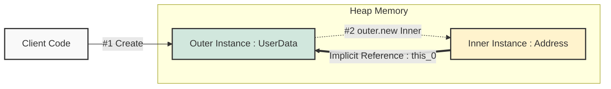

## 1. 개요

Java의 클래스 선언 내부에 `static` 키워드 없이 정의된 클래스를 **비정적 멤버 클래스(Non-Static Member Class)** 또는 **내부 클래스(Inner Class)**라고 한다[^1].

이 구조는 클래스가 비대해질 때, 특정 기능을 논리적으로 그룹화하거나 외부 클래스(Outer Class)의 `private` 멤버에 쉽게 접근하기 위해 사용된다. 정적(Static) 중첩 클래스와 달리, **내부 클래스의 인스턴스는 외부 클래스의 인스턴스에 암묵적으로 연결**되어 있다는 점이 가장 큰 특징이다.

## 2. 아키텍처 및 동작 원리

내부 클래스는 독립적으로 존재할 수 없다. 외부 클래스의 인스턴스가 먼저 생성된 후에야 내부 클래스의 인스턴스를 생성할 수 있으며, 생성된 내부 객체는 외부 객체의 참조(Reference)를 몰래(Implicitly) 가지고 있다.



* **강결합 (Strong Coupling)**: 내부 클래스는 외부 클래스의 '구성 요소'로 취급된다.
* **접근 제어**: 내부 클래스는 외부 클래스의 `private` 필드와 메서드에 제약 없이 접근할 수 있다.

> **Deep Dive: 컴파일 후의 구조 (Bytecode)**
> 
> 컴파일러는 내부 클래스를 `Outer$Inner.class`라는 별도의 파일로 변환한다. 이때 내부 클래스의 생성자에 **외부 클래스의 참조를 넘겨받는 매개변수**가 자동으로 추가된다. 이 참조를 통해 내부에서 외부의 멤버를 사용할 수 있게 된다.
{: .prompt-info }

## 3. 핵심 문법과 `this` 참조

### 3.1 이름 충돌과 스코프 (Shadowing)

내부 클래스와 외부 클래스에 동일한 이름의 변수가 존재할 경우, 가까운 스코프(내부 클래스)의 변수가 우선순위를 가진다. 이때 외부 클래스의 멤버를 명시적으로 참조하려면 `OuterClassName.this.fieldName` 형식을 사용해야 한다.

### 3.2 인스턴스 생성 문법

내부 클래스는 외부 인스턴스 없이는 생성될 수 없으므로, `new` 연산자의 사용 방식이 특이하다.

* **내부에서 생성 시**: `new InnerClass()` (일반적인 방식)
* **외부에서 생성 시**: `outerInstance.new InnerClass()` (참조 변수를 통해 생성)

> **주의:** `new OuterClass.InnerClass()`와 같은 정적 스타일의 생성 방식은 지원하지 않는다. 반드시 외부 인스턴스 참조 변수(`instance`)에 점(`.`)을 찍고 `new`를 호출해야 한다.
{: .prompt-warning }

## 4. 구현 (Java)

이름 충돌 처리와 인스턴스 생성 과정을 구현한 코드

```java
public class UserData {
    // 외부 클래스의 Private 멤버
    private String name;

    public UserData(String name) {
        this.name = name;
    }

    // 내부 클래스 (Non-Static Inner Class)
    public class Address {
        private String city;
        private String street;
        
        // 이름 충돌을 유도하기 위한 변수
        private String name = "Inner Name"; 

        public Address(String city, String street) {
            this.city = city;
            this.street = street;
        }

        public void printInfo() {
            // 1. 내부 클래스의 멤버 접근
            System.out.println("Address Name: " + this.name);
            
            // 2. 외부 클래스의 멤버 접근 (Shadowing 해결)
            // 형식: [외부클래스명].this.[멤버명]
            System.out.println("User Name: " + UserData.this.name);
            
            System.out.println("Full Address: " + city + " " + street);
        }
    }

    // 편의를 위한 팩토리 메서드 (외부 클래스 내부에서는 바로 생성 가능)
    public Address createAddress(String city, String street) {
        return new Address(city, street);
    }
}

public class Main {
    public static void main(String[] args) {
        // 1. 외부 클래스 인스턴스 생성 (필수)
        UserData user = new UserData("Kim Chul-soo");

        // 2. 내부 클래스 인스턴스 생성
        // 주의: user.new Address() 문법 사용
        UserData.Address address = user.new Address("Seoul", "Gangnam-gu");

        address.printInfo();
    }
}
```

### 실행 결과

```text
Address Name: Inner Name
User Name: Kim Chul-soo
Full Address: Seoul Gangnam-gu
```

## 5. 메모리 누수와 사용 시 주의사항

비정적 내부 클래스는 편리하지만, 메모리 관리 측면에서 주의가 필요하다.

> **위험: 메모리 누수 (Memory Leak)**
> 
> 내부 클래스의 인스턴스가 살아있는 한, **외부 클래스의 인스턴스는 가비지 컬렉션(GC)의 대상이 되지 않는다.**
> 만약 내부 클래스 인스턴스가 외부(예: UI 리스너, 장기 실행 작업 등)로 전달되어 생명주기가 길어지면, 더 이상 필요 없는 외부 클래스 객체까지 메모리에 계속 남아있게 되어 메모리 누수를 유발한다.
{: .prompt-danger }

> **Tip:** 외부 클래스의 인스턴스 멤버에 접근할 필요가 없다면, 무조건 **`static` 중첩 클래스**를 사용하는 것이 좋다. 이는 불필요한 참조 유지를 막아 메모리 효율성을 높인다.
{: .prompt-tip }

---

## 💡 Quiz: 학습 내용 확인하기

**Q1. 외부 클래스 `Outer`의 인스턴스 `myOuter`가 있을 때, 내부 클래스 `Inner`를 생성하는 올바른 Java 코드는 무엇인가?**

<details>
<summary>정답 확인</summary>
<div>
<code>Outer.Inner inner = myOuter.new Inner();</code>


내부 클래스는 외부 인스턴스의 참조에 의존하므로, 인스턴스 변수 뒤에 <code>.new</code> 연산자를 사용해야 한다.
</div>
</details>

**Q2. 내부 클래스에서 외부 클래스의 멤버 변수 이름이 겹칠 때(Shadowing), 외부 클래스의 변수를 호출하는 키워드는?**

<details>
<summary>정답 확인</summary>
<div>
<code>OuterClassName.this.variableName</code> 형식을 사용한다. 단순히 <code>this</code>만 사용하면 내부 클래스 자신을 가리킨다.
</div>
</details>

**Q3. 비정적 내부 클래스(Inner Class) 사용을 지양하고 정적 중첩 클래스(Static Nested Class)를 권장하는 주요 이유는 무엇인가?**

<details>
<summary>정답 확인</summary>
<div>
비정적 내부 클래스는 외부 클래스 인스턴스에 대한 암묵적인 참조를 유지하므로, 의도치 않은 메모리 누수(Memory Leak)를 유발할 수 있기 때문이다.
</div>
</details>

---

[^1]:Java Language Specification에서는 이를 Inner Class라고 부르며, static이 붙은 것은 Static Nested Class라고 구분한다.