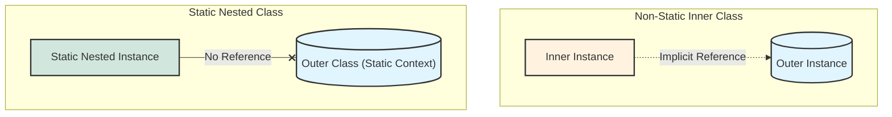
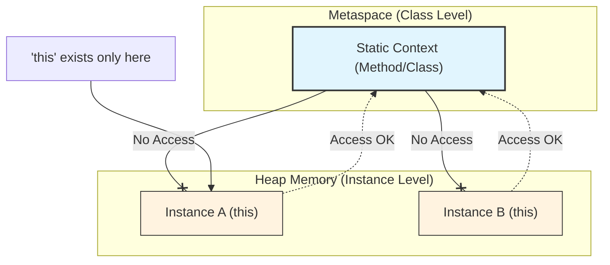

## 1. 개요

자바에서 중첩 클래스(Nested Class)는 클래스 내부에 선언되는 클래스를 말한다. 이 중 **정적 중첩 클래스(Static Nested Class)**는 `static` 키워드가 붙은 중첩 클래스로, 외부 클래스(Outer Class)와 강하게 결합되어 보이지만 실제로는 **논리적인 그룹핑(Logical Grouping)**만 되어 있을 뿐 독립적인 클래스처럼 동작한다[^1].

일반적인 내부 클래스(Inner Class)가 외부 클래스의 인스턴스에 종속적인 것과 달리, 정적 중첩 클래스는 외부 클래스의 인스턴스화 없이도 단독으로 생성하여 사용할 수 있다.

## 2. 아키텍처 및 메모리 모델

정적 중첩 클래스의 핵심은 **외부 클래스 인스턴스에 대한 참조(Reference)가 없다**는 점이다. 이를 이해하기 위해 일반 내부 클래스와의 메모리 구조 차이를 시각화하면 다음과 같다.



* **Non-Static Inner Class**: 내부 인스턴스가 생성될 때, 자신을 감싸는 외부 인스턴스의 참조(`this`)를 묵시적으로 가지고 있다.
* **Static Nested Class**: 외부 클래스의 정적 멤버(Static Member)와 같은 레벨로 취급된다. 따라서 외부 인스턴스와의 연결 고리가 전혀 없다.

> **Deep Dive: 메모리 누수(Memory Leak)와 정적 중첩 클래스**
> 
> 일반 내부 클래스(Non-static)는 외부 클래스 인스턴스에 대한 숨겨진 참조를 유지한다. 만약 내부 클래스의 인스턴스가 외부보다 오래 생존하거나 다른 곳에서 참조될 경우, **외부 클래스 인스턴스는 가비지 컬렉션(GC)의 대상이 되지 못해 메모리 누수가 발생**할 수 있다.
> 반면, **정적 중첩 클래스**는 이러한 참조가 없으므로 외부 인스턴스의 생명주기와 무관하며, 메모리 누수 위험에서 훨씬 안전하다. 따라서 외부 인스턴스 참조가 굳이 필요 없다면 **무조건 `static`을 붙이는 것이 권장**된다.
{: .prompt-info }

## 3. 핵심: static 컨텍스트와 'this'의 부재

`static` 영역에서 `this`를 사용할 수 없는 이유를 "공유 자원이라서"라고 생각하기 쉽지만, 정확한 기술적 이유는 **생명주기(Lifecycle)와 소속의 불일치** 때문이다.

### 3.1 메모리 영역의 분리 (Metaspace vs Heap)

`static`과 `this`(인스턴스)는 존재하는 메모리 공간과 생성 시점이 다르다.



1. **Static 로딩 (Metaspace)**: 프로그램 시작 시 클래스 로더에 의해 메모리에 올라간다. 이때는 인스턴스(객체)가 하나도 없을 수도 있다.
2. **Instance 생성 (Heap)**: `new` 연산자가 수행되어야 비로소 `this`가 가리킬 실체가 생긴다.

### 3.2 'this'가 배제된 진짜 이유

`this`는 **"현재 실행 중인 특정 인스턴스의 주소"**를 의미한다. 하지만 `static` 컨텍스트(정적 중첩 클래스 포함)에서는 다음의 이유로 `this`가 성립할 수 없다.

* **대상의 부재**: `static` 코드가 실행되는 시점에 힙 영역에 객체가 아예 존재하지 않을 수 있다.
* **특정의 불가**: 설령 객체가 100개 생성되어 있다 하더라도, `static`은 클래스 소속이므로 어떤 객체(A인지 B인지)를 가리켜야 할지 알 수 없다.

> **Tip: 'this'는 사실 숨겨진 파라미터다**
> 
> 컴파일러는 인스턴스 메서드를 호출할 때, 내부적으로 `this`를 첫 번째 파라미터로 몰래 넘긴다. (`Method(Instance this, int args)`)
> 반면, **`static` 메서드는 특정 객체에 종속되지 않으므로 이 숨겨진 파라미터(`this`)를 받지 않도록 설계**되어 있다. 이것이 기술적으로 "this가 배제되었다"는 말의 의미다.
{: .prompt-tip }

## 4. 접근 제어 규칙과 인스턴스화

### 4.1 접근 제어 (Access Control)

정적 중첩 클래스는 외부 클래스의 멤버(가족)로 취급되므로, 접근 제어 지시자가 `private`이라 할지라도 서로 접근이 가능하다.

1. **Outer -> Static Nested**: 외부 클래스는 정적 중첩 클래스의 `private` 멤버에 접근할 수 있다.
2. **Static Nested -> Outer**
* **접근 가능**: 외부 클래스의 `static` 변수 및 메서드 (private 포함).
* **접근 불가**: 외부 클래스의 인스턴스 변수 및 메서드. (참조할 `this`가 없기 때문)


### 4.2 인스턴스화 문법

정적 중첩 클래스는 외부 클래스의 인스턴스를 먼저 생성할 필요가 없다. `new Outer.Inner()` 형태의 문법을 사용한다.

## 5. 구현 (Java)

위의 개념들을 종합한 코드

```java
public class OuterClass {
    // 외부 클래스의 인스턴스 멤버 (Heap 영역)
    private String instanceData = "Instance Data";
    // 외부 클래스의 정적 멤버 (Method/Metaspace 영역)
    private static String staticData = "Outer Static Data";

    // 정적 중첩 클래스 선언
    static class StaticNestedClass {
        private String nestedMsg = "Nested Message";

        public void accessOuterMembers() {
            // 1. 외부 클래스의 정적 멤버 접근: 가능 (private이어도 접근 가능)
            System.out.println(OuterClass.staticData);

            // 2. 외부 클래스의 인스턴스 멤버 접근: 불가능 (컴파일 에러)
            // 이유: static 컨텍스트에서는 'this'로 특정할 외부 인스턴스가 존재하지 않음
            // System.out.println(OuterClass.this.instanceData); // Error!
        }
        
        public String getNestedMsg() {
            return this.nestedMsg;
        }
    }

    public void accessNestedMember() {
        // 외부 클래스에서 내부 클래스 인스턴스 생성
        StaticNestedClass nested = new StaticNestedClass();
        
        // 3. 내부 클래스의 private 멤버 접근: 가능
        // 같은 클래스 파일 내에 존재하므로 접근 제어자를 무시하고 접근 가능 (Nest Mate)
        System.out.println(nested.nestedMsg); 
    }
}

// 메인 실행 클래스
public class Main {
    public static void main(String[] args) {
        // [중요] 외부 클래스 인스턴스 없이 바로 생성 가능
        // 타입 선언: OuterClass.StaticNestedClass
        // 생성자 호출: new OuterClass.StaticNestedClass()
        OuterClass.StaticNestedClass nestedInstance = new OuterClass.StaticNestedClass();
        
        nestedInstance.accessOuterMembers();
    }
}
```

> **주의:** 인스턴스화 문법의 차이를 명확히 구분해야 한다.
> 
> * **Static Nested**: `new Outer.Nested()`
> * **Inner Class**: `new Outer().new Inner()` (반드시 외부 인스턴스가 먼저 존재해야 함)
{: .prompt-warning }

## 6. 실무 활용 패턴: Builder Pattern

정적 중첩 클래스가 실무에서 가장 빈번하게 사용되는 패턴은 **빌더 패턴(Builder Pattern)**이다. `Lombok`의 `@Builder`가 내부적으로 이 코드를 생성한다.

```java
public class Member {
    private String name;
    private int age;

    // private 생성자: 외부에서 직접 생성을 막음
    private Member(Builder builder) {
        this.name = builder.name;
        this.age = builder.age;
    }

    // 정적 중첩 클래스로 Builder 정의
    public static class Builder {
        private String name;
        private int age;

        // 메서드 체이닝을 위한 반환 타입 설정
        public Builder name(String name) {
            this.name = name;
            return this;
        }

        public Builder age(int age) {
            this.age = age;
            return this;
        }

        public Member build() {
            // 외부 클래스(Member)의 private 생성자 호출 가능
            return new Member(this);
        }
    }
}

// 사용 예시
public class Main {
    public static void main(String[] args) {
        // Static Nested Class인 Builder를 통해 객체 생성
        Member member = new Member.Builder()
                .name("Chirpy")
                .age(25)
                .build();
    }
}
```

## 💡 Quiz: 학습 내용 확인하기

**Q1. 정적 중첩 클래스(Static Nested Class) 내부에서 외부 클래스의 인스턴스 변수(Instance Variable)에 직접 접근할 수 없는 이유는 무엇인가?**

<details>
<summary>정답 확인</summary>
<div>
정적 중첩 클래스는 외부 클래스의 인스턴스와 독립적으로 생성될 수 있기 때문에, 실행 시점에 외부 클래스의 인스턴스 참조(this)를 가지고 있지 않다. 따라서 참조할 대상이 없어 인스턴스 변수에 접근이 불가능하다.
</div>
</details>

**Q2. `Outer` 클래스 내부에 `static class Nested`가 선언되어 있을 때, `Main` 메서드에서 `Nested` 클래스의 인스턴스를 생성하는 올바른 코드는?**

<details>
<summary>정답 확인</summary>
<div>
<code>Outer.Nested nested = new Outer.Nested();</code>


외부 클래스의 인스턴스 생성 없이 클래스 이름으로 바로 접근하여 생성한다.
</div>
</details>

**Q3. 메모리 관리 측면에서 일반 내부 클래스(Inner Class) 대신 정적 중첩 클래스를 사용하는 것이 권장되는 이유는?**

<details>
<summary>정답 확인</summary>
<div>
일반 내부 클래스는 외부 클래스 인스턴스에 대한 암묵적인 참조를 유지하므로, 외부 클래스가 더 이상 사용되지 않더라도 내부 클래스 인스턴스가 살아있으면 가비지 컬렉션(GC)되지 않아 메모리 누수가 발생할 수 있다. 정적 중첩 클래스는 이러한 참조가 없어 안전하다.
</div>
</details>

---

[^1]:물리적으로는 외부 클래스 내부에 정의되어 있지만, 기능적으로는 패키지로 분리된 다른 클래스와 거의 동일하게 독립적이다.