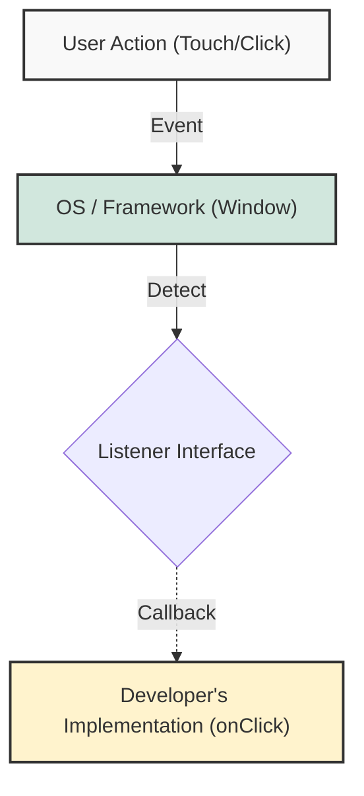

## 1. 개요

Java에서 인터페이스는 일반적으로 독립적인 파일로 존재한다. 그러나 특정 클래스 내부에 `interface`를 선언하는 **중첩 인터페이스(Nested Interface)** 패턴은 GUI(Graphic User Interface) 프로그래밍, 특히 안드로이드 개발에서 필수적인 아키텍처 요소다.

이 패턴은 단순히 코드를 정리하는 것을 넘어, **이벤트 드리븐(Event-Driven)** 구조에서 객체 간의 결합도를 낮추고 콜백(Callback) 메커니즘을 효율적으로 구현하기 위해 사용된다. 오늘은 과거 MFC(Microsoft Foundation Class) 방식의 한계를 극복하고, 현대적인 리스너 패턴이 정착된 배경과 그 내부 동작 원리를 알아보자.

## 2. 아키텍처의 진화: 상속에서 위임으로

### 2.1 레거시 시스템의 한계 (MFC 스타일)

과거 Windows 어플리케이션 개발(MFC 등)이나 초기 프레임워크에서는 이벤트를 처리하기 위해 **상속(Inheritance)** 구조를 주로 사용했다.

1. **메시지 큐(Message Queue)**: OS 레벨에서 발생한 입력(키보드, 마우스)이 큐에 쌓인다.
2. **이벤트 루프**: 무한 루프를 돌며 메시지를 하나씩 꺼내 분석한다.
3. **상속을 통한 오버라이딩**: 특정 윈도우의 동작을 정의하려면 프레임워크 클래스를 상속받는 자식 클래스를 만들고, 핸들러 메서드를 재정의해야 했다.

이 방식은 버튼 하나를 만들 때마다 별도의 클래스 파일이 필요하여 **클래스 폭발(Class Explosion)** 문제를 야기했으며, 프로젝트 규모가 커질수록 유지보수가 불가능해지는 단점이 있었다.

### 2.2 현대적인 이벤트 리스너 구조

Java와 안드로이드는 상속 대신 **위임(Delegation)** 과 **인터페이스(Interface)** 를 활용하여 이 문제를 해결했다. 프레임워크 내부 동작은 숨기고(Encapsulation), 개발자는 인터페이스만 구현하여 필요한 로직을 주입한다.



> **Deep Dive: 콜백(Callback) 메커니즘**
> 
> 콜백이란 "피호출자(Callee)가 호출자(Caller)를 다시 부르는 것"을 의미한다.
> 1. 개발자는 `Listener` 객체를 생성하여 프레임워크(Window)에 등록한다.
> 2. 프레임워크는 이벤트 발생 시, 등록된 객체의 약속된 메서드(`onClick`)를 호출한다.
> 3. 즉, 제어권이 프레임워크에 있으며, 필요할 때 개발자의 코드가 실행되는 **제어의 역전(IoC)** 이 발생한다.
{: .prompt-info }
## 3. 구현 (Java)

이벤트 리스너 패턴을 이해하기 위해 좌표(`MyPoint`)를 다루는 윈도우 시스템을 시뮬레이션해본다.

### 3.1 핵심 컴포넌트 설계

* **Window 클래스**: 이벤트를 감지하는 주체. 내부에 `OnClickListener` 인터페이스를 정의한다.
* **OnClickListener**: 이벤트 발생 시 호출될 메서드 규격을 정의한다. 클래스 내부에 선언됨으로써 "이 인터페이스는 Window 전용임"을 명시한다.

```java
// 좌표를 표현하는 데이터 클래스
class MyPoint {
    int x, y;
    public MyPoint(int x, int y) {
        this.x = x;
        this.y = y;
    }
    @Override
    public String toString() {
        return "Point(" + x + ", " + y + ")";
    }
}

// GUI 윈도우를 추상화한 클래스
public class Window {
    
    // 1. 중첩 인터페이스 선언 (Nested Interface)
    // 클래스 내부에 선언된 인터페이스는 자동으로 static으로 간주된다.
    // 'On' 접두사는 특정 시점(Event)을 의미한다.
    public interface OnClickListener {
        void onClick(MyPoint p);
    }

    // 2. 리스너 객체를 저장할 멤버 변수
    private OnClickListener listener;

    // 3. 리스너 등록 메서드 (Setter)
    public void setOnClickListener(OnClickListener listener) {
        this.listener = listener;
    }

    // 4. 이벤트 발생 시뮬레이션
    // 실제 프레임워크에서는 OS나 하드웨어 인터럽트에 의해 호출된다.
    public void touch() {
        // 하드웨어로부터 좌표를 수신했다고 가정
        MyPoint currentPoint = new MyPoint(100, 200);
        
        if (listener != null) {
            // 등록된 리스너의 메서드를 호출 (Callback)
            listener.onClick(currentPoint);
        }
    }
}
```

### 3.2 클라이언트 코드 (Main)

개발자는 `Window` 클래스를 수정하지 않고, `OnClickListener`를 구현하여 원하는 동작을 정의한다.

```java
public class Main {
    public static void main(String[] args) {
        Window button = new Window();

        // 1. 익명 클래스(Anonymous Class)를 통한 리스너 구현
        // 별도의 클래스 파일 없이 즉석에서 인터페이스를 구현한다.
        button.setOnClickListener(new Window.OnClickListener() {
            @Override
            public void onClick(MyPoint p) {
                System.out.println("이벤트 감지됨! 좌표: " + p);
                // 여기에 로그인, 화면 전환 등 비즈니스 로직을 작성한다.
            }
        });

        // 2. 윈도우 터치 시뮬레이션
        button.touch(); 
    }
}
```

> **Tip:** Java 8 이상에서는 **람다(Lambda)** 표현식을 사용하여 코드를 더욱 간결하게 줄일 수 있다.
{: .prompt-tip }

> **주의:** 중첩 인터페이스 사용 시, 외부 클래스(`Window`)의 인스턴스 멤버에 접근하려면 해당 인터페이스 구현체가 외부 클래스의 인스턴스를 참조하고 있어야 한다. 하지만 정적(static) 컨텍스트인 인터페이스 자체에서는 외부 클래스의 인스턴스 멤버에 직접 접근할 수 없다.
{: .prompt-warning }

## 4. 중첩 인터페이스 사용의 이점

1. **캡슐화와 응집도(Cohesion) 향상**: `OnClickListener`는 `Window`와 밀접하게 관련되어 있다. 이를 내부에 선언함으로써 관계를 명확히 하고 코드의 응집도를 높인다.
2. **클래스 네이밍 공간 절약**: `OnClickListener`라는 일반적인 이름을 `Window.OnClickListener`, `Button.OnClickListener` 등으로 구분하여 사용할 수 있다.
3. **코드 가독성**: 이벤트 발생 주체와 처리 로직의 명세가 한 파일(또는 인접한 공간)에 위치하여 코드 흐름을 파악하기 쉽다.

## 💡 Quiz: 학습 내용 확인하기

**Q1. Java의 클래스 내부에 선언된 인터페이스는 기본적으로 어떤 접근 제어자 속성을 가지는가?**

<details>
<summary>정답 확인</summary>
<div>
<code>static</code>입니다. 클래스 내부에 선언된 인터페이스는 명시하지 않아도 자동으로 static 멤버로 취급됩니다.
</div>
</details>

**Q2. 프레임워크가 이벤트를 감지했을 때 개발자가 등록한 메서드를 호출하는 디자인 패턴을 무엇이라 하는가?**

<details>
<summary>정답 확인</summary>
<div>
옵저버 패턴(Observer Pattern) 또는 콜백(Callback) 메커니즘입니다. 리스너(Listener) 구조는 옵저버 패턴의 대표적인 구현 형태입니다.
</div>
</details>

**Q3. 안드로이드 등에서 별도의 클래스 파일을 만들지 않고, 리스너를 즉석에서 구현하여 파라미터로 전달하는 기법은?**

<details>
<summary>정답 확인</summary>
<div>
익명 내부 클래스(Anonymous Inner Class) 또는 익명 객체입니다. (Java 8 이후부터는 람다 표현식도 포함됩니다.)
</div>
</details>