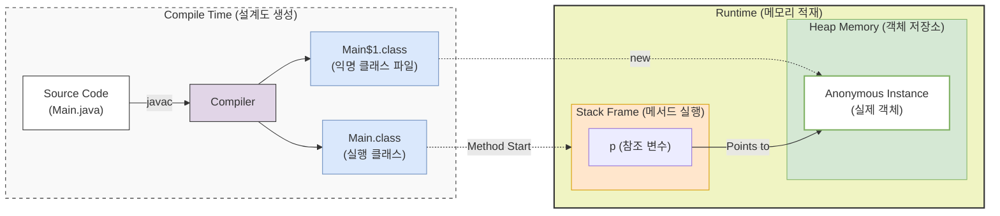

## 1. 개요

Java에서 **익명 객체(Anonymous Object)**는 이름이 없는 클래스를 선언함과 동시에 인스턴스를 생성하는 문법이다. 일반적인 클래스가 정의(Declaration)와 생성(Instantiation)이 분리되어 있는 것과 달리, 익명 객체는 이 두 과정이 하나의 표현식 안에서 이루어진다.

주로 특정 클래스를 상속받거나 인터페이스를 구현해야 하는데, 해당 구현체가 **단 한 번만 사용되고 재사용될 여지가 없을 때** 사용한다. 이는 특히 GUI 프로그래밍의 이벤트 리스너나 스레드 작업 정의 시 코드의 복잡도를 낮추는 데 핵심적인 역할을 한다.

### 핵심 특징

* **이름 부재**: 클래스의 이름이 없으므로 생성자를 가질 수 없다.
* **단일 상속/구현**: 단 하나의 클래스를 상속받거나, 단 하나의 인터페이스만 구현할 수 있다.
* **일회성**: 생성된 인스턴스는 한 번만 사용되고, 참조 변수에 할당되지 않으면 곧바로 가비지 컬렉션(GC)의 대상이 된다.

---

## 2. 아키텍처 및 내부 동작 원리

익명 객체는 소스 코드 상에서는 이름이 없지만, 컴파일러에 의해 내부적으로는 **별도의 클래스 파일**로 생성된다.



1. **컴파일 단계**: 컴파일러는 익명 객체를 발견하면 외부 클래스 이름 뒤에 `$`와 숫자를 붙여 클래스 파일을 생성한다(예: `Main$1.class`).
2. **런타임 단계**: `new` 연산자가 실행될 때 힙(Heap) 메모리에 인스턴스가 생성된다.
3. **라이프사이클**: 힙 영역에 존재하므로 GC(Garbage Collector)의 관리 대상이 된다. 메서드 종료 등으로 참조가 끊기면 회수된다.

> **Deep Dive: 익명 객체와 로컬 클래스의 관계**
> 
> 익명 객체는 본질적으로 **이름이 없는 로컬 클래스(Local Class)**와 같다. 따라서 메서드 내의 로컬 변수를 익명 객체 내부에서 사용할 때는 해당 변수가 `final` 혹은 `effectively final`(사실상 상수)이어야 한다는 제약조건이 동일하게 적용된다. 이는 스택 메모리(로컬 변수)와 힙 메모리(객체)의 생명주기 불일치 문제를 해결하기 위한 캡처링(Capturing) 메커니즘 때문이다.
{: .prompt-info }

---

## 3. 코드의 진화: 명시적 클래스에서 익명 객체로

강의에서는 GUI 프레임워크의 이벤트 처리를 예로 들어 익명 객체의 유용성을 설명한다. 동일한 기능을 수행하는 코드가 어떻게 간소화되는지 비교해 보자.

### 3.1 단계 1: 명시적 자식 클래스 (Explicit Child Class)

별도의 클래스 파일을 만들거나 내부에 명시적인 자식 클래스를 정의하여 사용하는 방식이다. 단 한 번만 쓰이는 클래스임에도 불구하고 코드가 길어진다.

```java
// 부모 클래스 (혹은 인터페이스)
abstract class Parent {
    abstract void process();
}

// 1. 별도의 자식 클래스를 명시적으로 정의
class Child extends Parent {
    @Override
    void process() {
        System.out.println("Explicit Child Process Executed");
    }
}

public class Main {
    public static void main(String[] args) {
        // 2. 인스턴스 생성 및 호출
        Parent p = new Child();
        p.process(); 
        // 불필요한 클래스 정의(Child)가 공간을 차지함
    }
}
```

### 3.2 단계 2: 익명 객체 활용 (Anonymous Object)

클래스 정의와 생성을 하나로 합쳐 코드를 획기적으로 줄인다. `Child` 클래스를 별도로 정의할 필요가 없다.

```java
public class Main {
    public static void main(String[] args) {
        // 클래스 정의와 동시에 인스턴스 생성
        Parent p = new Parent() {
            @Override
            void process() {
                // 부모의 메서드를 오버라이딩하여 즉시 정의
                System.out.println("Anonymous Object Process Executed");
            } // 세미콜론 필수 (구문의 끝)
        }; // p 변수에 참조 할당

        p.process();
    }
}
```

> **주의:** 익명 객체 정의 끝에는 반드시 **세미콜론(`;`)**을 붙여야 한다. 이는 단순한 블록(`{}`)이 아니라 `new` 연산자를 사용한 하나의 실행 구문(Statement)이기 때문이다.
{: .prompt-warning }

---

## 4. 실무 적용: GUI 이벤트 리스너 패턴

익명 객체가 가장 빛을 발하는 곳은 프레임워크의 콜백(Callback) 처리, 특히 UI 이벤트 리스너다.

### 구현 예제 (Java)

버튼 클릭 시 동작을 정의하는 상황을 가정해 보자. 사용자는 `ClickListener` 인터페이스를 구현하기 위해 별도 클래스를 만들 필요 없이, 버튼을 생성하는 시점에 동작을 주입할 수 있다.

```java
// 1. 이벤트 리스너 인터페이스 (규격)
interface ClickListener {
    void onClick();
}

// 2. UI 컴포넌트 (버튼)
class Button {
    private ClickListener listener;

    // 리스너 주입 (Dependency Injection)
    public void setClickListener(ClickListener listener) {
        this.listener = listener;
    }

    // 버튼 클릭 시 발생할 이벤트 로직 (프레임워크 내부 동작)
    public void click() {
        if (this.listener != null) {
            this.listener.onClick(); // Call by Framework
        }
    }
}

// 3. 클라이언트 코드
public class ClientApp {
    public static void main(String[] args) {
        Button btn = new Button();

        // [핵심] 익명 객체를 사용하여 리스너 등록
        // 별도의 클래스 정의 없이, "클릭되면 무엇을 할지"만 기술한다.
        btn.setClickListener(new ClickListener() {
            @Override
            public void onClick() {
                System.out.println("Button was clicked! (Handled by Anonymous Object)");
            }
        });

        // 사용자가 버튼을 클릭함 (시뮬레이션)
        btn.click();
    }
}
```

### 코드 분석

1. **필드 주입**: `setClickListener` 메서드의 인자로 익명 구현 객체를 생성하여 전달했다.
2. **Call by Framework**: 개발자는 `onClick` 내부 로직만 작성하면, 실제 호출은 `Button` 클래스(프레임워크) 내부에서 이벤트 발생 시점에 이루어진다.
3. **간결성**: 이벤트 처리를 위해 파일을 오가거나 클래스 이름을 고민할 필요 없이, 로직이 필요한 위치에 코드가 응집된다.

> **Tip:** Java 8 이후에는 함수형 인터페이스(메서드가 1개인 인터페이스)에 한해 익명 객체를 **람다식(Lambda Expression)**으로 더 축약할 수 있다. 위 코드는 `btn.setClickListener(() -> System.out.println("..."))`로 대체 가능하다.
{: .prompt-tip }

---

## 5. 결론 및 인사이트

익명 객체는 단순한 문법적 설탕(Syntactic Sugar)을 넘어, 코드의 **응집도**를 높이고 **불필요한 파생 클래스**의 양산을 막는 중요한 설계 도구다.

* **재사용성 vs 일회성**: 재사용이 필요한 로직은 일반 클래스나 내부 클래스로 정의하고, 특정 문맥에서만 소비되는 로직은 익명 객체로 처리한다.
* **프레임워크 이해**: Spring이나 GUI 툴킷 등 많은 프레임워크가 내부적으로 이러한 구조를 전제로 설계되어 있다. "생략된 코드"가 무엇인지 이해하는 것이 문제 해결 능력의 핵심이다.

---

## 💡 Quiz: 학습 내용 확인하기

**Q1. 익명 객체를 생성할 때 반드시 필요한 전제 조건은 무엇인가?**

<details>
<summary>정답 확인</summary>
<div>
익명 객체는 단독으로 존재할 수 없으며, 반드시 부모 클래스를 상속받거나 인터페이스를 구현해야 합니다.
</div>
</details>

**Q2. 컴파일 후 익명 객체는 어떤 파일명으로 생성되며, 메모리 어디에 저장되는가?**

<details>
<summary>정답 확인</summary>
<div>
파일명은 '외부클래스명1.class) 형식으로 생성되며, 인스턴스는 런타임 시 힙(Heap) 메모리 영역에 저장되어 가비지 컬렉터의 관리 대상이 됩니다.
</div>
</details>

**Q3. 익명 객체 구문의 끝에 세미콜론(;)을 붙여야 하는 이유는?**

<details>
<summary>정답 확인</summary>
<div>
익명 객체 구문은 클래스 정의 블록처럼 보이지만, 실제로는 인스턴스를 생성하는 '실행 문장(Statement)'에 해당하기 때문에 문장의 끝을 알리는 세미콜론이 필수적입니다.
</div>
</details>