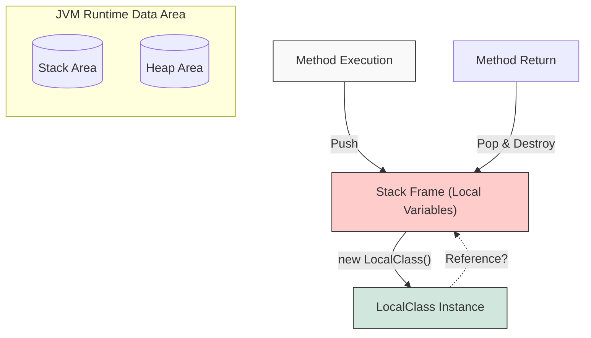

## 1. 개요

Java에서 **지역 클래스(Local Class)**는 메서드, 생성자, 초기화 블록 등 특정 블록(`{...}`) 내부에서 선언된 클래스를 의미한다. 일반적으로 특정 메서드 내에서만 한시적으로 사용되는 로직을 캡슐화하거나, 익명 클래스(Anonymous Class)의 기반 이론이 되는 중요한 개념이다.

단순히 클래스 내부에 클래스를 정의하는 문법적인 허용을 넘어, JVM의 메모리 관리 모델과 밀접한 연관이 있다. 특히 **지역 변수(Local Variable)**에 접근할 때 발생하는 생명주기(Lifecycle)의 모순을 해결하기 위해 Java는 독특한 내부 처리 방식을 가진다.

## 2. 생명주기의 역설 (The Lifecycle Paradox)

지역 클래스가 메서드 내부의 지역 변수를 참조할 때, 심각한 메모리 구조적 모순이 발생한다. 이를 이해하기 위해서는 JVM의 Runtime Data Area 중 **Stack**과 **Heap**의 동작 방식을 이해해야 한다.

### 2.1 스택 프레임 vs 힙 인스턴스

1. **메서드 실행**: 메서드가 호출되면 스택(Stack) 영역에 새로운 **스택 프레임(Stack Frame)**이 생성되고, 여기에 지역 변수(매개변수 포함)가 저장된다.
2. **객체 생성**: 메서드 내부에서 `new` 연산자로 지역 클래스의 인스턴스를 생성하면, 이 객체는 **힙(Heap)** 영역에 할당된다.
3. **메서드 종료**: 메서드 실행이 끝나면 해당 스택 프레임은 **즉시 소멸(Pop)**된다.

**문제점**: 힙 영역에 생성된 인스턴스는 GC(Garbage Collector)가 수거하기 전까지 살아남는다. 만약 이 인스턴스가 이미 사라진 스택 프레임의 지역 변수를 참조하려 한다면, 존재하지 않는 메모리에 접근하는 **Dangling Reference** 오류가 발생해야 한다.



## 3. 해결책: 변수 캡처 (Variable Capturing)

Java는 이 문제를 해결하기 위해 **변수 캡처(Variable Capturing)**라는 메커니즘을 사용한다. 지역 클래스 인스턴스가 생성될 때, 참조하는 지역 변수의 값을 자신의 인스턴스 내부에 **복사**하여 저장하는 방식이다.

### 3.1 내부 동작 원리 (Under the hood)

컴파일 시점에 컴파일러는 지역 클래스를 분석하여 다음과 같은 변환 작업을 수행한다[^1].

1. **외부 클래스 래핑**: 지역 클래스는 컴파일 후 `외부클래스$1지역클래스`와 같은 이름을 가진 독립적인 클래스 파일로 생성된다.
2. **필드 생성**: 참조하는 지역 변수의 값을 저장할
3. `private final` 필드를 지역 클래스 내부에 자동으로 생성한다.
4. **생성자 주입**: 지역 클래스의 생성자에 해당 지역 변수 값을 넘겨받는 매개변수를 추가하고, 내부 필드에 값을 초기화하는 코드를 삽입한다.

결과적으로 인스턴스는 원본 지역 변수(스택)가 사라져도, 복사된 값(힙)을 가지고 있기 때문에 정상적으로 동작한다.

## 4. Effectively Final의 엄격한 규칙

Java 8 이전에는 지역 클래스에서 접근하는 지역 변수에 반드시 `final` 키워드를 명시해야 했다. Java 8부터는 명시하지 않아도 값이 변경되지 않는다면 **Effectively Final(사실상 상수)**로 간주하여 허용한다.

### 4.1 데이터 동기화 문제와 불변성

왜 값을 변경할 수 없는가? 스택의 원본 변수와 힙의 복사본 변수 사이에 **데이터 동기화(Synchronization)**를 보장할 수 없기 때문이다.

* **인스턴스 내부 변경 불가**: 인스턴스 내부에서 값을 바꿔도, 스택의 원본에는 반영되지 않는다.
* **외부 지역 변수 변경 불가**: 스택의 원본이 바뀌어도, 이미 생성된 인스턴스(복사본)에는 반영되지 않는다.

이러한 데이터 불일치 문제를 원천 차단하기 위해 Java는 캡처된 변수를 **읽기 전용(Read-Only)**으로 강제한다.

### 4.2 외부에서의 값 변경 제한 (계약의 파기)

중요한 점은 지역 클래스 **내부**뿐만 아니라, **외부(메서드 영역)**에서도 해당 변수의 값을 변경할 수 없다는 것이다. 이를 **'신뢰의 계약'** 관점에서 이해하면 쉽다.

1. **계약 성립**: 지역 클래스가 외부 변수를 참조하는 순간, "이 변수는 변하지 않는다"는 전제하에 값을 복사(캡처)해 간다.
2. **계약 파기**: 만약 외부 메서드에서 변수의 값을 변경하면, 복사해 간 값과 원본 값이 달라지게 된다.
3. **제재**: 컴파일러는 이를 감지하고, 해당 변수가 Effectively Final이 아니라고 판단하여 지역 클래스에서의 사용 자체를 금지한다.

```java
public void testScope() {
    int data = 10; // 1. 변수 선언

    class LocalClass {
        void print() {
            // 3. 사용 시도 -> 컴파일 에러 발생!
            // Error: local variables referenced from an inner class must be final or effectively final
            System.out.println(data); 
        }
    }

    // 2. 외부에서 값 변경 시도
    // 이 코드가 존재하는 순간 'data'는 Effectively Final 자격을 박탈당한다.
    data = 20; 
}
```

> **Deep Dive: 컴파일 에러의 위치**
> 
> 흥미로운 점은 에러가 발생하는 위치다. 값을 변경한 `data = 20` 라인이 아니라, 변수를 사용하려고 시도한 `System.out.println(data)` 라인에서 에러가 발생한다. 이는 "상수가 아닌 변수를 캡처하려고 시도했음"을 지적하는 것이다.
{: .prompt-info }

## 5. 한계 돌파: 값을 변경해야 한다면?

만약 지역 클래스와 외부 메서드 간에 변경되는 값을 공유해야 한다면, **Stack의 참조(Reference)**는 유지하되 **Heap의 데이터**를 변경하는 방식을 사용해야 한다.

가장 흔한 패턴은 **배열(Array)**이나 **객체(Object)**를 사용하는 것이다.

```java
public void workaround() {
    // 1. 배열을 사용하여 힙 영역에 값을 저장 (dataWrapper 변수의 주소값 자체는 불변)
    final int[] dataWrapper = { 10 };

    class LocalClass {
        void print() {
            // 주소값을 통해 힙 영역의 최신 데이터를 읽어옴
            System.out.println("Inner: " + dataWrapper[0]);
        }
    }

    LocalClass lc = new LocalClass();
    
    // 2. 값 변경 (주소값은 그대로, 내부 데이터만 변경)
    // Stack에 있는 dataWrapper 참조변수는 변하지 않았으므로 Effectively Final 규칙 준수
    dataWrapper[0] = 20;
    
    lc.print(); // 결과: Inner: 20 (변경 사항이 반영됨)
}
```

> **Tip:** 지역 클래스나 람다에서 외부 변수를 수정해야 할 때, `AtomicInteger`와 같은 스레드 안전한 객체를 사용하거나, 길이가 1인 배열(`new int[1]`)을 사용하는 것이 표준적인 해결책이다.
{: .prompt-tip }

---

## 💡 Quiz: 학습 내용 확인하기

**Q1. 메서드가 종료되어 스택 프레임이 사라졌음에도 지역 클래스 인스턴스가 지역 변수 값을 사용할 수 있는 이유는 무엇인가?**

<details>
<summary>정답 확인</summary>
<div>
<strong>변수 캡처(Variable Capturing)</strong> 메커니즘 때문입니다. 지역 클래스 인스턴스 생성 시, 참조하는 지역 변수의 값을 인스턴스 내부의 필드로 복사하여 힙 영역에 저장하기 때문에 스택 프레임의 소멸 여부와 관계없이 값에 접근할 수 있습니다.
</div>
</details>

**Q2. 지역 클래스가 참조하는 지역 변수를 메서드 영역(외부)에서 수정하면 컴파일 에러가 발생하는 이유는?**

<details>
<summary>정답 확인</summary>
<div>
지역 변수가 수정되는 순간 <strong>Effectively Final(사실상 상수)</strong> 요건을 충족하지 못하게 되기 때문입니다. 데이터의 일관성(스택 원본 vs 힙 복사본)을 보장하기 위해, Java는 값이 변경되는 변수는 지역 클래스 내부에서 캡처(참조)할 수 없도록 차단합니다.
</div>
</details>

---

[^1]:컴파일러가 생성한 바이트코드를 `javap` 등으로 역컴파일해보면, 외부 클래스에 대한 참조(`this$0`)와 캡처된 지역 변수(`val$변수명`)가 생성자 매개변수로 전달되는 것을 확인할 수 있다.