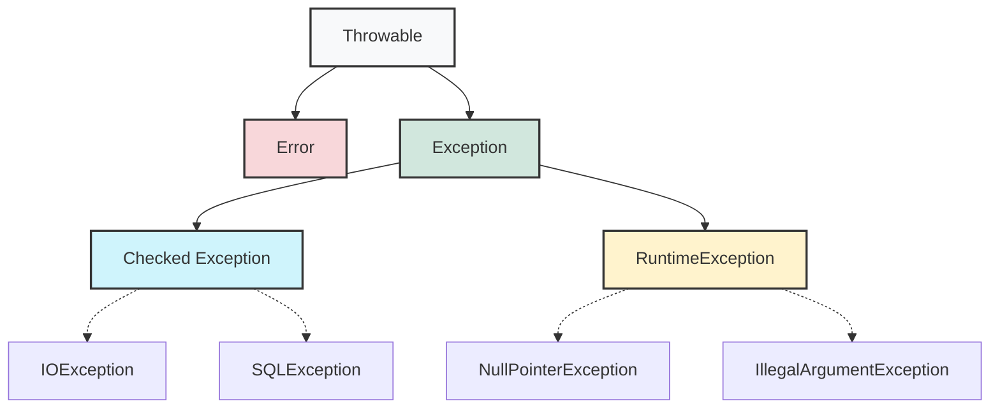
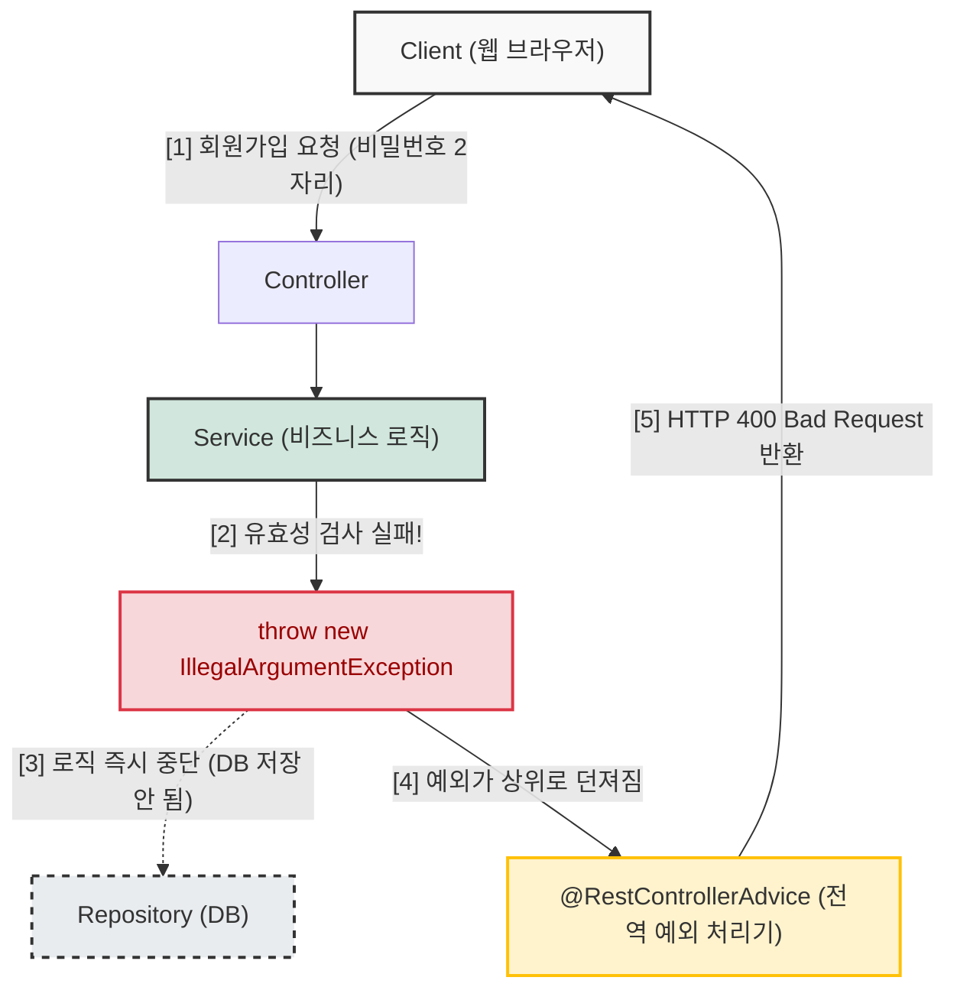
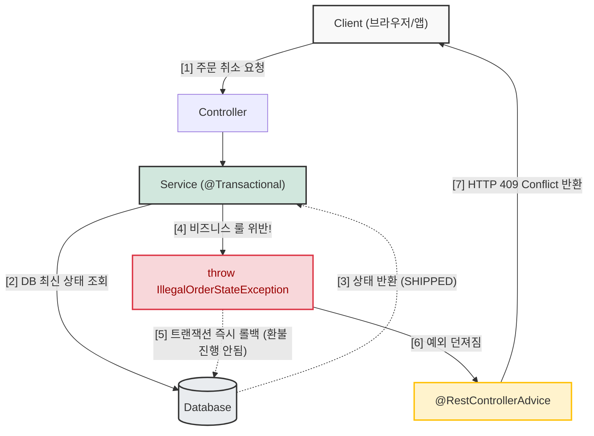

## 1. 개요

소프트웨어 시스템은 언제나 예상치 못한 상황에 직면한다. 자바(Java)는 이러한 비정상적인 흐름을 제어하기 위해 **예외 처리(Exception Handling)** 메커니즘을 제공한다. 예외를 바라보는 핵심적인 관점은 크게 **'언제 대응해야 하는가(발생 시점과 검증 시점)'**와 **'어떻게 복구할 것인가(대응 가능성)'**로 나뉜다.

모든 예외는 런타임(프로그램 실행 중)에 발생하지만, 자바 컴파일러가 소스 코드를 빌드하는 과정에서 예외 처리 로직의 존재 여부를 강제하는지 여부에 따라 **Checked Exception**과 **Unchecked Exception**으로 분류된다.

## 2. 자바의 예외 상속 구조 (Architecture)

자바의 모든 에러와 예외는 `java.lang.Throwable` 클래스를 상속받는다. 이를 기점으로 시스템 레벨의 에러와 애플리케이션 레벨의 예외가 분리된다.



### 2.1 Error (시스템 에러)

`OutOfMemoryError`나 `StackOverflowError`처럼 JVM 레벨에서 발생하는 치명적인 오류다. 이는 코드 레벨에서 대응하거나 복구할 수 없는 환경적/설정적 이슈(예: 힙 메모리 부족, 무한 재귀 호출)이므로, 애플리케이션 개발자가 `catch` 블록으로 제어하려고 시도해서는 안 된다.

> **위험:** JVM 파라미터나 운영체제 설정 문제로 발생하는 에러를 억지로 예외 처리하여 무시할 경우, 시스템의 완전한 중단을 지연시켜 메모리 릭(Memory Leak)이나 심각한 데이터 정합성 훼손을 유발할 수 있다.
{: .prompt-danger }

### 2.2 Exception (애플리케이션 예외)

애플리케이션 로직에서 처리할 수 있는 예외 상황이다. 이는 다시 컴파일러가 처리를 강제하는지 여부에 따라 나뉜다.

## 3. Checked vs Unchecked Exception

### 3.1 Checked Exception

`RuntimeException`을 상속하지 않는 모든 `Exception` 파생 클래스다. 컴파일 타임에 예외를 잡아서(`catch`) 처리하거나, 밖으로 던진다고 선언(`throws`)해야만 컴파일이 가능하다.

* **목적**: 반드시 예외 상황을 인지하고, 복구 전략(대안 파일 제공, 재시도 등)을 마련하도록 강제한다.
* **사례**: `IOException`, `SQLException`. 외부 시스템(로컬 파일 시스템, 네트워크, DB)과 연동할 때 주로 발생한다.

### 3.2 Unchecked Exception (Runtime Exception)

`RuntimeException`을 상속하는 모든 예외다. 명시적인 예외 처리를 강제하지 않는다.

* **목적**: 주로 개발자의 논리적 오류나 잘못된 API 사용을 나타낸다. 모든 메서드에 `throws`를 선언하면 코드 가독성이 심각하게 저하되므로 이를 생략할 수 있게 한다.
* **사례**: `NullPointerException`, `IndexOutOfBoundsException`, `NumberFormatException`.

> **Deep Dive: Checked 예외와 트랜잭션 롤백(Rollback)**
> 
> 실무에서 데이터베이스와 연동하는 Spring 프레임워크의 선언적 트랜잭션(`@Transactional`) 환경을 사용할 때, 예외의 종류는 매우 중요하다. 기본적으로 트랜잭션은 `RuntimeException`(Unchecked)과 `Error`가 발생하면 롤백을 수행하지만, `Exception`(Checked)이 발생하면 커밋을 시도한다. 따라서 JPA나 DB 연동 중 발생하는 비즈니스 예외를 어떻게 매핑하고 전환(Exception Translation)할지가 시스템 설계의 핵심 요소가 된다.
{: .prompt-info }

## 4. 시스템 경계와 예외 발생 요인

예외를 단순히 자바 문법으로만 이해해서는 안 된다. 애플리케이션이 실행되는 **컨텍스트(로컬 vs 원격)**에 따라 발생 원인과 대응 전략이 완전히 달라진다.

### 4.1 로컬 시스템 요인

내가 제어할 수 있는 애플리케이션 내부나 로컬 운영체제 자원에서 발생하는 예외다.

* **파일 I/O**: 파일이 존재하지 않거나(`FileNotFoundException`), 디스크 공간이 가득 찬 경우.
* **권한 문제**: JVM 프로세스에 부여된 OS 레벨의 권한이 부족하여 읽기/쓰기 시도가 거부되는 경우.
* 상대적으로 원인 파악이 쉽고, 디스크 용량 증설이나 권한 부여 등으로 통제가 가능하다.

### 4.2 외부 시스템 요인 (네트워크 및 데이터베이스)

애플리케이션을 벗어난 네트워크 구간이나 외부 인프라와 통신할 때 발생한다. 내가 통제할 수 없는 수많은 변수가 존재한다.

* **보안 장비 개입**: 웹 방화벽(WAF)이나 침입탐지시스템(IDS)이 정상적인 요청을 공격으로 오인하여 연결을 강제로 차단할 수 있다.
* **동시성 및 부하**: 트래픽 증가로 인한 DB 커넥션 풀(Connection Pool) 고갈, 데드락(Deadlock), 쿼리 타임아웃 등.
* 이러한 외부 요인은 완벽한 사전 차단이 불가능하므로, 장애 격리(Circuit Breaker)[^1]와 안전한 실패 처리 체계를 구축하는 것이 필수적이다.

> **주의:** 네트워크 I/O 예외의 원인을 애플리케이션 코드 내부에서만 찾으려 하면 디버깅 미궁에 빠지기 쉽다. 인프라 계층의 패킷 드롭이나 세션 타임아웃을 항상 의심해야 단다.
{: .prompt-warning }

## 5. 예외 처리에 대한 오해: throw vs return

"예외(`throw`)를 던지면 시스템 부하가 심하므로, `if`문으로 조건을 체크하고 로그를 남긴 뒤 `return`하는 것이 좋다"는 이야기는 **절반은 맞고 절반은 틀린(안티 패턴에 가까운) 오해**다.

### 5.1 예외 생성의 비용 (True)

Java에서 예외 객체를 생성할 때(`new Exception()`) 시스템 부하가 발생하는 것은 사실이다. 가장 큰 원인은 예외가 생성될 때 현재 실행 중인 메서드들의 호출 흐름인 **스택 트레이스(Stack Trace)**를 추적하고 기록(`fillInStackTrace()` 메서드 호출)하기 때문이다.

### 5.2 왜 if-return이 아닌 throw를 써야 하는가? (False)

부하가 있음에도 불구하고 **'정상적인 비즈니스 흐름'과 '예외(오류) 상황'은 반드시 분리**해야 한다.
만약 에러 상황을 `if`문으로 체크해서 `return null;`이나 `return -1;` 같은 에러 코드로 반환하게 되면 다음과 같은 심각한 문제가 발생한다.

1. **에러 처리의 누락**: 호출한 상위 메서드에서 반환값(예: `-1`)을 깜빡하고 검사하지 않으면, 잘못된 데이터가 시스템 전체로 퍼져나가 엉뚱한 곳에서 시스템이 터지게 된다.
2. **코드의 복잡도 증가**: 비즈니스 로직을 작성해야 할 곳이 온통 `if (result == null) { return ... }` 형태의 방어 코드로 도배된다. (과거 C언어 스타일의 에러 핸들링)
3. **Fail-Fast 실패**: 오류는 발견된 즉시 애플리케이션의 실행 흐름을 중단시키고(Fail-Fast), 안전한 곳으로 제어권을 넘겨야 데이터 오염을 막을 수 있다. 예외를 던지는 것(`throw`)이 이를 보장하는 가장 확실한 방법이다.

> **Tip:** 예외는 제어문(`if-else` 대신 흐름을 제어하려는 목적)으로 사용해서는 안 되며, 정말로 **예외적인 상황(Exceptional Flow)**에서만 사용해야 한다. 비즈니스 로직 상 충분히 발생 가능한 '결과 없음' 상태라면 예외 대신 `Optional`을 반환하는 것이 현대적인 Java 설계 방식이다.
{: .prompt-tip }

### 5.3 throw는 프로그램 종료가 아니라 '비상벨'이다

과거 콘솔 프로그램에서는 에러가 발생하면 프로그램이 죽어버렸지만, 현대의 웹 서버 환경(Spring)에서는 `throw`가 발생한다고 해서 서버가 멈추지 않는다.
`throw`는 **"데이터가 오염되었으니, 더 이상 비즈니스 로직(DB 저장 등)을 진행하지 말고 즉시 중단(Abort)한 뒤 에러 처리 전담반으로 넘겨라"**라고 울리는 비상벨과 같다. 오히려 잘못된 데이터가 DB로 파고드는 것을 원천 차단하는 가장 안전한 방어막이다.



### 5.4 비즈니스 로직 보호와 사용자 경험(UX)

사용자가 비밀번호를 짧게 입력한 상황을 가정하여 두 방식을 비교해 보자.

**[안 좋은 예: if-return 방식]**

```java
public String registerUser(String password) {
    if (password.length() < 8) {
        // 에러를 의미하는 임의의 문자열을 리턴한다.
        return "ERROR_PASSWORD_LENGTH"; 
    }
    // 호출자가 반환값을 검사하지 않으면 "ERROR_..." 문자열이 DB에 그대로 저장되는 대참사 발생 가능
    // ... DB 저장 로직 ...
    return "SUCCESS";
}
```

**[좋은 예: throw 방식]**

```java
public void registerUser(String password) {
    if (password.length() < 8) {
        // 조건이 안 맞으면 즉시 예외를 던진다 (Fail-Fast)
        throw new IllegalArgumentException("비밀번호는 8자리 이상이어야 합니다.");
    }
    // 예외가 발생하지 않았다면 데이터가 정상임을 100% 보장하므로 깔끔하게 비즈니스 로직만 작성
    // ... DB 저장 로직 ...
}
```

이처럼 예외를 던지면 글로벌 예외 처리기에서 이를 낚아채어 클라이언트에게 HTTP 400(Bad Request)과 함께 에러 메시지를 보낸다. 브라우저는 이 응답을 받아 "비밀번호는 8자리 이상이어야 합니다"라는 텍스트를 화면에 띄워 사용자에게 다시 입력하도록 유도하게 되며, 이는 **시스템 안정성과 사용자 경험을 동시에 챙기는 완벽한 아키텍처**가 된다.

## 6. 핵심 구현 로직 (Java)

위에서 설명한 철학을 바탕으로, 실제 실무(특히 Spring 환경)에서 예외를 어떻게 설계하고 처리하는지 알아본다.

### 6.1 사용자 정의 예외 클래스의 의미

```java
// 사용자 정의 비즈니스 예외 클래스 (Unchecked Exception으로 설계)
class SystemConfigurationException extends RuntimeException {
    public SystemConfigurationException(String message, Throwable cause) {
        super(message, cause); // 부모 클래스의 메모리 공간에 에러 데이터를 저장만 한다.
    }
}
```

이 코드는 **"에러 내용을 로그 파일에 쓰는 동작"을 하는 코드가 아니다.** 이 클래스는 발생한 문제의 **정보를 담아 운반하는 '택배 상자(Data Container)'** 역할을 할 뿐이다.

* **`String message`**: "설정 파일을 읽지 못했습니다"처럼 사람이 읽을 수 있는 요약 정보(택배 상자에 붙이는 라벨)다.
* **`Throwable cause`**: 실제로 내부에서 터진 진짜 에러 원인 객체(예: `IOException`)다. 상자 안에 넣는 진짜 내용물이다.
* **`super(message, cause)`**: 자바의 기본 예외 클래스(`RuntimeException`)의 생성자를 호출하여, 이 두 가지 정보를 메모리에 잘 보관해달라고 넘겨주는(초기화) 역할을 한다.

### 6.2 예외 포장과 던지기 (Throw)

특정 로직에서 문제가 발생하면, 위에서 만든 '택배 상자'에 에러를 담아 상위 호출자에게 **던진다(`throw`)**.

```java
public class ExceptionHandlingExample {
    public String readConfiguration(String filePath) {
        try (BufferedReader reader = new BufferedReader(new FileReader(filePath))) {
            return reader.readLine();
        } catch (IOException e) {
            // 진짜 원인인 IOException(e)를 상자에 담아 명시적인 이름의 예외로 던진다.
            throw new SystemConfigurationException("설정 파일을 읽는 중 오류 발생: " + filePath, e);
        }
    }
}
```

> **Deep Dive: 예외 연쇄(Exception Chaining)를 해야 하는 이유**
> 
> 만약 `cause` 파라미터 없이 새로운 예외만 던진다면, 상위 클래스에서는 "설정 파일 오류"라는 표면적인 현상만 알 수 있다. 그 기저의 원인이 '파일 누락'인지 '권한 부족'인지 파악할 길이 사라진다. 예외 연쇄를 통해 최초 장애 발생 지점부터 예외가 변환된 지점까지의 모든 스택 트레이스 흐름을 잃어버리지 않고 추적할 수 있다.
{: .prompt-info }

### 6.3 글로벌 예외 처리기(@RestControllerAdvice)의 역할

앞서 컨트롤러나 서비스 계층에서 발생한 모든 커스텀 예외들은 계속 상위로 던져지다가, 결국 **스프링이 제공하는 안전망(Global Exception Handler)**에 걸리게 된다.

여기서 비로소 **"에러 로그를 남기는 동작"**과 **"사용자에게 안전한 응답(예: 500 에러 화면, 400 Bad Request)을 보내는 동작"**이 한 곳에서 이루어진다.

```java
import org.slf4j.Logger;
import org.slf4j.LoggerFactory;
import org.springframework.http.HttpStatus;
import org.springframework.http.ResponseEntity;
import org.springframework.web.bind.annotation.ExceptionHandler;
import org.springframework.web.bind.annotation.RestControllerAdvice;

// 애플리케이션 전역에서 발생하는 예외를 한 곳으로 모아 처리하는 클래스
@RestControllerAdvice
public class GlobalExceptionHandler {
    private static final Logger log = LoggerFactory.getLogger(GlobalExceptionHandler.class);

    // SystemConfigurationException이 발생하면 무조건 이 메서드가 가로채서 실행된다.
    @ExceptionHandler(SystemConfigurationException.class)
    public ResponseEntity<String> handleSystemConfigException(SystemConfigurationException e) {
        
        // 1. 에러 로깅: 이때 예외 객체(e) 안에 담겨있던 message와 cause(스택 트레이스)가 로그에 출력된다.
        log.error("시스템 구성 오류 발생: {}", e.getMessage(), e);
        
        // 2. 클라이언트 응답: 시스템 내부의 상세한 에러 내역은 숨기고, 규격화된 메시지만 반환한다.
        return ResponseEntity.status(HttpStatus.INTERNAL_SERVER_ERROR)
                             .body("서버 내부 설정 오류로 인해 요청을 처리할 수 없습니다.");
    }
}
```

이처럼 예외를 정의(`Exception` 클래스), 발생(`throw`), 처리(`@RestControllerAdvice`)하는 세 가지 역할을 완벽히 분리함으로써, 비즈니스 코드는 깔끔하게 유지되고 에러는 안전하고 일관성 있게 관리될 수 있다.

실무에서 개발자가 직접 **커스텀 예외(Custom Exception)를 만들고 `throw`를 던지는 진짜 이유**는 클라이언트가 절대 알 수 없는 **'서버의 실시간 상태'**나 **'복잡한 비즈니스 규칙(Domain Rules)'**을 검증할 때다.

실무와 가장 밀접한 2가지 대표 사례를 통해 커스텀 예외의 필요성을 알아보자.

---

### 실무 사례 1: 상태 기반 비즈니스 룰 위반 (주문 취소)

쇼핑몰에서 사용자가 '주문 취소' 버튼을 눌렀다고 가정해 보자. 클라이언트(브라우저) 화면에서는 아직 '결제 완료' 상태로 보여서 취소가 가능할 것 같지만, 사용자가 버튼을 누르기 1초 전에 관리자가 백오피스에서 이미 **'배송 중'**으로 상태를 변경했을 수 있다.

이러한 **동적 데이터 상태**는 서버(DB)에서만 검증할 수 있다.

#### 1) 커스텀 예외 정의

```java
// 비즈니스 규칙 위반을 명확히 나타내는 커스텀 예외
public class IllegalOrderStateException extends RuntimeException {
    public IllegalOrderStateException(String message) {
        super(message);
    }
}
```

#### 2) 서비스 계층 (비즈니스 로직)

```java
@Transactional
public void cancelOrder(Long orderId, Long userId) {
    // 1. DB에서 주문의 최신 실시간 상태를 조회
    Order order = orderRepository.findById(orderId)
            .orElseThrow(() -> new EntityNotFoundException("주문을 찾을 수 없습니다."));

    // 2. 비즈니스 룰 검증: 배송이 이미 시작되었는지 확인
    if (order.getStatus() == OrderStatus.SHIPPED || order.getStatus() == OrderStatus.DELIVERED) {
        // 클라이언트 단에서는 막을 수 없는 비즈니스 룰 위반 상황 발생 -> 즉시 차단(Fail-Fast)
        throw new IllegalOrderStateException("이미 배송이 시작되어 주문을 취소할 수 없습니다.");
    }

    // 3. 정상 상태라면 취소 로직 진행
    order.cancel(); 
}
```

#### 3) 트랜잭션과 시스템 보호 효과

만약 `throw` 대신 `return "FAIL"` 처리를 했다면, 개발자가 실수로 리턴 값을 검사하지 않았을 때 이미 배송된 상품의 결제가 취소(환불 API 호출 등)되어 버리는 대형 금융 사고가 발생할 수 있다. `throw`를 던지면 **해당 트랜잭션이 즉시 롤백(Rollback)**되므로 시스템의 데이터 정합성을 가장 안전하게 지킬 수 있다.

---

### 실무 사례 2: 자원 경합 및 동시성 문제 (재고 차감 / 쿠폰 사용)

수강신청이나 선착순 쿠폰 발급처럼 여러 사용자가 동시에 하나의 자원(DB Row)에 접근할 때 발생한다. 화면에서는 재고가 1개 남았다고 보였지만, 0.1초 차이로 다른 사람이 먼저 결제해버린 상황이다.

```java
// 재고 부족을 나타내는 커스텀 예외
public class OutOfStockException extends RuntimeException {
    public OutOfStockException(String message) {
        super(message);
    }
}
```

```java
@Transactional
public void orderItem(Long itemId, int quantity) {
    Item item = itemRepository.findById(itemId).orElseThrow(...);

    // DB의 현재 재고 수량과 요청 수량 비교
    if (item.getStockQuantity() < quantity) {
        // 동시성 경합으로 인한 재고 부족 발생
        throw new OutOfStockException("상품의 재고가 부족합니다. 남은 수량: " + item.getStockQuantity());
    }

    item.removeStock(quantity); // 재고 차감 로직 수행
}

```

---

### 💡 실무 아키텍처 흐름 시각화 (Mermaid)

위와 같은 비즈니스 예외 상황이 발생했을 때 시스템이 어떻게 유기적으로 동작하는지 다이어그램으로 구조화한 것이다.



### 요약: 커스텀 예외는 언제 만들어야 하는가?

1. **상태 검증**: 프론트엔드에서 알 수 없는 **DB의 실시간 데이터 상태**를 기반으로 비즈니스 룰을 검증할 때 (예: 이미 취소된 티켓, 배송 중인 상품).
2. **동시성 경합**: 여러 스레드(사용자)가 동시에 접근하여 **자원(재고, 쿠폰, 잔액)이 고갈**되었을 때.
3. **권한 및 인가**: 단순 로그인이 아니라, **"이 게시물을 수정할 권한이 이 사용자에게 있는가?"**를 DB의 소유자 ID와 비교 검증할 때 (`AccessDeniedException`).

이처럼 커스텀 예외는 단순한 입력값 오류가 아닌, **비즈니스 도메인의 핵심 규칙을 보호하는 최후의 보루** 역할을 한다고 이해하면 된다.

---

## 💡 Quiz: 학습 내용 확인하기

**Q1. 자바에서 예외(Exception)를 Checked와 Unchecked로 분류하는 가장 큰 기준은 무엇인가?**

<details>
<summary>정답 확인</summary>
<div>
컴파일 시점에 예외 처리(try-catch 또는 throws 선언)를 강제하는지 여부입니다. Checked Exception은 처리를 강제하며, Unchecked Exception은 강제하지 않습니다.
</div>
</details>

**Q2. Spring 프레임워크의 @Transactional 환경에서, 기본 설정 기준으로 데이터베이스 롤백(Rollback)을 유발하는 예외 계층은 무엇인가?**

<details>
<summary>정답 확인</summary>
<div>
RuntimeException(Unchecked Exception)과 Error 계층입니다. 일반적인 Exception(Checked Exception)은 기본적으로 커밋(Commit)을 수행합니다.
</div>
</details>

**Q3. 에러 발생 시 예외(throw)를 던지지 않고 if문으로 로그를 남긴 후 특정한 에러 값(예: -1, null)을 return하는 방식이 지양되는 핵심 이유는 무엇인가?**

<details>
<summary>정답 확인</summary>
<div>
호출자가 반환된 에러 값을 검사하지 않고 누락할 경우 시스템 오동작을 유발하며, 정상 비즈니스 로직과 에러 처리 로직이 뒤섞여 코드 가독성을 크게 훼손하기 때문입니다. 또한 발견 즉시 실행을 중단하는 Fail-Fast를 보장할 수 없습니다.
</div>
</details>

**Q4. 사용자 정의 예외 클래스를 만들 때, `super(message, cause)`를 호출하여 기존 예외 객체를 넘겨주는 '예외 연쇄(Exception Chaining)'를 사용하는 주된 이유는 무엇인가?**

<details>
<summary>정답 확인</summary>
<div>
최초로 발생한 근본 원인(Root Cause)과 스택 트레이스(Stack Trace) 정보를 잃어버리지 않고 상위 호출자나 로그 시스템에 온전히 전달하여, 정확한 문제 원인을 추적하기 위함입니다.
</div>
</details>

---

[^1]:회로 차단기(Circuit Breaker) 패턴: 외부 서비스 호출의 실패 빈도가 특정 임계치에 도달하면 해당 서비스로의 호출을 일시적으로 차단하여, 장애가 시스템 전체로 전파되는 것을 막는 소프트웨어 디자인 패턴.