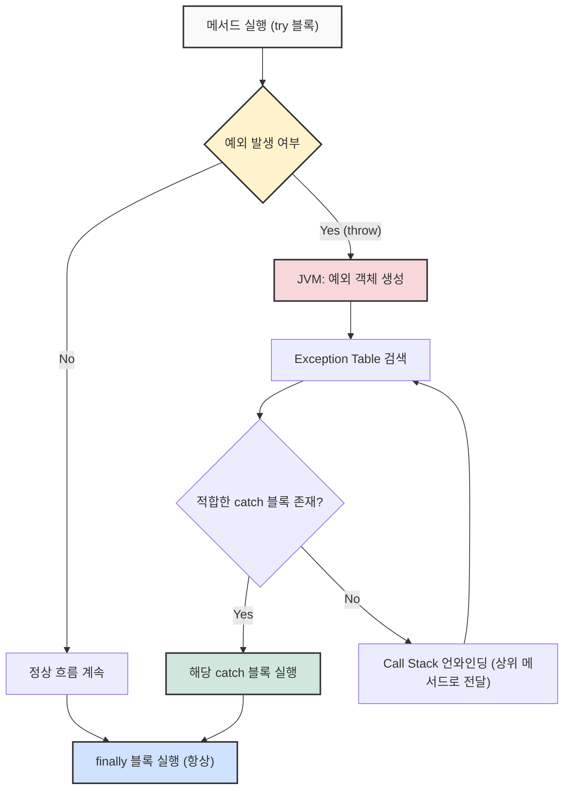
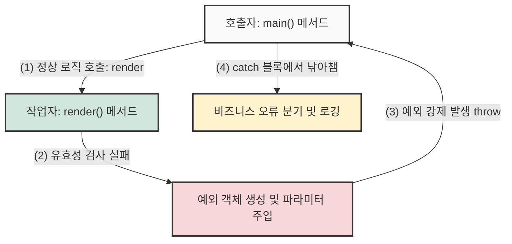

## 1. 개요

프로그램을 실행하다 보면 개발자의 실수나 예상치 못한 외부 요인으로 인해 런타임 오류가 발생한다. 자바(Java)는 이러한 상황에서 애플리케이션이 강제 종료되지 않고 안전하게 복구되거나 처리될 수 있도록 구조화된 **예외 처리(Exception Handling)** 메커니즘을 제공한다.

기본적으로 예외 처리는 `try`, `catch`, `finally` 블록을 통해 이루어진다. 정상적인 비즈니스 로직은 `try` 블록에 작성하고, 예외 발생 시의 대안 흐름은 `catch` 블록에 위임하여 핵심 로직과 오류 처리 로직을 분리할 수 있다. 이를 통해 코드의 가독성과 유지보수성이 크게 향상된다.

## 2. 아키텍처 및 동작 원리

예외가 발생했을 때 자바 가상 머신(JVM)은 발생한 예외 객체를 생성하고, 이를 처리할 수 있는 핸들러를 찾기 위해 콜 스택(Call Stack)[^1]을 역추적한다.



> **Deep Dive: JVM의 예외 테이블(Exception Table)과 스택 언와인딩**
> 
> 자바 컴파일러는 예외 처리가 포함된 코드를 바이트코드로 변환할 때, 각 메서드 내부에 **예외 테이블(Exception Table)**을 생성한다. 이 테이블은 `try` 블록의 시작과 끝 범위, 처리할 예외의 타입, 그리고 일치할 경우 이동할 `catch` 블록의 명령어 위치(PC Register 값) 정보를 담고 있다.
> 예외가 발생하면 JVM은 이 테이블을 탐색하며, 처리할 핸들러를 찾지 못하면 현재 메서드의 스택 프레임을 팝(Pop)하고 호출자(Caller) 메서드로 돌아가 탐색을 이어간다. 이 과정을 **스택 언와인딩(Stack Unwinding)**이라고 한다.
{: .prompt-info }

> **Tip:** 예외 처리 구조화의 함정
> 
> 예외 처리를 체계적으로 하려다 보면 중첩된 `try-catch` 문으로 인해 코드가 비대해지고 생산성이 저하될 수 있다. 예외를 무조건 그 자리에서 잡기보다는, 적절한 계층(예: 전역 예외 처리기)으로 `throws` 하여 일괄 처리하는 것이 유리할 때가 많다.
{: .prompt-tip }

## 3. 예외의 종류와 처리 전략

자바의 예외는 크게 컴파일 타임에 강제되는 **Checked Exception**과 런타임에 발생하는 **Unchecked Exception(RuntimeException)**으로 나뉜다.

1. **배열 경계 초과 (`ArrayIndexOutOfBoundsException`)**: 크기가 5인 배열에 인덱스 5(6번째 요소)로 접근할 때 발생하는 대표적인 런타임 예외다.
2. **널 참조 (`NullPointerException`)**: 인스턴스가 생성되지 않아 참조값이 `null`인 상태에서 객체의 메서드나 필드에 접근할 때 발생한다.

> **주의:** 예외를 포괄적으로 잡는 안티 패턴
> 
> `catch (Exception e)` 또는 `catch (RuntimeException e)`와 같이 상위 추상 클래스로 예외를 잡는 것은 지양해야 한다. 배열 경계 초과인지, 널 참조인지 명확한 원인을 파악하기 어려워져 디버깅과 적절한 후속 조치를 방해한다.
{: .prompt-warning }

## 4. 사용자 정의 예외 (Custom Exception)와 `throw`

실무에서는 기본 제공 예외만으로 비즈니스 로직의 구체적인 실패 원인을 표현하기 어렵다. 이때 `Exception` 또는 `RuntimeException`을 상속받아 **사용자 정의 예외**를 생성할 수 있다. 특정 조건에서 개발자가 명시적으로 예외를 발생시킬 때는 `throw` 키워드를 사용한다.

### 4.1 관심사의 분리 (Separation of Concerns)와 예외 흐름

메서드 내에서 발생한 예외를 직접 처리하지 않고 호출자에게 던지는(`throw`) 핵심 이유는 **역할의 분리**에 있다. 작업자 메서드는 로직 검증과 실행만 책임지고, 호출자(관리자)는 문제가 발생했을 때 던져진 예외를 낚아채어 적절하게 복구하거나 로깅을 수행한다.



> **Deep Dive: 예외 객체 생성 시 파라미터 세팅 원리**
> 
> 커스텀 예외 클래스에 작성한 파라미터들은 자동으로 세팅되는 것이 아니다. 예외를 발생시키는 시점에 개발자가 `throw new InvalidShapeException("메시지", "상세정보");`처럼 인스턴스를 생성하며 값을 명시적으로 전달해야 한다.
> 전달된 인자들은 커스텀 예외 클래스의 생성자를 거치게 되며, `super(message)`를 통해 부모 예외 클래스의 기본 메시지를 초기화하고, `this.details = details`를 통해 본인만의 고유 멤버 변수를 세팅하는 과정을 거친다.
{: .prompt-info }

> **위험:** Checked Exception 남용 주의
> 
> 비즈니스 로직에서 사용자 정의 예외를 만들 때 무분별하게 `Exception`을 상속(Checked)받으면, 호출하는 모든 메서드에 `try-catch`나 `throws`가 강제되어 코드가 급격히 지저분해진다. 최신 자바 트렌드에서는 `RuntimeException`을 상속받아 Unchecked Exception으로 구성하는 것을 권장한다.
{: .prompt-danger }

## 5. 구현 (Java)

다음은 사용자 입력을 받아 도형(Shape)을 렌더링하는 과정에서 발생할 수 있는 예외를 `try-catch-finally`와 사용자 정의 예외를 통해 처리하는 실무 수준의 예제다.

```java
// 1. 사용자 정의 예외 클래스 작성 (RuntimeException 상속)
class InvalidShapeException extends RuntimeException {
    private final String details;

    // 파라미터를 받아 예외 객체의 내부 값을 명시적으로 세팅해준다.
    public InvalidShapeException(String message, String details) {
        super(message); // 상위 클래스(Throwable)의 메세지 초기화
        this.details = details;
    }

    public String getDetails() {
        return details;
    }
}

public class ShapeRenderer {

    // 작업자: 특정 조건에서 명시적으로 커스텀 예외를 호출자에게 던짐 (throw)
    public void render(int shapeType) {
        if (shapeType < 0 || shapeType > 1) {
            // 발생 시점에 직접 파라미터 2개를 넘겨주며 예외 객체를 생성한다.
            throw new InvalidShapeException("지원하지 않는 도형입니다.", "입력값: " + shapeType);
        }
        System.out.println("도형 렌더링 성공!");
    }

    // 호출자: 작업자가 던진 예외를 catch 블록으로 잡아 비즈니스 처리를 담당
    public static void main(String[] args) {
        ShapeRenderer renderer = new ShapeRenderer();
        Integer[] shapeInputs = {0, 1, 4, null}; 

        for (Integer input : shapeInputs) {
            try {
                // 중첩 try-catch 예시: 외부 블록은 Null 확인 로직
                try {
                    if (input == null) {
                        throw new NullPointerException("입력값이 null입니다.");
                    }
                    renderer.render(input);
                } catch (InvalidShapeException e) {
                    // 예외의 디테일한 정보를 활용하여 로그 작성 (비즈니스 오류 분기)
                    System.err.println("[비즈니스 오류] " + e.getMessage() + " / " + e.getDetails());
                }
            } catch (NullPointerException e) {
                // 런타임 오류(Null 처리)를 상위 블록에서 캐치 (시스템 오류 분기)
                System.err.println("[시스템 오류] " + e.getMessage());
            } finally {
                // 예외 발생 여부와 상관없이 무조건 실행됨 (자원 해제 등에 주로 사용)
                System.out.println("--- 단일 렌더링 시도 종료 ---");
            }
        }
    }
}
```

---

## 💡 Quiz: 학습 내용 확인하기

**Q1. 예외 발생 시 JVM이 현재 메서드에서 적절한 catch 블록을 찾지 못했을 때, 상위 메서드로 예외 처리를 위임하며 스택 프레임을 제거하는 과정을 무엇이라 하는가?**

<details>
<summary>정답 확인</summary>
<div>
스택 언와인딩 (Stack Unwinding)
</div>
</details>

**Q2. try 블록 내부에서 throw 구문이 실행되어 예외가 발생했을 때, 예외 발생 구문 바로 아래에 작성된 정상 로직과 finally 블록의 실행 여부는 어떻게 되는가?**

<details>
<summary>정답 확인</summary>
<div>
예외 발생 구문 아래의 정상 로직은 실행되지 않고 무시되며 제어권이 즉시 catch 블록으로 넘어간다. 하지만 finally 블록은 예외 발생 및 처리 여부와 관계없이 무조건 실행된다.
</div>
</details>

[^1]:**콜 스택(Call Stack)**: 프로그램 실행 시 호출된 메서드들의 실행 정보(지역 변수, 매개변수, 복귀 주소 등)가 LIFO(Last In First Out) 형태로 쌓이는 메모리 영역이다.