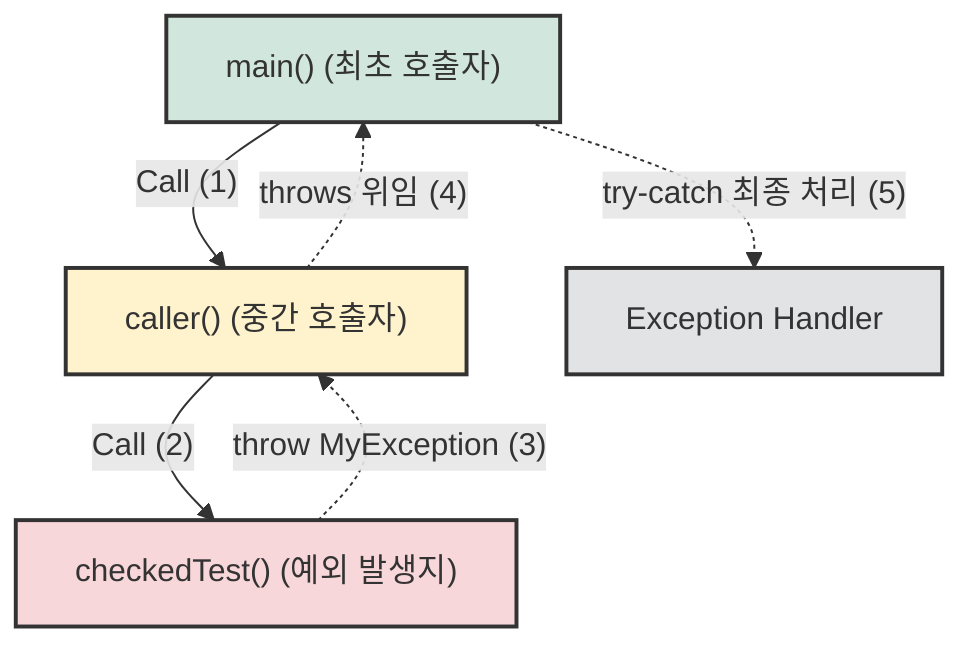

## 1. 개요

Java에서 예외 처리는 애플리케이션의 안정성을 보장하는 핵심 메커니즘이다. 특정 메서드 내부에서 발생할 수 있는 예외를 직접 처리(`try-catch`)하지 않고, 해당 메서드를 호출한 상위 호출자(Caller)에게 처리를 위임하는 방식이 존재한다. 이때 사용하는 키워드가 바로 `throws`다.

`throws`를 사용하면 컴파일 타임에 Checked Exception[^1] 처리를 문법적으로 강제할 수 있으며, 콜 스택을 따라 예외를 상위로 전파(Propagation)하여 가장 적절한 계층에서 일괄적으로 예외를 처리하도록 구조화할 수 있다.

## 2. 예외 전파 메커니즘 및 아키텍처

예외는 발생한 지점에서 처리되지 않으면, 메서드 호출의 역순으로 콜 스택을 타고 상위 호출자에게 전달된다. 이를 **예외 전파(Exception Propagation)**라고 한다.



* **`checkedTest()`**: 예외가 실제로 발생하는(throw) 지점이다. 직접 처리하지 않고 시그니처에 `throws MyException`을 선언하여 책임을 떠넘긴다.
* **`caller()`**: 중간 계층의 메서드 역시 예외를 처리하기 번거롭다면 `throws`를 통해 다시 상위로 예외를 던질 수 있다.
* **`main()`**: 콜 그래프 상의 최초 호출자로, 최종적으로 `try-catch` 블록을 작성하여 예외 상황을 안전하게 복구하거나 로깅해야 한다.

> **Deep Dive: 예외 생성 비용과 JVM 스택 트레이스**
> 
> 예외를 발생시킬 때(`throw new Exception()`) JVM 내부에서는 현재 스레드의 콜 스택 정보를 추적하여 담는 `fillInStackTrace()` 메서드가 실행된다. 이 작업은 애플리케이션의 실행 흐름을 역추적하여 메모리 구조(Call Stack)[^2]를 순회해야 하므로 상당히 무거운 연산이다. 따라서 비즈니스 흐름 제어 목적으로 예외를 남용하면 심각한 성능 저하를 초래할 수 있다.
{: .prompt-info }

> **주의:** 상위 메서드로 무분별하게 예외를 던지기 위해 `throws Exception`과 같이 최상위 클래스를 선언하는 것은 안티 패턴이다. 호출자는 어떤 구체적인 예외가 발생하는지 알 수 없어 적절한 복구 전략을 세울 수 없게 된다.
{: .prompt-warning }

## 3. 구현 (Java)

실제 실무와 유사하게, 입력값 검증 과정에서 발생하는 사용자 정의 예외를 선언하고 이를 상위로 전파하는 구조를 구현한다.

```java
// 1. 사용자 정의 Checked Exception 작성
class MyException extends Exception {
    private String msg;

    MyException(String param) {
        super(param); // 상위 Exception 클래스의 메시지로도 전달
        this.msg = param;
    }

    public String getMsg() {
        return msg;
    }
}

public class Main {
    
    // 2. 예외 발생 메서드: 처리를 Caller에게 위임 (throws)
    static void checkedTest() throws MyException {
        int input = 110;
        
        // 비즈니스 로직 검증: 범위를 벗어나면 예외를 발생시킴
        if (input < 0 || input > 100) {
            throw new MyException("입력값 범위를 초과했습니다 (0~100).");
        }
    }

    // 3. 중간 호출자 메서드: 예외를 직접 처리하지 않고 다시 위임 (throws)
    static void caller() throws MyException {
        // 하위 메서드 호출 시 컴파일러가 예외 처리를 강제함
        // try-catch가 없으므로 다시 메서드 시그니처에 throws 선언 필요
        checkedTest(); 
    }

    // 4. 최초 호출자 (최종 예외 처리)
    public static void main(String[] args) {
        try {
            caller(); // 이 지점에서 예외가 캡처됨
        } catch (MyException e) {
            // 예외 복구 및 로깅
            System.out.println("[예외 처리됨] " + e.getMsg());
        }
    }
}

```

> **Tip:** 예외 처리를 강제하는 Checked Exception이 코드의 생산성을 떨어뜨린다고 판단될 경우, 예외를 런타임 예외(Unchecked Exception)로 래핑(`throw new RuntimeException(e)`)하여 던지는 전략을 많이 사용한다. 최근 Spring Framework 등도 대부분 RuntimeException 기반으로 구성되어 있다.
{: .prompt-tip }

---

## 💡 Quiz: 학습 내용 확인하기

**Q1. `throws` 키워드를 통해 예외를 상위 호출자로 계속해서 위임(떠넘기기)할 수 있다. 만약 최초 호출자인 `main()` 메서드에서조차 예외를 처리하지 않고 `throws` 한다면 최종적으로 어떤 일이 발생하는가?**

<details>
<summary>정답 확인</summary>
<div>
예외가 최종적으로 JVM의 기본 예외 처리기(Default Exception Handler)로 전달되어 애플리케이션의 콜 스택 트레이스를 콘솔에 출력하고, 프로그램이 비정상 종료(Crash)된다.
</div>
</details>

**Q2. Checked Exception이 발생할 수 있는 메서드를 호출하면서, 내부에서 `try-catch`로 처리하지도 않고 메서드 시그니처에 `throws`도 선언하지 않으면 어떤 문제가 발생하는가?**

<details>
<summary>정답 확인</summary>
<div>
컴파일러가 예외 처리 누락을 감지하여 unreported exception 에러를 발생시키며, 프로그램의 컴파일 자체가 실패한다.
</div>
</details>

[^1]:**Checked Exception**: `RuntimeException`을 상속하지 않는 예외. 컴파일러가 컴파일 타임에 예외 처리(`try-catch` 또는 `throws`) 여부를 강제 검사하므로 문법적으로 처리가 누락될 수 없다.

[^2]:**Call Stack**: 프로그램에서 현재 실행 중인 서브루틴에 관한 정보를 저장하는 스택 자료구조. 메서드가 호출될 때마다 스택 프레임이 생성되어 쌓이고, 메서드가 종료되거나 예외를 던지면 Pop 된다.