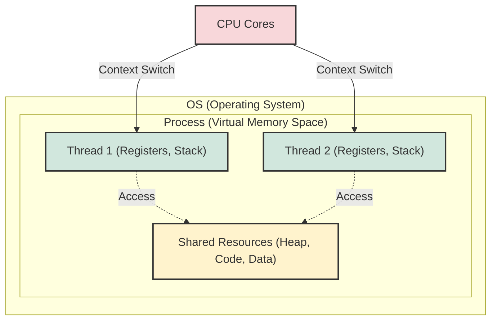
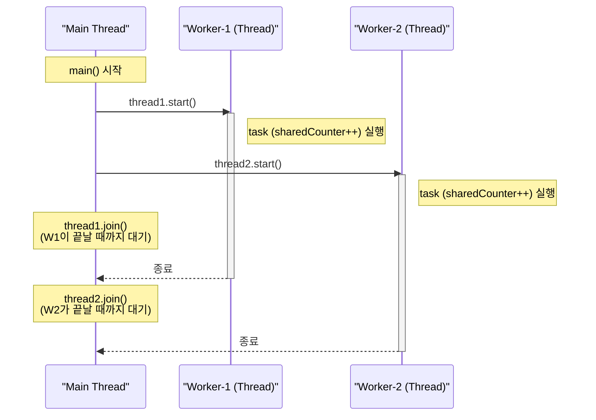
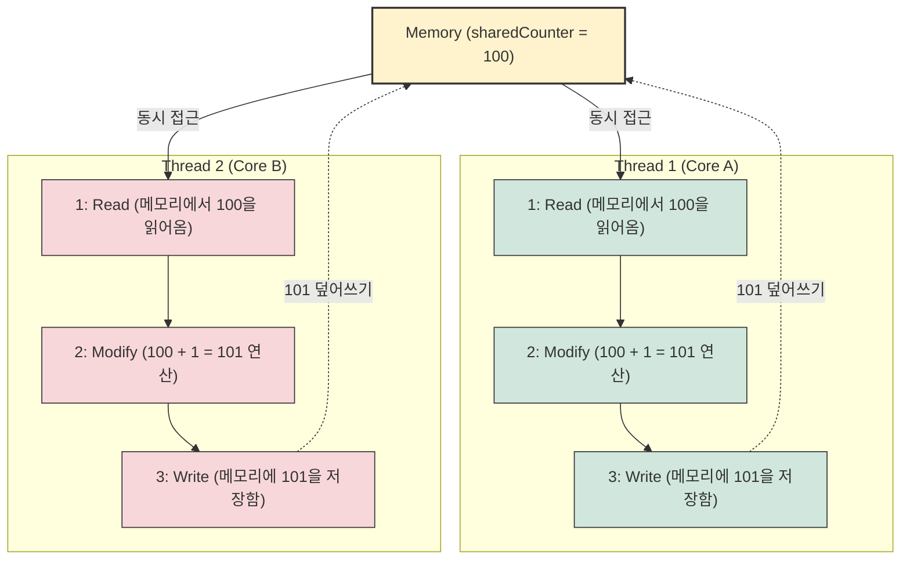
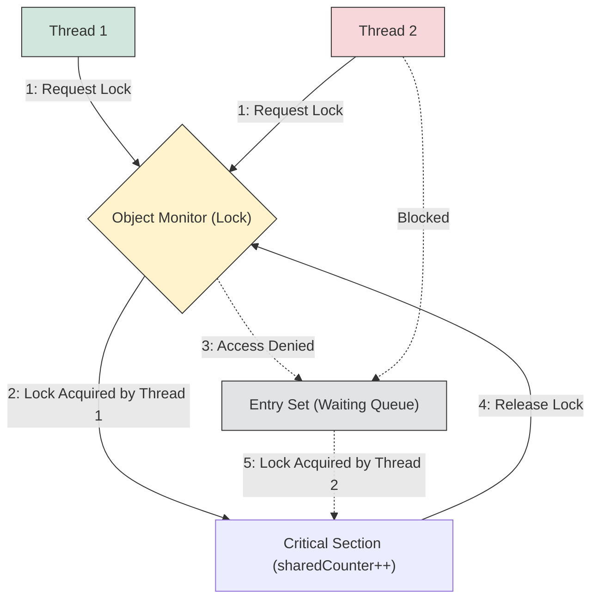

### 1. 개요: CPU 관점에서의 "실행"

소프트웨어 개발자에게 프로그램의 "실행"은 보통 애플리케이션의 시작을 의미하지만, 하드웨어(CPU) 관점으로 내려가면 이는 **명령어(Instruction)를 메모리에서 가져와 연산을 수행하는 연속적인 과정**을 뜻한다. 이 연산은 한 번에 끝나지 않으며, 값을 계산하고 조건에 따라 분기하며 순차적으로 이어지는 절차적 흐름을 형성한다. 이 논리적인 실행 흐름의 최소 단위가 바로 스레드(Thread)다.

자바(Java) 애플리케이션을 구동할 때 기본적으로 할당되는 `main()` 메서드 역시 하나의 스레드(Main Thread) 위에서 동작한다. 멀티스레딩(Multi-threading)은 이러한 단일 흐름을 N개로 분기시켜 동시다발적인 작업을 처리하는 핵심 기술이다.

## 2. 아키텍처 및 동작 원리: 프로세스와 스레드

스레드의 동작을 명확히 이해하기 위해서는 그들이 존재하는 환경인 **프로세스(Process)** 의 구조를 먼저 파악해야 한다.



### 2.1 프로세스: OS가 관리하는 독립된 공간

프로그램을 실행하면 디스크(2차 저장소)에 있던 코드가 RAM에 적재되고, CPU가 연산을 시작한다. 이 “실행 중인 프로그램의 인스턴스”가 바로 프로세스다. 프로세스는 운영체제(OS)로부터 다음 두 가지를 할당받는다.

1. **독립적인 가상 메모리 공간(Virtual Memory Space)**[^1]
2. 파일, 네트워크, 장치 등 시스템 자원에 대한 **접근 권한**

각 프로세스는 철저히 격리(Isolation)되어 있다. 프로세스 A가 프로세스 B의 메모리를 침범하려 하면 OS는 이를 즉시 차단하며(Segmentation Fault), 이 강력한 격리가 시스템의 안전성을 보장한다.

### 2.2 스레드: 공유 공간 안의 독립적 실행 흐름

스레드는 프로세스라는 "집" 안에서 움직이는 "사람"과 같다. 프로세스 내에 존재하는 여러 스레드는 자신만의 실행 문맥을 유지하기 위해 스택(Stack)과 레지스터(Register) 상태만 독립적으로 가질 뿐, **힙(Heap) 메모리, 데이터(Data), 코드(Code) 영역은 모두 공유**한다.

혼자 사는 집(싱글 스레드)은 규칙이 필요 없지만, 여러 사람이 한 집에 살며 거실이나 주방 등 **공유 자원(Shared Resource)** 을 동시에 사용하려면 충돌을 막기 위한 규칙(동기화)이 반드시 필요해진다.

> **Deep Dive: TCB (Thread Control Block)와 PCB (Process Control Block)**
> 
> OS는 프로세스 관리를 위해 PCB를, 스레드 관리를 위해 TCB를 유지한다. 프로세스 간 전환(IPC)은 가상 메모리 맵 전체를 교체해야 하므로 비용이 크지만, 스레드 간 전환 시에는 TCB 정보(레지스터 상태, 프로그램 카운터, 스택 포인터)만 교체하면 되므로 상대적으로 가볍다.
{: .prompt-info }

## 3. 컨텍스트 스위칭 (Context Switching)의 명암

현대의 OS는 한정된 CPU 코어를 가지고 수천 개의 스레드를 동시에 실행하는 것처럼 보이게 한다. 코어 수보다 스레드가 많음에도 동시성(Concurrency)이 가능한 이유는 CPU를 **번갈아(Time-slicing)** 쓰기 때문이다.

한 스레드가 CPU를 점유하다가 대기 상태로 밀려나고, 다른 스레드가 실행을 이어받는 과정을 **컨텍스트 스위칭(Context Switching)** 이라고 한다. 이때 멈춘 스레드가 나중에 연산을 재개하기 위해서는 **이전에 어디까지 연산했는지에 대한 현재까지의 CPU 레지스터 값과 스택 포인터 상태를 메모리에 저장**하고, 새로 실행될 스레드의 상태를 복원해야 한다.

> **주의:** 상태를 저장하고 복원하는 컨텍스트 스위칭은 애플리케이션의 비즈니스 연산이 아닌 단순 "관리 비용"이다. 스레드 개수가 무분별하게 늘어나면 CPU는 실제 작업보다 스레드 상태를 교체하는 데 더 많은 시간을 소모하게 되어 전체적인 시스템 성능이 크게 저하된다 (Thrashing 현상).
{: .prompt-warning }

## 4. 공유 자원 문제 (Race Condition) 예제

흐름이 1개에서 2개 이상으로 늘어날 때 개발자가 직면하는 가장 큰 문제는 **공유 자원 접근 시의 데이터 오염**이다.

```java
public class ThreadConcurrencyExample {
    // 힙(Heap) 영역에 존재하는 공유 자원
    private static int sharedCounter = 0;

    public static void main(String[] args) throws InterruptedException {
        Runnable task = () -> {
            for (int i = 0; i < 10000; i++) {
                // 원자적(Atomic)이지 않은 연산: 읽기 -> 수정 -> 쓰기 3단계로 이루어짐
                sharedCounter++; 
            }
        };

        Thread thread1 = new Thread(task, "Worker-1");
        Thread thread2 = new Thread(task, "Worker-2");

        thread1.start(); // 첫 번째 스레드 실행
        thread2.start(); // 두 번째 스레드 실행

        // 메인 스레드가 worker 스레드들의 종료를 대기
        thread1.join();
        thread2.join();

        // 기대값은 20000이지만, 실제 결과는 매번 다르며 더 작게 나온다.
        System.out.println("최종 카운터 값: " + sharedCounter);
    }
}

```

위 코드에서 기대값은 `20000`이지만 실제로는 그보다 훨씬 작은 값이 출력된다. 스레드 1이 값을 읽고 1을 더해 메모리에 쓰기 직전에 스레드 2가 예전 값을 읽어버리면 연산 결과가 덮어씌워지는(Lost Update) **경쟁 조건(Race Condition)** 이 발생하기 때문이다.

그렇다면 이 코드에서 `thread1.start()`와 `thread2.start()`가 호출되었을 때, 내부적으로 어떤 일이 일어나길래 두 코드가 '동시에' 실행되어 충돌을 일으킨 것일까?

## 5. `Thread.start()`의 진실: 새로운 "실행 흐름"의 탄생

결론부터 얘기하자면, **`start()`가 호출된다고 해서 현재의 `main` 메서드가 순차적으로 로직을 실행하는 것이 아니다.**

`thread1.start()`가 호출되는 순간, 메인 스레드와는 완전히 독립된 **새로운 실행 줄기(Worker Thread)**가 생겨나고, 그 줄기 위에서 우리가 정의한 `task`(Runnable) 내부의 코드가 돌아가기 시작한다.

### 5.1 실행 흐름 시각화 (Main vs Worker)

앞선 예제 코드의 실행 흐름은 아래와 같이 갈라진다.



`start()` 메서드가 내부적으로 수행하는 가장 중요한 작업은 **새로운 호출 스택(Call Stack)을 생성**하는 것이다[^2].
메인 스레드는 `thread1.start()`를 통해 JVM에게 새로운 스택을 만들어달라고 요청한 뒤, **결과를 기다리지 않고 즉시 다음 줄인 `thread2.start()`로 넘어간다(비동기성).** 새롭게 생성된 스택들 위에서 `task.run()`이 각각 병렬적으로 실행되므로, 같은 시간대에 하나의 힙 메모리(`sharedCounter`)를 동시에 수정하는 사태가 벌어진 것이다.

> **Deep Dive: start() vs run()**
> 
> 만약 앞선 예제에서 `thread1.start()` 대신 `thread1.run()`을 호출했다면 어떻게 되었을까?
> 이때는 새로운 스택(스레드)이 만들어지지 않는다. 메인 스레드 위에서 `run()` 메서드의 로직을 순차적으로 끝까지 실행한 뒤에야 다음 코드로 넘어가므로 멀티스레딩 자체가 성립하지 않으며, 동기화 문제도 발생하지 않는다.
{: .prompt-info }

## 6. `++` 연산의 숨겨진 함정 (Lost Update)

`Thread.start()`로 인해 두 스레드가 동시에 실행된다는 것은 알았다. 그렇다면 소스 코드상으로는 단 한 줄인 `sharedCounter++`가 왜 동시에 실행될 때 문제를 일으킬까?

이는 자바의 `++` 연산자가 원자적(Atomic, 더 이상 쪼갤 수 없는 단일 연산)이지 않으며, 내부적으로 **3단계의 기계어 명령**으로 쪼개져서 실행되기 때문이다.

### 6.1 `++` 연산의 3단계 (Read-Modify-Write)

CPU는 연산을 위해 메모리에 있는 값을 곧바로 수정하지 못하고 자신의 내부 임시 저장소인 '레지스터(Register)'로 가져와야 한다.

1. **Read (읽기)**: 메모리(RAM)에 있는 `sharedCounter`의 현재 값을 CPU 레지스터로 가져온다.
2. **Modify (수정)**: CPU 내부의 연산 장치(ALU)를 사용하여 레지스터의 값에 1을 더한다.
3. **Write (쓰기)**: 연산이 끝난 새로운 값을 다시 메모리(RAM)의 `sharedCounter` 위치에 덮어쓴다.

### 6.2 덮어쓰기 문제 시각화

두 개의 스레드가 거의 동시에 동작할 때, 연산 중간에 흐름이 겹치면 아래와 같은 현상이 발생한다. 현재 `sharedCounter` 값이 `100`이라고 가정해 보자.



Thread 1이 `101`을 만들어 메모리에 쓰기 직전에, Thread 2도 과거의 데이터인 `100`을 읽어버린다. 결국 스레드는 2번 동작했지만 메모리에 저장된 최종 값은 `102`가 아닌 `101`이 되어버리며, 이를 **Lost Update(업데이트 손실)** 라고 부른다.

> **Deep Dive: 싱글 코어에서의 컨텍스트 스위칭**
> 
> 물리적인 CPU 코어가 하나뿐인 환경이라도 이 문제는 똑같이 발생한다. Thread 1이 'Read'와 'Modify'까지만 수행한 상태에서 운영체제(OS)가 CPU 점유권을 빼앗아 Thread 2에게 넘겨버리는(Context Switch) 상황이 수시로 발생하기 때문이다.
{: .prompt-info }

## 7. 해결책: `synchronized`를 통한 모니터 동기화

결국 앞선 문제는 Read, Modify, Write의 3단계 과정이 진행되는 동안 **"그 누구도 중간에 난입할 수 없도록 문을 잠가야만"** 해결된다.

### 7.1 `synchronized`의 동작 원리: 모니터 락(Monitor Lock)

자바의 모든 객체는 내부에 고유한 락(Intrinsic Lock, Monitor Lock)을 하나씩 가지고 있다. `synchronized` 키워드를 사용하면 특정 스레드가 임계 구역(Critical Section)에 들어갈 때 이 모니터 락을 획득하고, 임무를 마치면 반납하도록 강제할 수 있다.



### 7.2 동기화가 적용된 안전한 코드

문제의 코드를 `synchronized`를 사용하여 안전하게 수정해 보자.

```java
public class ThreadSynchronizedExample {
    private static int sharedCounter = 0;
    // 동기화를 위한 전용 락 객체 생성
    private static final Object lock = new Object();

    public static void main(String[] args) throws InterruptedException {
        Runnable task = () -> {
            for (int i = 0; i < 10000; i++) {
                // 임계 구역 설정: lock 객체의 모니터를 획득한 스레드만 진입 가능
                synchronized (lock) {
                    sharedCounter++; 
                }
            }
        };

        Thread thread1 = new Thread(task, "Worker-1");
        Thread thread2 = new Thread(task, "Worker-2");

        thread1.start();
        thread2.start();

        thread1.join();
        thread2.join();

        // 락을 통해 한 번에 하나의 스레드만 접근함이 보장되므로 항상 20000이 출력된다.
        System.out.println("최종 카운터 값: " + sharedCounter);
    }
}

```

> **위험:** 과도한 `synchronized` 사용은 컨텍스트 스위칭 대기 시간을 기하급수적으로 증가시켜 성능 병목(Bottleneck)의 주범이 될 수 있으므로, 반드시 필요한 임계 구역(Block)에만 최소한으로 적용해야 한다.
{: .prompt-danger }

> **Tip:** 성능이 중요한 환경에서는 `synchronized` 대신 논블로킹(Non-blocking) 알고리즘인 CAS(Compare-And-Swap) 연산을 기반으로 동작하는 `java.util.concurrent.atomic.AtomicInteger` 클래스의 사용을 적극 권장한다.
{: .prompt-tip }

---

## 💡 Quiz: 학습 내용 확인하기

**Q1. 여러 스레드가 동시에 공유 변수에 접근하여 연산할 때 데이터가 훼손되는 현상을 무엇이라고 부르는가?**

<details>
<summary>정답 확인</summary>
<div>
경쟁 조건 (Race Condition)
</div>
</details>

**Q2. `Thread.start()` 호출 직후, 메인 스레드가 `thread1`의 작업 완료를 기다리지 않고 즉시 다음 라인을 실행할 수 있는 핵심적인 이유는 무엇인가?**

<details>
<summary>정답 확인</summary>
<div>
start() 메서드는 새로운 호출 스택(Call Stack)을 생성하여 비동기적으로 실행 흐름을 분기하라는 명령만 내리고 즉시 반환(Return)되기 때문입니다.
</div>
</details>

**Q3. `thread1.start()` 대신 `thread1.run()`을 직접 호출했을 때 발생하는 현상을 실행 스택(Call Stack) 관점에서 설명하시오.**

<details>
<summary>정답 확인</summary>
<div>
새로운 호출 스택이 생성되지 않으며, 현재 실행 중인 메인 스레드의 호출 스택 위에서 run() 메서드가 단순한 동기적 메서드로서 순차적으로 실행됩니다. 즉, 멀티스레딩이 작동하지 않습니다.
</div>
</details>

**Q4. 단순해 보이는 `++` 연산자에서 'Lost Update'가 발생하는 하드웨어(CPU) 수준의 근본적인 이유는 무엇인가?**

<details>
<summary>정답 확인</summary>
<div>
++ 연산은 단일 명령이 아니라 내부적으로 메모리에서 값을 레지스터로 읽어오는(Read), 1을 더하는(Modify), 다시 메모리에 저장하는(Write) 3단계로 이루어져 원자성(Atomicity)을 보장하지 않기 때문입니다.
</div>
</details>

**Q5. `synchronized` 블록에 진입하지 못하고 대기 중인 스레드들은 객체의 어떤 메커니즘에 의해 제어되는가?**

<details>
<summary>정답 확인</summary>
<div>
객체의 고유 락(Intrinsic Lock) 또는 모니터 락(Monitor Lock) 메커니즘에 의해 제어되며, 락을 획득하지 못한 스레드는 Entry Set(대기열)에서 블로킹 상태로 대기하게 됩니다.
</div>
</details>

---

[^1]: 가상 메모리 공간(Virtual Memory Space): 운영체제가 물리적 RAM의 한계를 극복하고 각 프로세스에게 연속적이고 고유한 메모리 주소를 제공하는 것처럼 추상화한 논리적 메모리 영역이다.

[^2]: 호출 스택(Call Stack): 스레드가 메서드를 호출할 때마다 로컬 변수와 복귀 주소 등을 저장하는 독립적인 메모리 공간이다. 스레드마다 하나씩 독립적으로 할당되어 병렬 처리를 가능하게 한다.