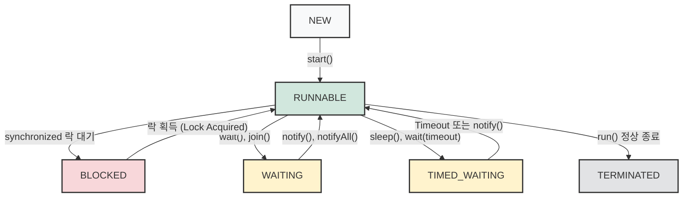

## 1. 개요

Java 애플리케이션에서 스레드(Thread)는 CPU 자원을 할당받아 명령을 실행하는 가장 작은 작업의 단위다. 멀티스레딩 환경을 구축할 때 스레드 생성 자체는 비교적 간단하지만, 동기화(Synchronization)와 상태 제어를 완벽히 다루는 것은 매우 까다롭다. 오늘은 스레드에 부여되는 핵심 속성들을 살펴보고, 스레드가 생성되어 소멸하기까지의 생명주기(Lifecycle) 및 동기화 과정에서 락(Lock)을 획득하는 원리를 알아보자.

## 2. 스레드의 핵심 속성 (Thread Attributes)

스레드 객체가 생성되면 JVM은 해당 스레드를 식별하고 스케줄링하기 위해 여러 가지 속성을 부여한다.

* **ID (식별자)**: 스레드가 생성될 때 부여되는 고유한 양의 정수 값이다. `getId()` 메서드를 통해 확인할 수 있으며, 멀티스레드 환경에서 발생한 오류나 교착 상태(Deadlock)를 디버깅할 때 스레드를 추적하는 중요한 단서가 된다.
* **Name (이름)**: 스레드의 목적을 명시할 수 있는 문자열 속성이다. 기본적으로 `Thread-0`, `Thread-1` 형태로 부여되지만, `setName()` 메서드를 통해 명시적으로 지정하는 것이 디버깅 관점에서 권장된다.
* **Priority (우선순위)**: CPU 자원 할당의 빈도를 결정하는 값이다. `Thread.MIN_PRIORITY`(1)부터 `Thread.MAX_PRIORITY`(10)까지 지정할 수 있으며 기본값은 `Thread.NORM_PRIORITY`(5)다.

> **Deep Dive: JVM 스레드 스케줄링과 우선순위**
> 
> Java의 스레드 스케줄링 정책은 운영체제(OS)가 아닌 JVM이 주도적으로 결정한다[^1]. 하지만 최신 JVM 구현체(HotSpot)는 대부분 Java 스레드를 OS의 네이티브 스레드(Native Thread)에 1:1로 매핑한다. 따라서 Java 코드 레벨에서 스레드의 우선순위를 극단적으로 높인다 하더라도, 최종적인 CPU 할당은 기반 OS의 스케줄러 정책에 종속된다. 특별한 성능 최적화의 이유가 없다면 우선순위는 기본값(`NORM_PRIORITY`)을 유지하는 것이 기아 상태(Starvation)를 방지하는 최선의 방법이다.
{: .prompt-info }

## 3. 스레드 생명주기와 상태 전이 (Lifecycle & State Transition)

스레드는 생성부터 소멸까지 명확한 상태(State)를 가지며, JVM의 통제하에 상태 전이가 일어난다. `java.lang.Thread.State` Enum에 정의된 주요 상태는 다음과 같다.



1. **NEW (생성)**: `new Thread()` 연산을 통해 객체가 생성되었지만, 아직 `start()`가 호출되지 않은 상태.
2. **RUNNABLE (실행 대기/실행 중)**: `start()`가 호출되어 스케줄러의 실행 대기열(Queue)에 진입한 상태다. CPU를 점유하여 실제 실행 중이거나, 실행을 기다리는 상태를 모두 포괄한다.
3. **BLOCKED (차단됨)**: 동기화 블록(`synchronized`)에 진입하기 위해 모니터 락(Monitor Lock)을 얻기 위해 대기하는 상태다.
4. **WAITING / TIMED_WAITING (대기)**: 다른 스레드가 특정 작업을 완료하기를 기다리거나(`join`), 정해진 시간 동안 일시 정지(`sleep`)된 상태다. 이 상태에서는 CPU 자원을 전혀 소모하지 않는다.
5. **TERMINATED (종료)**: `run()` 메서드의 실행이 완료되어 흐름이 끝난 상태다. 이후 가비지 컬렉터(GC)에 의해 메모리에서 회수된다.

> **Tip:** 매번 스레드를 `NEW` 상태로 생성하고 `TERMINATED`로 파괴하는 것은 상당한 시스템 오버헤드를 발생시킨다. 실무에서는 이러한 생성/소멸 비용을 줄이기 위해 스레드를 미리 생성해 두고 재사용하는 **스레드 풀(Thread Pool)** 아키텍처를 도입하는 것이 표준이다.
> {: .prompt-tip }

## 4. 동기화와 락(Lock) 획득 메커니즘

멀티스레드 환경에서는 여러 스레드가 동시에 공유 자원에 접근할 때 발생하는 동시성 문제를 해결해야 한다. 이를 위해 Java는 `synchronized` 예약어를 제공한다.

`synchronized` 블록이나 메서드에 진입하려는 스레드는 반드시 해당 객체의 **모니터 락(Monitor Lock)**을 획득해야 한다. 화장실(공유 자원)에 들어가기 위해 문을 잠그는(Lock) 행위와 동일하다. 락을 획득한 오직 단 하나의 스레드만 독점적으로 코드를 실행할 수 있으며, 나머지 스레드들은 앞선 스레드가 락을 반환할 때까지 **BLOCKED** 상태로 멈춰서 기다리게 된다.

> **위험:** 스레드 간의 실행 순서를 강제하거나 동기화를 구현하기 위해 `Thread.sleep()`을 사용하는 것은 매우 위험한 안티 패턴(Anti-Pattern)이다. 정확한 타이밍을 보장할 수 없으며 시스템 부하에 따라 예기치 않은 오류(Data Race)를 유발할 수 있다.
> {: .prompt-danger }

## 5. 구현 예제 (Java)

```java
// 1. Thread 클래스를 상속받아 새로운 스레드 클래스 정의
class WorkerThread extends Thread {
    
    // 생성자를 통해 스레드의 이름을 지정
    public WorkerThread(String name) {
        super(name); 
    }

    // start()가 호출되면 스케줄러에 의해 비동기적으로 실행될 내용 (알바생의 작업 매뉴얼)
    @Override
    public void run() {
        Thread current = Thread.currentThread();
        System.out.println("[" + current.getName() + "] 실행 시작. (ID: " + current.getId() + ")");
        
        try {
            // 상태 전이: RUNNABLE -> TIMED_WAITING
            // CPU 자원을 내려놓고 0.5초(500ms) 동안 대기한다.
            // 이 멈춤은 Main 스레드의 진행에 아무런 영향을 주지 않는다.
            Thread.sleep(500);
            
            // 0.5초 뒤 다시 잠에서 깨어나 남은 작업을 수행한다.
            System.out.println("[" + current.getName() + "] 0.5초 대기 후 작업 완료.");
        } catch (InterruptedException e) {
            // 대기 중 누군가 강제로 깨우면(Interrupt) 발생하는 예외 처리
            current.interrupt();
        }
    }
}

public class ThreadLifecycleDemo {

    public static void main(String[] args) {
        // [메인 스레드 흐름]
        Thread mainThread = Thread.currentThread();
        mainThread.setName("Main-Thread");
        
        System.out.println("[" + mainThread.getName() + "] 프로그램 시작 (ID: " + mainThread.getId() + ")");

        // 1. 객체 생성 (NEW 상태)
        // 아직 일은 시작하지 않았고, 'Worker-Thread'라는 이름표를 단 객체만 존재한다.
        WorkerThread worker = new WorkerThread("Worker-Thread");

        // 2. 스레드 실행 (RUNNABLE 상태로 전이)
        // 이 지점(start)을 기점으로 메인 스레드와 워커 스레드는 '독립적인 평행우주'로 분리된다.
        worker.start();

        // 3. 메인 스레드의 직진
        // 메인 스레드는 워커 스레드가 sleep(500)을 하든 말든 기다리지 않고 자신의 다음 코드를 즉시 실행한다.
        // 따라서 콘솔 화면에는 워커의 "작업 완료"보다 이 문장이 무조건 '먼저' 출력된다.
        System.out.println("[" + mainThread.getName() + "] 로직 종료. (하지만 Worker가 끝날 때까지 프로그램은 종료되지 않음)");
    }
}
```

### 💡 코드 흐름 분석 (출력 결과)

이 코드를 실행하면 콘솔에는 아래와 같은 순서로 출력된다. 주석에 적힌 대로, 위에서 아래로 흐르는 일반적인 동기식 코드와 완전히 다른 **멀티스레딩의 특징**을 정확히 보여준다.

```text
[Main-Thread] 프로그램 시작 (ID: 1)
[Main-Thread] 로직 종료. (하지만 Worker가 끝날 때까지 프로그램은 종료되지 않음)
[Worker-Thread] 실행 시작. (ID: 22)
( ... 0.5초 대기 ... )
[Worker-Thread] 0.5초 대기 후 작업 완료.
```

*(참고: 워커 스레드의 "실행 시작" 출력은 OS의 스케줄링 타이밍에 따라 Main의 "로직 종료"보다 아주 미세하게 먼저 출력될 수도 있고 늦게 출력될 수도 있다. 하지만 `sleep` 이후에 동작하는 "작업 완료"는 무조건 Main 이후에 출력된다.)*

위 코드를 실행하면 JVM에 의해 메인 스레드와 워커 스레드가 각기 다른 ID를 부여받고 병렬로 동작하는 것을 확인할 수 있다. 워커 스레드가 `sleep()`에 의해 대기 상태(`TIMED_WAITING`)에 빠지는 동안, 메인 스레드의 남은 로직은 중단 없이 실행된다.

---

## 💡 Quiz: 학습 내용 확인하기

**Q1. Java에서 스레드의 우선순위(Priority)를 결정하고 스케줄링을 주도하는 1차적인 주체는 무엇인가?**

<details>
<summary>정답 확인</summary>
<div>
JVM (Java Virtual Machine) 내부에 존재하는 스레드 스케줄러가 1차적으로 결정한다.
</div>
</details>

**Q2. 여러 스레드가 공유 자원에 동시 접근하는 것을 막기 위해 `synchronized` 블록을 사용했다. 이때 락(Lock)을 획득하지 못하고 대기열에 빠진 스레드의 상태(Thread.State)는 무엇인가?**

<details>
<summary>정답 확인</summary>
<div>
BLOCKED 상태가 된다. 해당 스레드는 락이 반환될 때까지 CPU 자원을 점유하지 않고 대기한다.
</div>
</details>

[^1]:Java 플랫폼은 OS에 독립적인 특징을 지니지만, 하위 레벨의 스레드 스케줄링 타임 슬라이스(Time Slice) 제어는 최종적으로 호스트 OS 커널의 컨텍스트 스위칭 정책을 따른다.