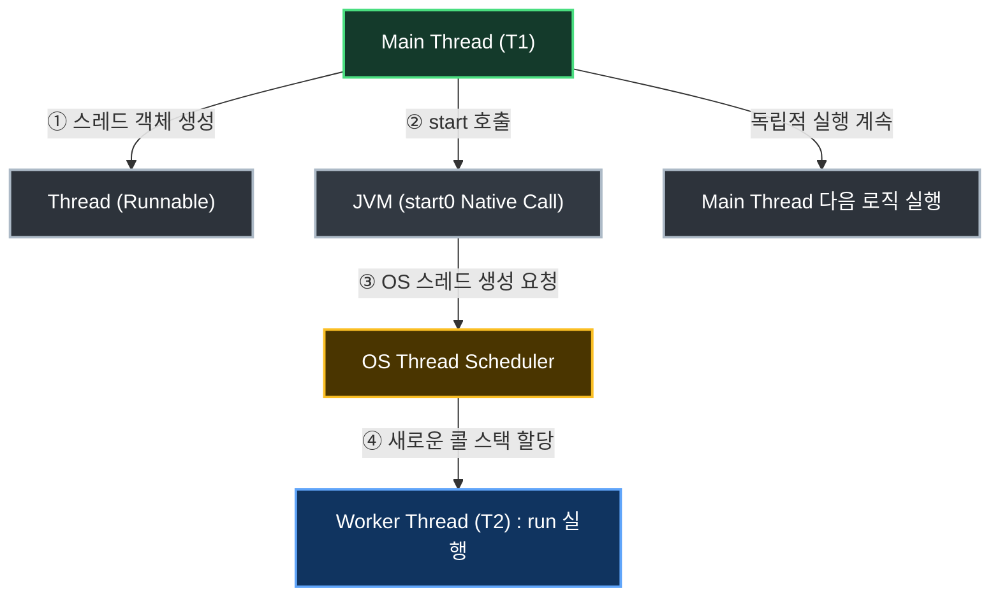

## 1. 개요

Java 애플리케이션을 실행하면 기본적으로 `main` 메서드를 진입점(Entry Point)으로 하는 하나의 연산 흐름이 생성된다. 이를 **메인 스레드(Main Thread)**라고 부른다. 절차적 흐름에 따라 `main` 메서드의 블록이 끝나면 애플리케이션은 종료된다.

하지만 병렬 처리가 필요한 경우, 메인 스레드 외에 별도의 작업 흐름을 만들어야 한다. 이러한 별도의 흐름을 **작업 스레드(Worker Thread)**라고 하며, 두 개 이상의 스레드가 실행되는 환경을 멀티스레딩(Multi-threading)이라고 한다.

## 2. 아키텍처 및 동작 원리

스레드는 단순히 객체를 생성(`new`)한다고 해서 바로 실행되는 것이 아니다. 생성된 스레드 객체는 JVM과 OS의 스레드 스케줄러[^1]의 상호작용을 통해 제어되며, 특정 시점에 실행 상태로 전환된다.



> **Deep Dive: start() 메서드 내부에서는 무슨 일이 일어날까?**
> 
> 가장 많이 하는 오해는 `start()` 메서드 내부에 단순히 `run()`을 호출하는 코드가 들어있을 것이라는 착각이다. 만약 `start()` 내부에서 직접 `run()`을 호출한다면, 이는 새로운 스레드를 생성하는 것이 아니라 기존의 메인 스레드에서 일반 메서드를 순차적으로 실행하는 것에 불과하다.
> 실제 `Thread` 클래스의 `start()` 내부 로직은 다음과 같이 동작한다.
> 
> 1. 스레드 상태를 검증한다. (이미 실행 중인 스레드인지 확인)
> 2. JNI(Java Native Interface)[^2]를 통해 C/C++로 작성된 **`start0()`**이라는 Native 메서드를 호출한다.
> 3. JVM은 커널에게 실제 OS 레벨의 새로운 스레드 생성을 요청한다.
> 4. OS 스케줄러에 의해 새로운 스레드가 생성되고 메모리(콜 스택)가 할당되면, 그제서야 **JVM이 새로운 스레드의 콜 스택 위에서 `run()` 메서드를 호출**하여 흐름을 시작한다.
> 
> 즉, `start()`는 `run()`을 직접 품고 실행하는 것이 아니라, **OS에게 새로운 스레드 생성을 위임하고 준비가 끝났을 때 `run()`이 실행되도록 연결해 주는 방아쇠(Trigger) 역할**을 한다.
{: .prompt-info }

> **start() 대신 run()을 직접 호출하는 실수**
> 
> 위 원리에 따라 스레드 객체의 `run()` 메서드를 직접 호출하면 JNI를 통한 스레드 생성 과정(`start0()`)이 생략된다. 결국 메인 스레드가 블로킹(Blocking)된 상태로 단순 동기 연산만 수행하게 되므로 병렬 처리가 불가능해진다.
{: .prompt-danger }

## 3. 구현 (Java)

Java에서 스레드를 생성하는 방법은 크게 `Thread` 클래스를 상속받는 방법과 `Runnable` 인터페이스를 구현하는 방법이 있다. 실무에서는 다중 상속의 제약을 피하고 객체지향적인 설계를 위해 **`Runnable` 인터페이스 구현**을 권장한다.

### 3.1. 익명 객체 및 람다식을 활용한 구현

매번 클래스를 정의하는 것이 번거롭다면, Java 8부터 지원하는 람다식(Lambda Expression)을 사용하여 간결하게 표현할 수 있다.

```java
public class LambdaThreadApp {
    public static void main(String[] args) {
        System.out.println("메인 스레드 시작: " + Thread.currentThread().getName());
        
        // 1. 람다식을 활용한 Runnable 작업 정의 및 스레드 생성
        Thread workerThread = new Thread(() -> {
            System.out.println("작업 스레드 실행 중: " + Thread.currentThread().getName());
            try {
                // 스레드를 500ms 동안 대기 상태(TIMED_WAITING)로 전환
                Thread.sleep(500);
            } catch (InterruptedException e) {
                // 인터럽트 발생 시 스레드 상태 복구
                Thread.currentThread().interrupt();
            }
            System.out.println("작업 스레드 완료");
        }, "T2-Worker");

        // 2. JVM에 새로운 스레드 생성 요청 (내부적으로 start0() Native 호출)
        workerThread.start();
        
        System.out.println("메인 스레드 종료: " + Thread.currentThread().getName());
    }
}

```

> **Tip: Thread.sleep()의 예외 처리**
> 
> `sleep()` 메서드는 대기 상태 중 인터럽트가 발생하면 `InterruptedException`을 던지므로 반드시 `try-catch` 블록으로 안전하게 예외 처리를 해야 한다.
{: .prompt-tip }

### 3.2. Deep Dive: Thread.sleep()의 정확성 문제

개발자들은 종종 `Thread.sleep(500)`을 호출하면 스레드가 '정확히' 500 밀리초(ms) 동안만 멈출 것이라고 기대한다. 하지만 이는 **완벽하게 부정확한 오해**다.

> **Deep Dive: OS 스케줄러와 Context Switching 오버헤드**
> 
> `sleep(500)`이 호출되면, 해당 스레드는 즉시 실행 상태(Runnable)에서 대기 상태(Timed Waiting)로 전환되며 CPU 제어권을 운영체제의 스케줄러에게 반납한다.
> 500ms가 지나면 스레드가 다시 즉시 실행되는 것이 아니라, 스케줄러의 대기열(Ready Queue)에 다시 진입하여 자신의 차례를 기다려야 한다.
> 따라서 실제 대기 시간은 **`500ms + α(알파)`**가 되며, 이 추가 시간(α)은 현재 시스템의 부하 상태, 우선순위, 문맥 교환(Context Switching)[^2] 비용에 따라 매번 무작위로 달라진다. 실시간(Real-time) 보장이 필요한 로직에서 `sleep()`을 시간 제어용으로 사용해서는 안 되는 이유가 여기에 있다.
{: .prompt-info }

여러 스레드가 동시에 실행되면서 어떤 코드가 먼저 실행될지 알 수 없는 비결정적(Non-deterministic)인 상황을 제어하기 위해 향후 **동기화(Synchronization)** 기법이 필요하게 된다.

---

## 💡 Quiz: 학습 내용 확인하기

**Q1. 스레드를 실행할 때 `run()` 메서드를 직접 호출하지 않고 반드시 `start()` 메서드를 호출해야 하는 기술적인 이유는 무엇인가?**

<details>
<summary>정답 확인</summary>
<div>
start 메서드는 JVM에게 새로운 실행 콜 스택을 생성하도록 지시한 후 해당 스택에서 run을 실행하게 합니다. 반면 run 메서드를 직접 호출하면 새로운 스레드가 생성되지 않고, 현재 스레드의 콜 스택에서 단순한 동기 메서드처럼 실행되기 때문입니다.
</div>
</details>

**Q2. 코드에 `Thread.sleep(500)`을 작성했을 때, 실제로 스레드가 정확히 500ms 뒤에 다음 코드를 실행한다고 보장할 수 없는 이유는 무엇인가?**

<details>
<summary>정답 확인</summary>
<div>
지정된 시간이 지나면 스레드는 즉시 실행되는 것이 아니라 실행 대기열(Ready Queue)로 돌아갑니다. 이후 OS의 스레드 스케줄러가 다시 CPU를 할당해 줄 때까지 기다려야 하므로, 다른 프로세스나 스레드의 상태에 따라 추가적인 대기 시간(알파)이 발생하기 때문입니다.
</div>
</details>

---

[^1]:**스레드 스케줄러 (Thread Scheduler)**: 운영체제(OS) 커널의 일부분으로, 한정된 CPU 자원을 여러 스레드에 어떻게 분배하고 언제 실행할지 결정하는 핵심 컴포넌트다.

[^2]:**JNI (Java Native Interface)**: Java 애플리케이션(JVM)이 C, C++ 등으로 작성된 하위 시스템(OS 커널 등)의 네이티브 라이브러리를 호출하고 상호작용할 수 있게 해주는 인터페이스다.

[^3]:**문맥 교환 (Context Switching)**: CPU가 현재 실행 중인 스레드의 상태(Context)를 레지스터에서 메모리로 저장하고, 다음 실행할 스레드의 상태를 복원하는 과정이다. 이 과정 자체에 컴퓨팅 리소스가 소모된다.