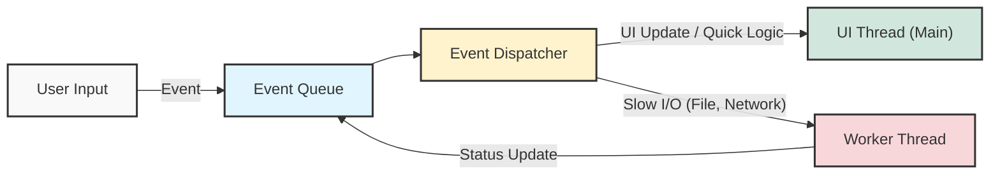

## 1. 개요

과거 단일 코어(Single-Core) 프로세서 시절에도 여러 프로그램이 동시에 실행되는 것처럼 보일 수 있었던 것은 운영체제의 고속 컨텍스트 스위칭(Context Switching)[^1] 덕분이다. 현대의 애플리케이션은 사용자의 입력(키보드, 마우스 등)을 즉각적으로 화면에 렌더링하면서도, 백그라운드에서는 무거운 파일 입출력이나 네트워크 다운로드 등을 동시에 처리해야 한다.

이러한 동시성을 안전하고 효율적으로 다루기 위해 GUI를 가진 대부분의 애플리케이션은 **이벤트 루프(Event Loop)와 멀티스레드(Multi-thread)** 구조를 채택하고 있다.

## 2. 이벤트 루프와 큐(Queue) 아키텍처

사용자 인터페이스(UI)를 갖는 애플리케이션의 핵심은 '이벤트(Event)' 기반으로 동작한다는 점이다. 키보드 입력, 마우스 클릭과 같은 사용자의 행동은 하나의 이벤트 객체로 생성되어 내부 자료구조에 쌓이고, 이를 전담 스레드가 꺼내어 처리한다.



이벤트 큐에 쌓인 작업은 디스패처(Dispatcher)에 의해 식별된다. 단순한 텍스트 입력이나 화면 렌더링은 UI 스레드가 즉시 처리하지만, 처리에 시간이 오래 걸리는 작업은 별도의 스레드(Worker Thread)로 분기되어야 한다.

> **Deep Dive: 멀티스레드 삼위일체 (Thread, Queue, Synchronization)**
> 
> 멀티스레드 환경을 논할 때 **스레드(Thread)**와 **큐(Queue)**, 그리고 **동기화(Synchronization)**는 결코 분리될 수 없는 개념이다. 다수의 스레드가 하나의 이벤트 큐를 공유하여 작업을 생산(Produce)하고 소비(Consume)할 때, 메모리 가시성 문제와 경합 조건(Race Condition)이 필연적으로 발생한다. 따라서 스레드 분기 아키텍처를 설계할 때는 반드시 뮤텍스(Mutex), 세마포어(Semaphore) 또는 모니터 락(Monitor Lock) 기반의 동기화 메커니즘이 기저에 깔려 있어야 한다.
{: .prompt-info }

## 3. 느린 I/O와 스레드 분리의 필요성

파일 복사나 네트워크 통신과 같은 I/O 작업은 디스크 속도, 네트워크 지연, 파일 용량 등 외부 요인에 의해 완료 시점을 특정하기 매우 어렵다.

> 만약 이러한 느린 I/O 작업을 UI를 담당하는 메인 스레드에서 처리하게 되면, I/O 작업이 완료될 때까지 애플리케이션은 사용자의 어떠한 제어(입력, 화면 이동, 클릭)도 받지 못한다. 운영체제는 이를 `응답 없음(Not Responding)` 상태로 간주하여 프로세스를 강제 종료시킬 수 있다.
{: .prompt-danger }

따라서 장기 실행 작업(Long-running Task)은 반드시 백그라운드 스레드로 분리하고, 처리의 진행률(Progress)이나 완료 여부만을 이벤트 큐에 콜백 형태로 전달하여 UI에 시각화(Progress Bar 등)하는 방식으로 설계해야 한다.

## 4. 구현 (Java)

아래 코드는 콘솔 애플리케이션 환경에서 UI 상호작용(메인 스레드)과 파일 입출력 시뮬레이션(워커 스레드)을 분리하여 처리하는 예제다. 특히 메인 어플리케이션이 종료될 때 워커 스레드의 라이프사이클을 안전하게 제어하는 방법에 주목하자.

```java
import java.util.Scanner;

// 백그라운드에서 독립적으로 실행될 I/O 전담 워커 스레드 정의
class FileIOThread extends Thread {
    /**
     * volatile: 여러 스레드가 이 변수를 참조할 때, CPU 캐시가 아닌 메인 메모리에서 직접 읽도록 강제한다.
     * 이를 통해 메인 스레드에서 값을 변경했을 때 워커 스레드가 즉시 변화를 감지(가시성)할 수 있다.
     */
    private volatile boolean isRunning = true; 

    @Override
    public void run() {
        System.out.println("\n[Worker] 무거운 파일 I/O 작업을 시작합니다...");
        try {
            // 10초 동안 진행되는 무거운 작업을 시뮬레이션
            for (int i = 1; i <= 10; i++) {
                /**
                 * 협력적 종료(Cooperative Shutdown): 
                 * 스레드를 강제로 kill하는 것은 위험하므로, 플래그를 주기적으로 확인하여 스스로 종료하게 유도한다.
                 */
                if (!isRunning) {
                    System.out.println("\n[Worker] 중단 요청 감지. 작업을 안전하게 정리하고 종료합니다.");
                    return; // run() 메서드를 빠져나가며 스레드 종료
                }

                Thread.sleep(1000); // 1초 대기 (InterruptedException 발생 가능 지점)
                System.out.printf("[Worker] 진행률: %d0%%\n", i);
            }
            System.out.println("[Worker] 모든 작업이 성공적으로 완료되었습니다.");
        } catch (InterruptedException e) {
            /**
             * sleep 상태에서 interrupt()가 호출되면 발생한다.
             * 예외 처리 후 스레드 상태를 복구하여 안정성을 높인다.
             */
            System.out.println("[Worker] 작업 중 인터럽트가 발생하여 강제 중단되었습니다.");
            Thread.currentThread().interrupt(); 
        }
    }

    // 외부(메인 스레드)에서 워커 스레드의 종료를 요청하는 통로
    public void stopThread() {
        this.isRunning = false;
    }
}

public class MultiThreadUIExample {
    public static void main(String[] args) {
        Scanner scanner = new Scanner(System.in);
        FileIOThread ioThread = null;

        while (true) {
            // 메인 스레드는 여기서 입력을 기다리며 블로킹되지만, 워커 스레드는 백그라운드에서 별도로 돌아간다.
            System.out.print("\n명령을 입력하세요 (1: 복사 시작, 0: 종료) > ");
            String input = scanner.nextLine();

            if ("1".equals(input)) {
                // 스레드 중복 실행 방지: 실행 중이 아닐 때만 새 객체 생성 및 시작
                if (ioThread == null || !ioThread.isAlive()) {
                    ioThread = new FileIOThread();
                    ioThread.start(); // 새로운 콜 스택을 생성하며 run() 실행
                } else {
                    System.out.println("[UI] 현재 작업이 이미 진행 중입니다.");
                }
            } else if ("0".equals(input)) {
                // Graceful Shutdown: 프로그램 종료 전 실행 중인 스레드를 먼저 정리
                if (ioThread != null && ioThread.isAlive()) {
                    System.out.println("[UI] 진행 중인 작업을 종료하는 중...");
                    ioThread.stopThread();
                    try {
                        ioThread.join(); // 워커 스레드가 완전히 끝날 때까지 메인 스레드가 대기
                    } catch (InterruptedException e) {}
                }
                System.out.println("[UI] 프로그램을 안전하게 종료합니다. Bye.");
                break;
            } else {
                System.out.println("[UI] 잘못된 입력이지만, 메인 스레드는 살아있으므로 응답이 가능합니다.");
            }
        }
        scanner.close();
    }
}
```

> **Tip:** 애플리케이션(메인 스레드)이 종료되더라도 실행 중인 일반 사용자 스레드(User Thread)가 남아있다면 프로세스는 완전히 종료되지 않는다. 이를 방지하기 위해 위 예제처럼 플래그를 이용해 명시적으로 자원을 정리하거나, 해당 스레드를 데몬 스레드(`setDaemon(true)`)로 설정해야 한다.
{: .prompt-tip }

---

## 💡 Quiz: 학습 내용 확인하기

**Q1. 메인 UI 스레드에서 파일 복사나 네트워크 통신과 같은 무거운 처리를 직접 수행하면 애플리케이션에 어떤 현상이 발생하는가?**

<details>
<summary>정답 확인</summary>
<div>
I/O 작업이 완료될 때까지 메인 스레드가 블로킹되어 이벤트(클릭, 키보드 입력 등)를 처리하지 못하므로, 애플리케이션이 화면 멈춤 및 '응답 없음' 상태에 빠지게 됩니다.
</div>
</details>

**Q2. 멀티스레드 환경에서 이벤트와 작업을 분배하기 위해 '큐(Queue)'를 사용할 때, 데이터 경합을 막기 위해 필연적으로 함께 설계되어야 하는 기술적 메커니즘은 무엇인가?**

<details>
<summary>정답 확인</summary>
<div>
동기화(Synchronization) 메커니즘입니다. 여러 스레드가 동시에 큐에 접근할 때 상태의 일관성을 유지하기 위해 반드시 적용되어야 합니다.
</div>
</details>

[^1]:컨텍스트 스위칭(Context Switching): CPU가 현재 실행 중인 스레드의 상태(Register 값 등)를 PCB/TCB에 저장하고, 다음에 실행할 스레드의 상태를 복원하여 작업을 교체하는 과정. 너무 빈번하게 발생하면 성능 저하(Overhead)의 원인이 된다.