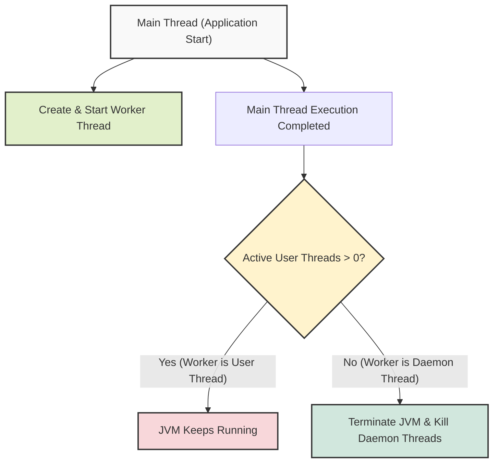

## 1. 개요

Java 어플리케이션을 개발하다 보면 백그라운드에서 지속적으로 실행되어야 하는 작업(예: 프로그레스 바 렌더링, 주기적인 임시 파일 삭제 등)을 처리하기 위해 멀티스레드를 활용하게 된다. 그러나 무분별한 스레드 생성은 애플리케이션이 정상적으로 종료되지 않는 현상을 유발할 수 있다.

이러한 문제를 해결하고 애플리케이션의 라이프사이클에 맞춰 백그라운드 작업을 유연하게 제어하기 위해 제공되는 개념이 바로 **데몬 스레드(Daemon Thread)**다. 본 문서에서는 JVM의 스레드 관리 정책과 데몬 스레드의 동작 원리, 그리고 올바른 스레드 제어 방법에 대해 알아본다.

## 2. JVM의 스레드 생존 정책과 라이프사이클

Java 가상 머신(JVM)은 애플리케이션의 구동을 멈추고 종료할 때 명확한 기준을 가진다. **"활성화된 일반 스레드(User Thread)[^1]가 하나라도 존재하면 애플리케이션을 종료하지 않는다."** 만약 메인 스레드(Main Thread)가 작업을 마치고 종료되었더라도, 파일 복사나 다운로드를 수행하는 별도의 일반 스레드가 여전히 실행 중이라면 프로세스는 멈추지 않는다.

### 2.1 동작 구조 시각화



이러한 특성 때문에 메인 스레드가 종료될 때 다른 작업자 스레드들도 알아서 운명을 같이 하도록 강제하고 싶다면, 해당 스레드들을 **데몬 스레드**로 설정해야 한다. 데몬 스레드는 메인 스레드의 보조 역할을 수행하며, JVM은 일반 스레드가 모두 종료되면 데몬 스레드의 작업 완료 여부와 관계없이 프로세스를 즉각 종료한다.

> **Deep Dive: 데몬 스레드의 강제 종료와 I/O 작업의 위험성**
> 
> 데몬 스레드는 애플리케이션 종료 조건이 충족되는 순간, 실행 중이던 코드의 위치와 무관하게 즉시 강제 종료(Abrupt Termination)된다. 심지어 `finally` 블록의 실행이나 I/O 자원(Stream, Socket 등)의 반환(`close()`)도 보장하지 않는다. 따라서 중요한 파일 입출력이나 데이터베이스 트랜잭션 처리 스레드를 데몬 스레드로 지정하면 데이터 손실이나 커럽션(Corruption)이 발생할 수 있다. 중요한 작업은 데몬 스레드 대신 `interrupt()` 등을 활용한 Graceful Shutdown으로 제어해야 한다.
{: .prompt-info }

## 3. 데몬 스레드의 구현 (Java)

스레드를 데몬 스레드로 만드는 방법은 매우 간단하다. `Thread` 객체의 `setDaemon(true)` 메서드를 호출하면 된다. 여러 개의 스레드가 필요하다면, 인스턴스를 여러 개 생성하고 각각 속성을 부여한 뒤 시작(`start()`)하면 된다.

```java
public class DaemonThreadExample {
    public static void main(String[] args) {
        // 작업자 스레드 생성 (예: 파일 복사 프로그레스 출력)
        Thread workerThread = new Thread(() -> {
            try {
                for (int i = 1; i <= 100; i++) {
                    System.out.println("백그라운드 작업 진행률: " + i + "%");
                    Thread.sleep(100); // 0.1초 대기
                }
            } catch (InterruptedException e) {
                System.out.println("작업이 인터럽트 되었습니다.");
            }
        });

        // 1. 스레드 시작 전 데몬 스레드로 속성 설정
        workerThread.setDaemon(true); 
        
        // 2. 스레드 실행
        workerThread.start();

        System.out.println("메인 스레드 로직 수행 중...");
        try {
            // 메인 스레드가 0.3초간 작업을 수행한다고 가정
            Thread.sleep(300); 
        } catch (InterruptedException e) {
            e.printStackTrace();
        }
        
        // 메인 스레드가 종료되면, 100%까지 완료되지 않은 데몬 스레드도 함께 종료된다.
        System.out.println("메인 스레드 종료."); 
    }
}
```

> **주의:** `setDaemon(true)`는 반드시 스레드의 `start()` 메서드를 호출하기 **전**에 설정해야 한다. 스레드가 이미 실행된 상태에서 상태를 변경하려 하면 `IllegalThreadStateException` 런타임 예외가 발생한다.
{: .prompt-warning }

## 4. 스레드 제어의 핵심: 실행보다 중요한 '정지'

멀티스레드 프로그래밍에서 스레드를 생성하고 실행(`start`)하는 것은 기초적인 단계에 불과하다. 시스템의 안정성을 결정짓는 가장 중요한 요소는 바로 **동기화(Synchronization)**와 **제어(Control)**다.

스레드가 아무리 빠르게 잘 달리더라도(Run), 제때 멈추거나 안전하게 종료(Stop)되지 못한다면 메모리 누수나 데드락(Deadlock) 같은 치명적인 장애를 유발한다. 데몬 스레드를 사용하는 것은 프로세스 종료 시나리오를 해결하는 하나의 수단일 뿐이며, 동작 중인 스레드를 정교하게 제어하기 위해서는 `Thread.interrupt()` 메서드를 통한 능동적인 인터럽트 처리나 공유 자원에 대한 동기화 기법을 추가로 학습해야 한다.

> **Tip:** 데몬 스레드는 메인 프로세스를 보조하는 가비지 컬렉터(GC), 오토 세이브, 모니터링 프로세스 등 애플리케이션 생존 여부에 전적으로 종속적인 작업에 사용하는 것이 가장 적합하다.
{: .prompt-tip }

---

## 💡 Quiz: 학습 내용 확인하기

**Q1. JVM이 실행 중인 애플리케이션 프로세스를 종료하는 정확한 기준은 무엇인가?**

<details>
<summary>정답 확인</summary>
<div>
애플리케이션 내에 실행 중인 일반 스레드(User Thread)가 단 하나도 남지 않았을 때 JVM이 종료된다. 데몬 스레드의 생존 여부는 JVM의 종료 기준에 영향을 주지 않는다.
</div>
</details>

**Q2. 특정 스레드를 데몬 스레드로 지정할 때, 코딩 상 반드시 지켜야 하는 규칙 한 가지는 무엇인가?**

<details>
<summary>정답 확인</summary>
<div>
해당 스레드의 start() 메서드를 호출하여 실행하기 전에 반드시 setDaemon(true)를 먼저 호출해야 한다.
</div>
</details>

[^1]:일반 스레드(User Thread): 기본적으로 Java에서 생성된 스레드는 모두 일반 스레드이며, 애플리케이션의 핵심 로직을 담당한다. 메인 스레드(`public static void main`) 역시 대표적인 일반 스레드다.