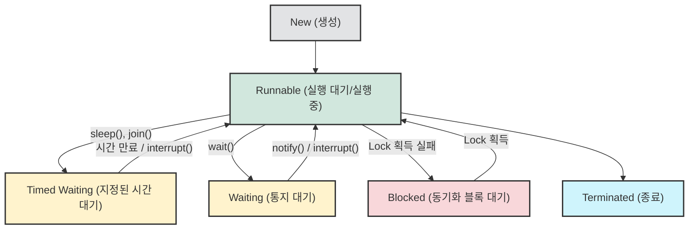

## 1. 개요

스레드(Thread)는 애플리케이션 내에서 실행되는 연산의 흐름이자 단위다. 멀티스레드 환경에서는 다수의 스레드가 동시에 실행되며 언젠가 종료 지점에 도달하게 된다. 이 과정에서 특정 스레드의 연산 결과가 다른 스레드의 입력으로 사용되어야 하는 **의존성(Dependency)**이 발생한다.

이러한 연산의 순서를 보장하고 흐름을 맞추는 작업을 **동기화(Synchronization)**라고 한다. 동기화를 구현할 때 흐름을 일시적으로 정지시키는 제어 메커니즘을 자주 사용하는데, 이 과정에서 동작 원리를 정확히 이해하지 못하고 임시방편으로 제어하게 되면 심각한 소프트웨어 결함을 유발할 수 있다.

## 2. 스레드의 상태 변화와 스케줄링 메커니즘

자바에서 스레드의 흐름을 일시적으로 멈출 때, 스레드는 `RUNNABLE` 상태에서 대기 상태(Suspended)[^1]로 전환된다.



스레드가 대기 상태로 빠지는 원인은 크게 세 가지다.

1. `synchronized` 블록 진입 대기로 인한 **Blocked**
2. 특정 조건이 충족될 때까지 기다리는 **Waiting** (예: `wait()`)
3. 지정된 시간 동안 멈추는 **Timed Waiting** (예: `sleep()`)

대기 상태에 진입한 스레드는 OS 스케줄러에 의해 CPU 할당 대상에서 제외되며, 대기 조건이 해제되어야만 다시 `RUNNABLE` 상태로 복귀하여 CPU 제어권을 얻을 수 있다.

> **Tip:** 무한 루프를 도는 스레드 내부에 `sleep(1)`과 같이 단 1ms의 지연만 주어도, 스레드가 CPU를 양보(Yield)하게 되어 CPU 점유율이 100%로 치솟는 현상을 방지할 수 있다. 전자적 관점에서 1ms는 CPU에게 매우 긴 시간이기 때문이다.
{: .prompt-tip }

## 3. Thread.sleep()의 치명적인 함정

`sleep(long millis)`은 밀리초 단위로 스레드를 `TIMED_WAITING` 상태로 밀어 넣는 아주 단순한 메서드다. 그러나 동기화나 작업 종료 대기를 목적으로 `sleep()`을 사용하는 것은 매우 위험하다.

### 부정확한 대기 시간

`sleep(1000)`을 호출했다고 해서 스레드가 정확히 1초(1000ms) 뒤에 실행을 재개한다는 보장은 없다. 루프를 돌며 24시간 동안 `sleep()`을 누적해보면, 실제 시스템 시간과 1~2시간 이상의 격차가 발생하기도 한다.

> **Deep Dive: 왜 sleep()은 정확하게 깨어나지 않을까?**
> 
> `sleep()` 시간이 만료되면 스레드는 즉시 실행되는 것이 아니라, JVM과 OS 스케줄러의 `Ready Queue`로 이동하여 `RUNNABLE` 상태가 될 뿐이다. 당시 CPU를 점유하고 있는 다른 스레드가 있거나, 스레드 간의 **컨텍스트 스위칭(Context Switching)**[^2] 오버헤드가 발생하기 때문에 항상 `요구 시간 + α(알파)`의 지연이 발생하게 된다.
{: .prompt-info }

### 우연에 맡기는 코드 (Coincidental Synchronization)

메인 스레드에서 워커 스레드를 생성한 뒤, 워커 스레드의 작업이 끝나기를 기다리기 위해 메인 스레드에 임의의 시간으로 `sleep()`을 거는 코드는 **우연에 동기화를 맡기는 코드**다.

OS 스케줄러의 컨디션, 현재 메모리 상태, 우선순위 경쟁에 따라 워커 스레드가 메인 스레드보다 늦게 끝나는 역전 현상이 언제든 발생할 수 있다.

> 타이밍에 의존하는 스레드 제어는 평상시에는 99% 정상 동작하는 것처럼 보이지만, 트래픽이 몰리는 상황에서는 1%의 치명적인 오동작(예금 계산 오류, 결제 누락 등)을 유발하는 시한폭탄이 된다.
{: .prompt-danger }

## 4. 스레드 종료와 생명주기 관리 (올바른 구현)

애플리케이션의 메인 스레드가 종료된다는 것은 곧 프로세스의 종료를 의미한다. 메인 스레드가 끝나기 전에 백그라운드에서 동작 중인 워커 스레드들을 안전하게 종료(Graceful Shutdown)시켜야 하며, 이를 위해 `sleep()`이 아닌 명시적인 통지 메커니즘을 사용해야 한다.

아래는 `sleep()`에 의존하지 않고, `interrupt()`와 `join()`을 활용하여 올바르게 스레드 의존성을 통제하는 Java 예제 코드다.

```java
public class ThreadControlExample {
    public static void main(String[] args) {
        // 1. 워커 스레드 생성
        Thread worker = new Thread(() -> {
            int count = 0;
            // Thread.currentThread().isInterrupted()로 안전한 종료 시그널 확인
            while (!Thread.currentThread().isInterrupted()) {
                count++;
                // 실제 연산 로직 가정
            }
            System.out.println("워커 스레드 안전하게 종료됨. 최종 연산: " + count);
        });

        worker.start();

        try {
            // 메인 스레드에서 1초간 다른 작업 수행 (의도된 비즈니스 대기)
            Thread.sleep(1000); 
            
            // 2. 워커 스레드에게 연산을 중단하라는 시그널(Interrupt) 전송
            worker.interrupt();
            
            // 3. 워커 스레드가 완전히 종료될 때까지 대기 (sleep 대신 join 사용)
            worker.join(); 
            
            System.out.println("메인 스레드 종료 및 애플리케이션 정상 종료");
            
        } catch (InterruptedException e) {
            // 인터럽트 발생 시 스레드 상태 복구 및 예외 처리
            Thread.currentThread().interrupt();
        }
    }
}
```

올바른 멀티스레드 프로그래밍은 각 스레드가 종료 상태를 명확히 인지하고, 통지(Signal)를 통해 유기적으로 제어권을 넘겨주는 구조를 갖추는 데서 시작한다. `sleep()`의 오남용을 줄이는 것만으로도 시스템의 신뢰성을 크게 높일 수 있다.

---

## 💡 Quiz: 학습 내용 확인하기

**Q1. `Thread.sleep(500)`을 호출했을 때, 시스템이 정확히 500ms 동안만 스레드를 멈추고 즉각 실행을 재개하지 못하는 이유는 무엇인가?**

<details>
<summary>정답 확인</summary>
<div>
sleep 시간이 지나도 스레드는 즉시 실행되는 것이 아니라 RUNNABLE 상태의 대기열로 돌아갈 뿐입니다. OS 스케줄러가 다시 해당 스레드에 CPU 제어권을 할당하기까지의 대기 시간과 Context Switching 비용이 추가로 발생하기 때문에 항상 지정된 시간보다 약간 더 지연(플러스 알파)됩니다.
</div>
</details>

**Q2. 메인 스레드에서 워커 스레드의 작업 종료를 기다리기 위해 임의로 `sleep()`을 호출하여 대기하는 방식을 무엇이라 부르며, 이것이 서버 환경에서 치명적인 이유는 무엇인가?**

<details>
<summary>정답 확인</summary>
<div>
이를 '우연에 맡기는 코드'라고 부릅니다. 시스템 부하나 스케줄링 상황에 따라 워커 스레드의 종료 시점을 정확히 예측할 수 없으므로, 트래픽이 몰리는 상황에서 1% 확률의 치명적인 데이터 오염이나 타이밍 오류를 일으킬 수 있기 때문입니다. 올바른 대기를 위해서는 join()이나 명시적인 동기화 객체를 사용해야 합니다.
</div>
</details>

---

[^1]:자바 공식 스펙에서 Suspended라는 독립된 상태 클래스는 존재하지 않으나, 전통적인 OS 스레드 모델에서 실행이 일시 정지된 `WAITING`, `TIMED_WAITING`, `BLOCKED` 상태를 통칭하는 개념적 어휘로 널리 쓰인다.

[^2]:**컨텍스트 스위칭(Context Switching)**: CPU가 현재 실행 중인 스레드의 상태(레지스터, PC 등)를 저장하고, 다음 실행할 스레드의 상태를 복원하는 과정. 이 과정은 순수 오버헤드로 작용한다.