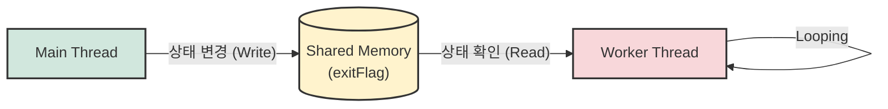

## 1\. 개요

멀티스레드 프로그래밍에서 특정 스레드의 작업을 안전하게 중단시키기 위해 상태를 나타내는 **플래그(Flag) 변수**를 사용하는 패턴은 매우 자주 사용된다. 주로 메인 스레드(Main Thread)가 작업자 스레드(Worker Thread)들을 생성한 뒤, 내부에서 무한 루프를 돌며 작업을 수행하는 워커 스레드에게 '작업 종료' 신호를 전달하기 위한 목적으로 활용된다.

하지만 스레드 간에 변수를 공유하게 되면 필연적으로 동시성 문제가 발생한다. 레거시 코드에서 자주 발견되는 이 패턴의 원리와 문제점을 정확히 이해하고, 시스템 자원을 효율적으로 관리하는 방법을 알아본다.

## 2\. 아키텍처 및 동작 원리

메인 스레드와 워커 스레드는 하나의 프로세스 내에서 힙(Heap) 영역을 공유한다. 따라서 클래스의 정적(Static) 변수나 인스턴스 변수를 통해 상태를 공유할 수 있다.



이 구조에서 워커 스레드는 지속적으로 `exitFlag`의 값을 확인하며 루프를 유지할지 탈출할지 결정한다.

## 3\. 구현 (Java)

일반적으로 구동되는 플래그 기반의 스레드 제어 코드는 다음과 같은 형태를 띤다.

```java
public class ThreadFlagExample {
    // 스레드 종료를 지시할 공유 플래그 변수
    private static boolean exitFlag = false;

    public static void main(String[] args) throws InterruptedException {
        // 워커 스레드 생성 및 실행
        Thread worker = new Thread(() -> {
            System.out.println("Worker Thread 시작");
            
            // exitFlag가 false인 동안 무한 반복
            while (!exitFlag) {
                try {
                    // CPU 점유율이 100%로 튀는 것을 방지하기 위한 짧은 대기
                    Thread.sleep(1); 
                } catch (InterruptedException e) {
                    Thread.currentThread().interrupt();
                }
            }
            System.out.println("Worker Thread 정상 종료");
        });

        worker.start();

        // 메인 스레드는 잠시 대기 후 종료 신호를 보냄
        Thread.sleep(100); 
        System.out.println("Main Thread: exitFlag를 true로 변경");
        
        // 플래그 변수 상태 변경
        exitFlag = true; 
        
        // 워커 스레드가 종료될 때까지 여유 시간을 두고 대기 (우연에 의존하는 안 좋은 패턴)
        Thread.sleep(500);
        System.out.println("Main Thread 종료");
    }
}
```

## 4\. 레이스 컨디션과 문제점

위의 코드는 얼핏 보면 정상적으로 작동할 것 같지만, 기술적으로 여러 가지 문제와 위험성을 내포하고 있다.

### 4.1. 레이스 컨디션 (Race Condition)

`exitFlag`라는 하나의 변수에 대해 메인 스레드는 쓰기(Write) 연산을, 워커 스레드는 읽기(Read) 연산을 동시에 수행한다. 이처럼 두 개 이상의 스레드가 공유 자원에 동시에 접근하여 경쟁하는 상태를 **레이스 컨디션(경쟁 조건)**[^1]이라고 한다. 동기화 처리가 되지 않은 공유 자원은 스레드 스케줄링에 따라 실행 결과가 달라지는 비결정성(Nondeterminism)을 유발한다.

### 4.2. 부정확한 스레드 제어 (`Thread.sleep`)

루프 내에서 CPU 점유율 폭주를 막기 위해 `Thread.sleep(1)`이나 잠시 CPU 점유를 양보하는 `Thread.yield()`를 사용한다. 하지만 `sleep()` 메서드는 OS의 스레드 스케줄러에 전적으로 의존하므로, 지정한 시간(ms)을 정확히 지킨다고 보장할 수 없다.

> **주의:** 메인 스레드에서 워커 스레드가 종료될 것이라 막연히 기대하고 `Thread.sleep(500)`처럼 넉넉한 대기 시간을 부여하는 것은 "우연에 맡기는 프로그래밍"이다. 시스템 부하에 따라 워커 스레드의 종료가 지연될 수 있으며, 이는 예기치 않은 오류를 낳는다.
{: .prompt-warning }

> **Deep Dive: 메모리 가시성(Memory Visibility) 문제**
>
> 멀티코어 환경에서 각 스레드는 성능 향상을 위해 메인 메모리(RAM)가 아닌 CPU의 L1/L2 캐시 메모리에서 변수 값을 읽어온다.
> 메인 스레드가 `exitFlag = true`로 값을 변경하더라도, 워커 스레드가 자신의 CPU 캐시를 갱신하지 않고 과거의 값(`false`)을 계속 참조한다면 워커 스레드는 영원히 종료되지 않는 무한 루프(Infinite Loop)에 빠질 수 있다. 단 1 나노초의 오차도 없이 즉각적으로 값이 반영되지 않으며 동기화 지연이 발생한다.
>
> 이를 해결하려면 변수 선언 시 `volatile` 키워드를 사용하여, 해당 변수에 대한 읽기/쓰기를 반드시 메인 메모리에서 직접 수행하도록 강제해야 한다. (`private static volatile boolean exitFlag = false;`)
{: .prompt-info }

## 5\. 리팩토링 및 대안

단순한 플래그 변수 조작보다는 Java에서 제공하는 명시적인 동기화 및 인터럽트 기법을 사용하는 것이 권장된다.

1.  **`volatile` 키워드 사용**: 가시성 문제를 해결하여 값이 즉각적으로 동기화되도록 한다.
2.  **`Thread.interrupt()` 활용**: `sleep()` 중인 스레드에 즉각적으로 `InterruptedException`을 발생시켜 안전하고 빠르게 루프를 탈출하게 유도한다.
3.  **`Thread.join()` 사용**: 워커 스레드가 종료될 때까지 메인 스레드가 `sleep(500)` 등으로 감을 잡아 기다리는 대신, `worker.join()`을 호출하여 워커 스레드의 종료를 안전하게 보장받아야 한다.

-----

## 💡 Quiz: 학습 내용 확인하기

Q1. 워커 스레드가 공유 플래그 변수의 변경된 값을 영원히 인식하지 못하고 무한 루프에 빠지는 원인이 되는 메모리 관련 개념은 무엇인가?

<details>
<summary>정답 확인</summary>
<div>
메모리 가시성(Memory Visibility) 문제입니다. 스레드가 메인 메모리가 아닌 각자의 CPU 캐시에서 값을 읽어오기 때문에 발생하는 현상입니다.
</div>
</details>

Q2. 메인 스레드에서 워커 스레드의 종료를 기다리기 위해 임의의 시간 동안 Thread.sleep()을 호출하는 방식의 가장 큰 문제점은 무엇인가?

<details>
<summary>정답 확인</summary>
<div>
운영체제의 스레드 스케줄링 환경과 시스템 부하에 따라 지정된 대기 시간 내에 스레드가 정확히 종료됨을 보장할 수 없어, 예측 불가능하고 비결정적인 결과를 초래하기 때문입니다.
</div>
</details>

[^1]:    **레이스 컨디션 (Race Condition)**: 두 개 이상의 프로세스나 스레드가 공유 자원에 동시 접근할 때, 실행 순서에 따라 결과값이 달라질 수 있는 불안정한 상태를 의미한다.