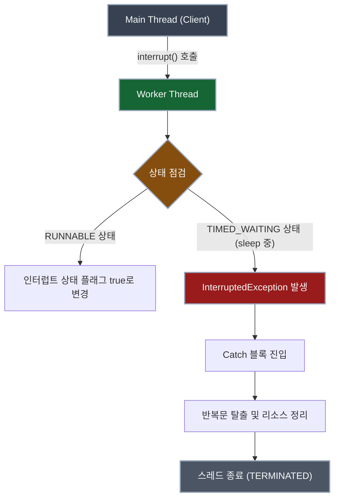

## 1. 개요

멀티스레드 프로그래밍을 하다 보면, 특정 조건이 만족되었는지 주기적으로 확인하는 **폴링(Polling)**[^1] 패턴을 자주 사용하게 된다. 이때 CPU 점유율이 비정상적으로 치솟는 것을 방지하기 위해 `Thread.sleep()`을 호출하여 스레드를 일정 시간 대기 상태로 만든다.

하지만 무작정 긴 시간 동안 스레드를 수면 상태로 두면, 외부에서 해당 스레드를 종료하고자 할 때 즉각적인 반응을 이끌어내기 어렵다. 오늘은 `Thread.sleep()`의 한계를 극복하고, `Thread.interrupt()`를 통해 안전하고 신속하게 스레드의 생명주기를 제어하는 방법을 알아보자.

## 2. 동작 원리 및 아키텍처

작업자 스레드가 `sleep()`을 통해 대기 상태에 빠져 있을 때, 외부 스레드(ex. Main Thread)가 `interrupt()` 메서드를 호출하여 강제로 기상시키는 과정은 다음과 같다.



> **Deep Dive: JVM의 스레드 인터럽트 메커니즘**
>
> 자바의 인터럽트는 스레드를 강제로 즉시 종료시키는 물리적인 킬(Kill) 스위치가 아니다. 이는 스레드에게 "작업을 멈추고 종료할 준비를 하라"는 **협력적인 시그널(Cooperative Signal)**에 가깝다.
> JVM 내부적으로 각 스레드는 '인터럽트 상태(Interrupt Status)'라는 boolean 플래그를 가진다. `Thread.interrupt()`가 호출되면 이 플래그가 `true`로 설정된다.
> 핵심은 스레드가 `sleep()`, `wait()`, `join()` 등의 메서드를 통해 `WAITING` 또는 `TIMED_WAITING` 상태[^2]에 있을 때 인터럽트가 발생하면, JVM은 즉시 플래그를 초기화(`false`)하고 `InterruptedException`을 던져 스레드를 깨운다는 점이다.
{: .prompt-info }

> **주의:** `InterruptedException`을 Catch 블록에서 잡은 후 아무런 처리도 하지 않고 무시(Swallow)하면, 스레드는 종료되지 않고 다음 루프를 계속 실행하게 된다. 반드시 루프를 탈출(`break`)하거나 스레드를 종료하는 로직을 포함해야 한다.
{: .prompt-warning }

## 3. 구현 (Java 예제)

실무에서 권장하는 명시적인 상태 플래그 검사와 예외 처리 로직을 결합한 코드다.

```java
public class ThreadInterruptExample {

    public static void main(String[] args) {
        // 1. 작업자 스레드 생성 및 실행
        Thread workerThread = new Thread(new PollingTask());
        workerThread.start();

        try {
            // 메인 스레드는 3초간 대기 (작업자 스레드가 폴링을 수행할 시간 제공)
            Thread.sleep(3000);
        } catch (InterruptedException e) {
            e.printStackTrace();
        }

        // 2. 외부에서 작업자 스레드에 종료 시그널 전달
        System.out.println("[Main] 작업자 스레드에 인터럽트 요청");
        workerThread.interrupt(); 

        System.out.println("[Main] 메인 로직 종료 (Bye)");
    }

    // 작업자 스레드의 실제 로직
    static class PollingTask implements Runnable {
        // 플래그 변수를 통한 종료 조건 제어
        private volatile boolean isRunning = true;

        @Override
        public void run() {
            System.out.println("[Worker] 폴링 작업을 시작합니다.");

            // 인터럽트 플래그와 논리적 플래그를 이중으로 체크
            while (isRunning && !Thread.currentThread().isInterrupted()) {
                try {
                    System.out.println("[Worker] 상태 감시 중...");
                    // 1초(1000ms) 대기 - 이 동안 인터럽트가 발생하면 예외가 발생함
                    Thread.sleep(1000); 
                } catch (InterruptedException e) {
                    // 예외가 발생하면 인터럽트 플래그는 false로 초기화됨
                    System.out.println("[Worker] InterruptedException 발생! 누군가 나를 깨웠습니다.");
                    
                    // 반복문을 탈출하기 위해 플래그 변경
                    isRunning = false; 
                    
                    // (선택) 인터럽트 상태를 다시 설정하여 상위 호출자에게 알림
                    Thread.currentThread().interrupt(); 
                }
            }
            
            // 리소스 해제 등의 마무리 작업 수행
            System.out.println("[Worker] 리소스 정리 중...");
            System.out.println("[Worker] 스레드 정상 종료 (End)");
        }
    }
}
```

### 3.1 비차단(Non-blocking) 상태에서의 종료 시그널 감지

위 예제의 `while` 반복문 조건식에 사용된 `Thread.currentThread().isInterrupted()`는 **현재 코드를 실행 중인 스레드의 인터럽트 상태(플래그)가 켜져 있는지(`true`) 확인하는 구문**이다.

`Thread.sleep()` 중에 `interrupt()`가 호출되면 즉시 `InterruptedException`이 발생하며 깨어나지만, 스레드가 `sleep()`에 들어가기 직전이거나 다른 무거운 연산을 수행하고 있는 등 **대기 상태가 아닐 때** `interrupt()`가 호출될 수도 있다. 

이때는 예외가 발생하지 않고 스레드의 인터럽트 플래그만 `true`로 변경된다. 따라서 다음 루프를 돌기 전에 `!Thread.currentThread().isInterrupted()`를 확인하여 플래그가 `true`라면 더 이상 루프를 진행하지 않고 안전하게 탈출(Break)하도록 만드는 방어적 코드 역할을 한다.

중요한 점은 `interrupt()`가 스레드를 강제로 중단시키는 메서드가 아니라는 것이다. `interrupt()`는 어디까지나 대상 스레드의 인터럽트 플래그를 켜는 **종료 요청 신호**다. 실제로 멈출지 여부는 작업자 스레드가 그 신호를 확인하고 루프를 빠져나오도록 작성되어 있는지에 달려 있다.

예를 들어 아래와 같이 인터럽트 상태를 확인하지 않는 코드는 외부에서 `interrupt()`를 호출해도 계속 실행될 수 있다.

```java
while (true) {
    // 인터럽트 상태를 확인하지 않으므로 계속 실행될 수 있음
}
```

반대로 아래처럼 인터럽트 상태를 반복 조건에 포함하면, 외부에서 `interrupt()`가 호출되었을 때 다음 반복 전에 종료할 수 있다.

```java
while (!Thread.currentThread().isInterrupted()) {
    // 작업 수행
}
```

> **Blocking 메서드와 인터럽트**
>
> `Blocking`이란 현재 스레드가 어떤 조건이 만족될 때까지 다음 코드를 실행하지 못하고 기다리는 상태를 말한다. 예를 들어 `sleep()`은 시간이 지날 때까지, `join()`은 대상 스레드가 끝날 때까지, `wait()`은 다른 스레드의 알림을 받을 때까지 현재 스레드를 멈춰 세운다.
>
> 이런 메서드들은 대기 중 인터럽트가 발생하면 공통적으로 `InterruptedException`을 던지고 `catch` 블록으로 흐름을 넘긴다.
>
> ```java
> try {
>     worker.join();
> } catch (InterruptedException e) {
>     Thread.currentThread().interrupt();
> }
> ```
>
> 즉, `InterruptedException`은 `sleep()`만의 동작이 아니다. `sleep()`, `wait()`, `join()`처럼 인터럽트에 반응하도록 설계된 blocking 메서드들의 공통적인 종료 신호 처리 방식이다.
{: .prompt-info }

> **Deep Dive: `interrupt()`, `isInterrupted()`, `Thread.interrupted()`**
>
> 자바의 인터럽트는 스레드를 강제로 죽이는 기능이 아니라, 해당 스레드의 **인터럽트 상태 플래그를 켜는 협력적 종료 신호**에 가깝다.
> 
> 1. **`interrupt()`**: 대상 스레드의 인터럽트 플래그를 `true`로 설정한다. 예를 들어 `workerThread.interrupt()`는 작업자 스레드에게 "이제 멈출 준비를 해라"라는 신호를 보내는 것이다.
> 2. **`isInterrupted()` (인스턴스 메서드)**: 특정 스레드의 인터럽트 상태를 확인만 한다. 플래그 값을 바꾸지 않는다.
> 3. **`Thread.interrupted()` (정적 메서드)**: 현재 스레드의 인터럽트 상태를 반환한 뒤, 플래그를 `false`로 초기화한다. 따라서 중간에 다시 인터럽트가 발생하지 않는 한, 연달아 두 번 호출했을 때 두 번째 호출은 `false`를 반환한다.
> 
> 비슷한 이름이지만 역할은 다르다. `interrupt()`는 플래그를 켜고, `isInterrupted()`는 확인만 하며, `Thread.interrupted()`는 확인한 뒤 꺼버린다.
{: .prompt-info }

> **왜 Catch 블록에서 다시 `interrupt()`를 호출할까?**
>
> `Thread.sleep()`, `wait()`, `join()` 중에 인터럽트가 발생하면 `InterruptedException`이 발생한다. 이때 JVM은 인터럽트 플래그를 자동으로 `false`로 초기화한다.
>
> 따라서 Catch 블록 안에서 아무 처리도 하지 않으면, 이후 코드가 `Thread.currentThread().isInterrupted()`를 확인했을 때 인터럽트 요청이 있었다는 사실을 알 수 없게 된다. 그래서 필요하다면 아래처럼 현재 스레드의 인터럽트 플래그를 다시 켜준다.
>
> ```java
> Thread.currentThread().interrupt();
> ```
>
> 이 코드는 스레드를 다시 깨우는 코드가 아니라, **인터럽트 요청이 있었다는 표시를 복구하는 코드**다. 현재 예제처럼 `isRunning = false`로 루프 종료를 직접 제어하더라도, 인터럽트 상태를 보존해두면 이후 상위 로직이나 정리 코드가 종료 사유를 더 명확하게 판단할 수 있다.
{: .prompt-info }

## 4. 스레드 종료 시점의 비동기성 문제

위 코드를 실행해보면, 가끔 메인 스레드의 종료 메시지 `[Main] 메인 로직 종료 (Bye)`가 작업자 스레드의 종료 메시지 `[Worker] 스레드 정상 종료 (End)`보다 **먼저** 출력되는 현상을 목격할 수 있다.

이유는 `interrupt()` 메서드 호출이 비동기적(Asynchronous)으로 작동하기 때문이다. 메인 스레드는 시그널만 던져놓고 곧바로 자신의 다음 코드를 실행하며, 작업자 스레드는 예외를 잡고 루프를 탈출해 마무리 작업을 하는 데 약간의 시간이 소요된다. 두 스레드가 독립적으로 병렬 실행되기 때문에 어떤 코드가 먼저 실행될지 보장할 수 없다(Race Condition).

> **Tip:** 작업자 스레드가 완벽하게 종료된 것을 확인한 후 메인 로직을 종료해야 한다면, 메인 스레드에서 작업자 스레드 객체의 `join()` 메서드를 호출하여 스레드의 동기화 지점을 명확히 설정해야 한다.
{: .prompt-tip }

---

## 💡 Quiz: 학습 내용 확인하기

**Q1. `Thread.sleep()` 중인 스레드에 `interrupt()`를 호출하면 어떤 일이 발생하며, 이때 스레드 내부의 인터럽트 상태 플래그는 어떻게 변하는가?**

<details>
<summary>정답 확인</summary>
<div>
InterruptedException 예외가 발생하면서 즉시 수면 상태에서 깨어납니다. 이때 내부적으로 true였던 인터럽트 상태 플래그는 다시 false로 초기화됩니다.
</div>
</details>

**Q2. 메인 스레드가 작업자 스레드에 인터럽트를 보낸 직후 출력한 로그가, 작업자 스레드의 마지막 종료 로그보다 먼저 출력될 수 있는 이유는 무엇인가?**

<details>
<summary>정답 확인</summary>
<div>
interrupt() 메서드는 비동기적으로 작동하는 시그널일 뿐이며, 작업자 스레드가 시그널을 받아 예외를 처리하고 종료하는 과정과 메인 스레드가 다음 코드를 실행하는 과정이 병렬로 실행되기 때문에 순서를 보장할 수 없습니다.
</div>
</details>

[^1]: 폴링(Polling): 하나의 장치 혹은 프로그램이 충돌 회피 또는 동기화 처리 등을 목적으로 다른 장치의 상태를 주기적으로 검사하여 조건을 만족할 때 처리하는 방식.
[^2]: TIMED_WAITING: `Thread.sleep()` 등과 같이 지정된 대기 시간 동안 스레드가 CPU를 점유하지 않고 대기열에서 기다리고 있는 상태.
