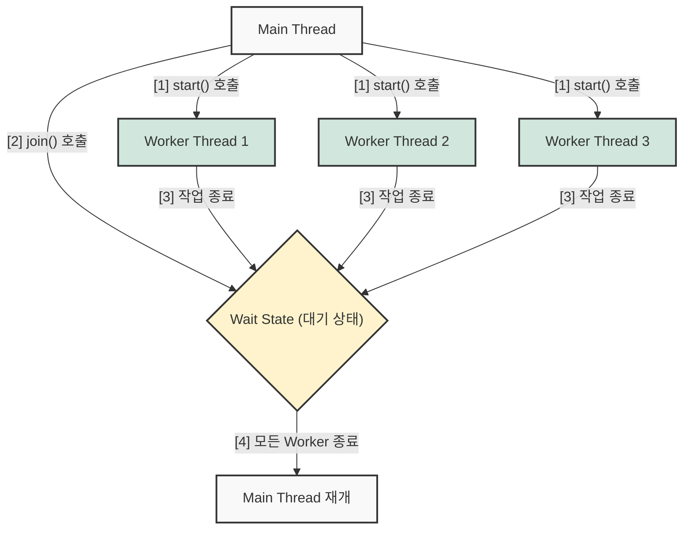

## 1. 개요

멀티스레드 프로그래밍에서 각 스레드는 운영체제의 스케줄러에 의해 독립적으로 실행된다. 따라서 여러 스레드를 동시에 실행(`start()`)했을 때, 어떤 스레드가 먼저 종료될지 정확한 시점을 예측하는 것은 불가능하다. 

부모 스레드(일반적으로 메인 스레드)가 생성한 작업자 스레드(Worker Thread)들의 연산 결과가 모두 취합된 후 다음 비즈니스 로직을 수행해야 하는 경우가 있다. 이때 **특정 스레드의 작업이 완료될 때까지 호출자 스레드의 실행을 일시 정지(Wait)시키는 메서드**가 바로 `join()`이다.

## 2. 아키텍처 및 동작 원리

메인 스레드가 3개의 작업자 스레드를 생성하고, 모든 작업이 끝날 때까지 대기하는 전형적인 `join()` 흐름은 다음과 같다.



메인 스레드는 루프를 돌며 각 스레드 객체에 대해 `join()`을 순차적으로 호출한다. 만약 대상 스레드가 이미 종료된 상태라면 `join()`은 즉시 반환(Return)되며, 다음 코드를 수행하게 된다.

## 3. 구현 및 예외 처리 (Java)

`join()` 메서드는 대기 상태에서 외부의 인터럽트(Interrupt)를 받을 수 있으므로 반드시 `InterruptedException` 예외 처리를 동반해야 한다. 

```java
public class ThreadJoinExample {
    public static void main(String[] args) {
        Thread[] workers = new Thread[3];

        // 1. 스레드 생성 및 실행
        for (int i = 0; i < 3; i++) {
            workers[i] = new Thread(() -> {
                System.out.println(Thread.currentThread().getName() + " - 작업 시작");
                try {
                    // 비즈니스 로직 수행 (시뮬레이션)
                    Thread.sleep((long) (Math.random() * 1000));
                } catch (InterruptedException e) {
                    Thread.currentThread().interrupt();
                }
                System.out.println(Thread.currentThread().getName() + " - 작업 완료");
            }, "Worker-" + i);
            
            workers[i].start();
        }

        // 2. 모든 작업자 스레드의 종료 대기
        for (int i = 0; i < 3; i++) {
            try {
                // 대상 스레드가 종료될 때까지 메인 스레드는 블로킹됨
                workers[i].join(); 
            } catch (InterruptedException e) {
                // 대기 중 인터럽트가 발생한 경우의 예외 처리
                System.err.println("메인 스레드 대기 중 인터럽트 발생");
                e.printStackTrace();
            }
        }

        // 3. 모든 스레드 종료 후 수행될 로직
        System.out.println("Main Thread - 모든 작업 종료 확인. 프로세스를 마칩니다.");
    }
}
```

> **Tip: 예외 처리 회피 (Throws)**
> 
> 간단한 테스트 코드 작성 시 `main` 메서드 시그니처에 `throws InterruptedException`을 선언하여 `try-catch` 블록을 생략할 수 있으나, 실무 환경에서는 발생 가능한 예외 상황에 대한 명시적인 복구 및 에러 핸들링 로직을 작성하는 것이 바람직하다.
{: .prompt-tip }

### 3.1 명시적인 스레드 이름 지정 (Thread Naming)

위 코드의 스레드 생성부를 보면 `"Worker-" + i`를 통해 스레드의 이름(Name)을 명시적으로 지정하고 있다. `Thread` 클래스의 생성자 중 `Thread(Runnable target, String name)`를 호출한 것이다.

스레드에 명시적인 이름을 부여하는 이유는 다음과 같다.

1. **로깅(Logging) 및 디버깅 편의성**: 멀티스레드 환경에서는 여러 작업이 병렬로 실행되므로, 로그만 보고는 어떤 흐름에서 발생한 문제인지 파악하기 어렵다. 코드 내부의 `Thread.currentThread().getName()`을 호출하면 지정한 이름이 반환되므로, "어떤 스레드가 이 작업을 수행 중인지" 쉽게 추적할 수 있다.
2. **모니터링 및 프로파일링**: JConsole, VisualVM, 혹은 스레드 덤프(Thread Dump) 분석 등 JVM 모니터링 도구를 사용할 때, 스레드의 역할이 이름에 명시되어 있으면 데드락(Deadlock)이나 병목 현상이 발생한 위치를 매우 빠르게 특정할 수 있다.

> **Tip: 기본 스레드 이름**
> 
> 이름을 따로 지정하지 않고 `new Thread(Runnable)` 형태로만 스레드를 생성할 경우, JVM은 내부적으로 `Thread-0`, `Thread-1`과 같은 형식으로 임의의 이름을 자동 부여한다. 하지만 실무에서는 시스템의 유지보수성을 높이기 위해 스레드의 목적과 역할이 명확히 드러나는 이름을 부여하는 것이 표준적인 관례다.
{: .prompt-tip }

## 4. 타임아웃을 적용한 대기 (Timed Wait)

매개변수가 없는 `join()`은 대상 스레드가 무한루프에 빠지거나 데드락(Deadlock)에 걸려 종료되지 않으면, 호출자 스레드 역시 **무한정 대기(Infinite Wait)** 상태에 빠지는 위험이 있다. 이를 방지하기 위해 밀리초(ms) 단위의 타임아웃을 지정할 수 있다.

```java
long timeoutMs = 100L;
// 최대 100ms 까지만 대기하고, 시간이 초과되면 즉시 제어권을 반환한다.
workers[0].join(timeoutMs); 

if (workers[0].isAlive()) {
    System.out.println("작업이 시간 내에 완료되지 않았습니다. 인터럽트를 시도합니다.");
    workers[0].interrupt(); // 응답 없는 스레드 강제 종료 시도
}
```

> **타임아웃 적용 시 상태 검증 누락**
> 
> `join(timeout)` 메서드는 지정된 시간이 만료되어 반환된 것인지, 아니면 대상 스레드가 실제로 종료되어 반환된 것인지 상태 값을 리턴하지 않는다. 따라서 타임아웃 적용 시 반드시 `isAlive()` 메서드를 통해 대상 스레드의 실제 생존 여부를 확인하고 후속 처리(재대기 또는 인터럽트)를 수행해야 한다.
{: .prompt-danger }

## 5. 안티 패턴: 스레드 체이닝 (Thread Chaining)

초보자들이 흔히 범하는 설계 오류 중 하나는 스레드 내부에서 다른 스레드를 생성하고 대기하는 구조를 깊게 가져가는 것이다. 예를 들어 `Thread 0` 내부에서 `Thread 1`을 생성하여 대기하고, `Thread 1` 내부에서 `Thread 2`를 생성하여 대기하는 방식이다.

이러한 **스레드 체이닝 구조**는 멀티스레드의 장점인 병렬성을 완전히 상실하게 만든다. 순차적으로 실행되며 다른 스레드를 기다리기만 할 것이라면, 굳이 컨텍스트 스위칭(Context Switching) 비용[^1]을 낭비하며 스레드를 생성할 이유가 없기 때문이다. 따라서 주체적인 비즈니스 연산은 각 작업자 스레드에 위임하고, 메인 스레드 레벨에서 루프를 통해 한 번에 `join()`을 관리하는 플랫(Flat)한 구조가 권장된다.

## 6. 심화 분석 (Deep Dive)

> **Deep Dive: Thread.join()의 JVM 내부 동작 메커니즘**
> 
> `join()` 메서드는 내부적으로 `Object` 클래스의 `wait()` 메서드를 기반으로 동작한다. `Thread.join()`의 Java 내부 소스코드를 살펴보면, `isAlive()`가 참(true)인 동안 루프를 돌며 자신(Thread 객체 인스턴스)에 대해 `wait(0)`을 호출한다.
> 
> 호출자 스레드가 대기 상태(`WAITING` 또는 `TIMED_WAITING`)에 진입하면, JVM은 어떻게 대상 스레드가 끝났음을 알고 깨워줄까?
> 정답은 C++로 구현된 **JVM의 스레드 종료 루틴(Thread Exit Routine)**에 있다. 대상 스레드의 실행(`run()`)이 종료되어 JVM 레벨에서 스레드가 소멸하는 과정 중, JVM은 해당 스레드 객체(this)의 모니터 락을 획득한 후 내부적으로 `notifyAll()`을 호출하도록 C++ 코드로 하드코딩 되어 있다.
> 이로 인해 해당 Thread 객체를 락으로 삼아 대기하고 있던 호출자 스레드들이 깨어나, `isAlive()` 검사를 탈출하고 `join()` 메서드가 비로소 종료되는 것이다.
{: .prompt-info }


## 💡 Quiz: 학습 내용 확인하기

**Q1. `join()` 메서드를 파라미터 없이 호출했을 때 발생할 수 있는 가장 큰 설계적 위험성은 무엇인가?**

<details>
<summary>정답 확인</summary>
<div>
대상 스레드가 데드락에 빠지거나 무한루프를 도는 등 종료되지 않는 문제가 발생할 경우, join()을 호출한 메인 스레드 역시 무한정 대기 상태에 빠져 애플리케이션의 응답성이 완전히 멈추는 위험이 존재합니다.
</div>
</details>

**Q2. 메인 스레드가 작업 스레드 A, B, C를 배열에 담아 순차적으로 join()을 호출했다. 메인 스레드가 B의 join()을 대기하던 도중, C 작업이 먼저 종료되었다면 어떤 일이 발생하는가?**

<details>
<summary>정답 확인</summary>
<div>
메인 스레드가 A와 B의 종료를 기다리는 동안 C는 시스템 스케줄러에 의해 이미 작업을 마치고 정상 종료 상태(TERMINATED)가 됩니다. 이후 루프가 순환하여 C.join()이 호출될 때, C는 이미 종료(isAlive()가 false)되었으므로 메인 스레드는 대기 상태에 빠지지 않고 즉시 다음 코드로 진행(Return)됩니다.
</div>
</details>

**Q3. 타임아웃을 지정한 join(long millis) 메서드를 사용했을 때, 지정된 시간이 지나 제어권이 반환되었다면 대상 작업 스레드는 즉시 소멸하는가?**

<details>
<summary>정답 확인</summary>
<div>
아닙니다. join(long millis)은 호출자 스레드의 대기 시간만 제한할 뿐 대상 스레드의 생명주기에는 관여하지 않습니다. 타임아웃 이후에도 대상 스레드는 백그라운드에서 계속 실행되므로, 필요하다면 isAlive()로 확인 후 interrupt()를 명시적으로 호출해야 합니다.
</div>
</details>


[^1]: 컨텍스트 스위칭(Context Switching): CPU가 현재 실행 중인 스레드의 상태를 레지스터에 저장하고, 다음 실행할 스레드의 상태를 적재하는 작업으로 멀티 코어 환경에서 적지 않은 오버헤드를 발생시킨다.