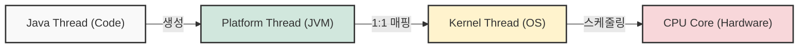
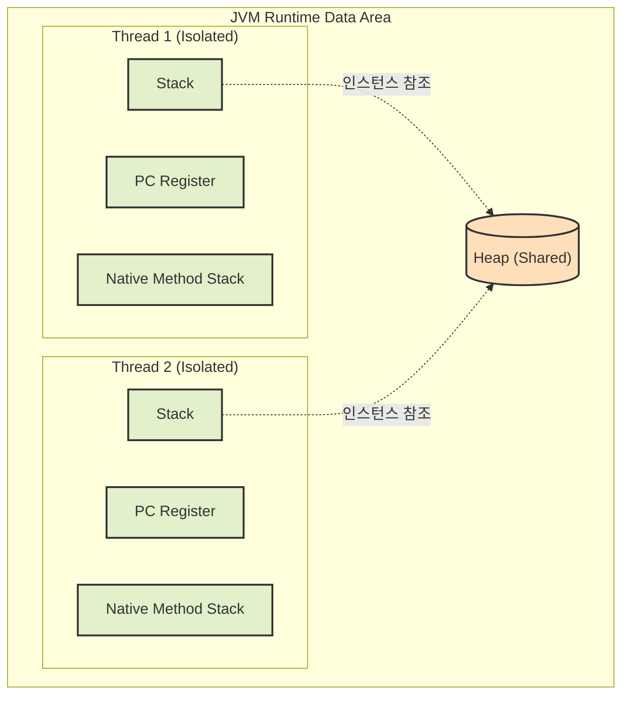

## 1. 개요: Java와 네이티브 언어의 차이

C++과 같은 네이티브 언어는 OS 및 컴퓨터 아키텍처(플랫폼)에 직접적인 의존성을 가진다. 반면, Java는 플랫폼 독립적이라는 강력한 장점이 있다. 하지만 이는 사실상 **Java가 JVM(Java Virtual Machine)에 전적으로 의존한다**는 것을 의미한다. 

JVM 자체는 C++과 어셈블리어 등 네이티브 코드로 작성되어 있으며, 플랫폼마다 다른 바이너리로 제공된다. 따라서 실무에서 발생하는 복잡한 장애나 성능 문제를 해결하기 위해서는 JVM의 내부 구조와 동작 방식, 특히 **스레드(Thread) 모델과 메모리 구조**에 대한 깊은 이해가 필수적이다.

## 2. 스레드(Thread)의 3가지 유형과 매핑 구조

소프트웨어 실행의 최소 단위인 스레드는 크게 세 가지로 분류할 수 있다.

1. **플랫폼 스레드 (Platform Thread)**: 사용자 공간(User-mode) 애플리케이션 수준에서 생성되는 스레드다.
2. **커널 스레드 (Kernel Thread)**: 운영체제(OS) 커널 수준에서 직접 관리하고 CPU 코어에 할당되는 스레드다.
3. **가상 스레드 (Virtual Thread)**: Java 21부터 정식 도입된 경량 스레드 모델이다[^1].

### 2.1 OS 시스템 스레드와 Java 스레드의 관계

Windows 환경에서 C++의 Win32 API(`CreateThread` 등)를 통해 스레드를 생성하면, 사용자 모드의 플랫폼 스레드와 OS 수준의 커널 스레드가 정확히 **1:1로 매핑**된다.

Java 역시 이와 동일한 방식을 따른다. Java 애플리케이션에서 `new Thread().start()`를 호출하면 JVM 내부에 플랫폼 스레드가 생성되고, 이는 곧바로 OS의 커널 스레드와 1:1로 연결된다. 실제 연산은 이 커널 스레드를 통해 물리적 CPU 코어에서 수행된다.



> **Deep Dive: 컨텍스트 스위칭(Context Switching)과 TCB**
>
> 멀티스레드 환경에서는 제한된 CPU 코어를 여러 스레드가 번갈아 사용한다. 이때 실행 중인 스레드의 상태를 저장하고 다음 스레드의 상태를 복원하는 과정을 **컨텍스트 스위칭**이라고 한다. 
> 운영체제는 이 상태 정보를 **TCB(Thread Control Block)**라는 자료구조에 저장한다. CPU 레지스터 값(스냅샷)을 백업하고 복원하는 일련의 과정은 시스템 자원을 소모하며, 스레드가 과도하게 많아지면 심각한 성능 오버헤드를 유발한다.
{: .prompt-info }

## 3. JVM 메모리 구조와 스레드 격리(Isolation)

JVM의 런타임 데이터 영역(Runtime Data Area)은 스레드마다 독립적으로 할당되는 영역과, 모든 스레드가 공유하는 영역으로 나뉜다.

### 3.1 스레드 독립 공간 (Thread-Local Storage)
스레드가 생성될 때마다 JVM은 해당 스레드 전용 메모리 공간을 할당한다. 이 공간은 다른 스레드가 침범할 수 없으므로 근본적으로 동기화(Synchronization) 이슈가 발생하지 않는다.

* **Stack 영역**: 메서드 호출 시 생성되는 지역 변수, 매개변수 등이 저장된다. 호출 스택(Call Stack) 형태로 쌓인다.
* **PC Register**: 현재 실행 중인 Java 바이트코드의 메모리 주소를 가리킨다. (CPU의 EIP 레지스터와 유사한 역할)
* **Native Method Stack**: C/C++ 등 JNI(Java Native Interface)를 통한 네이티브 코드 실행 시 사용되는 스택이다.

### 3.2 스레드 공유 공간
* **Heap 영역**: `new` 키워드로 생성된 객체의 인스턴스가 저장되는 공간이다. 모든 스레드가 공유하므로, 접근 시 의존성이 발생하고 **동기화 이슈(Race Condition)**의 주원인이 된다.



> **주의:** Stack 영역은 스레드마다 독립적으로 존재하지만, 크기가 제한되어 있어 깊은 재귀 호출 등이 발생하면 `StackOverflowError`를 유발할 수 있다.
{: .prompt-warning }

## 4. Java 스레드 구현 및 동기화 이슈 예제

다음 코드는 스레드 고유 영역(Stack)과 공유 영역(Heap)의 차이로 인해 발생하는 동기화 문제를 보여준다. 특히 스레드에 작업을 할당할 때 사용된 `::` 문법(메서드 참조)의 발전 과정도 함께 살펴보자.

```java
public class ThreadMemoryModel {
    // 힙(Heap) 영역에 저장되는 인스턴스 변수 (모든 스레드가 공유)
    private int sharedResource = 0;

    public void performTask() {
        // 스택(Stack) 영역에 저장되는 지역 변수 (스레드마다 독립적)
        int localVariable = 0;

        for (int i = 0; i < 1000; i++) {
            localVariable++;
            
            // 공유 자원에 접근할 때 동기화(synchronized) 처리가 없으면 경합 발생
            sharedResource++; 
        }

        System.out.println(Thread.currentThread().getName() + " - Local: " + localVariable);
    }

    public static void main(String[] args) throws InterruptedException {
        ThreadMemoryModel model = new ThreadMemoryModel();

        // =================================================================
        // [스레드 작업 할당 방식의 진화 과정 비교]
        // =================================================================
        
        // 1단계. 전통적인 익명 클래스 방식 (Java 7 이전, 코드가 길다)
        /*
        Thread t1 = new Thread(new Runnable() {
            @Override
            public void run() {
                model.performTask();
            }
        }, "Thread-1");
        */

        // 2단계. 람다식(Lambda) 방식 (Java 8, 화살표를 사용해 단축)
        // Thread t1 = new Thread(() -> model.performTask(), "Thread-1");

        // 3단계. 메서드 참조(Method Reference) 방식 (현재 코드)
        // "model 객체의 performTask 메서드를 그대로 실행해라"라는 의미의 최종 축약형
        Thread t1 = new Thread(model::performTask, "Thread-1");
        Thread t2 = new Thread(model::performTask, "Thread-2");

        t1.start();
        t2.start();

        t1.join();
        t2.join();

        // Local 변수는 각 스레드마다 1000이 출력되지만,
        // sharedResource는 동기화 부재로 인해 2000이 아닐 확률이 높다.
        System.out.println("Final Shared Resource: " + model.sharedResource);
    }
}
```

> **Deep Dive: 메서드 참조(Method Reference)가 가능한 이유**
> 
> `::` 기호는 Java 8에서 도입된 문법으로, 불필요한 매개변수를 생략하고 핵심 로직의 실행 의도만 명확하게 전달한다. 
> 아무 곳에서나 쓸 수 있는 것은 아니며, `Runnable` 인터페이스처럼 내부에 구현해야 할 추상 메서드가 딱 하나만 있는 **함수형 인터페이스(Functional Interface)**를 파라미터로 요구할 때만 사용 가능하다. `Runnable`의 유일한 메서드인 `void run()`과 `model.performTask()`는 둘 다 "매개변수가 없고, 반환값이 없다(void)"는 **메서드 시그니처(형태)가 완벽히 일치**하기 때문에 JVM이 알아서 매핑해 줄 수 있다.
{: .prompt-info }

> **Tip:** 공유 자원에 대한 원자성(Atomicity)을 보장하려면 `synchronized` 키워드나 `java.util.concurrent.atomic` 패키지의 `AtomicInteger` 등을 활용해야 한다.
{: .prompt-tip }

---
## 💡 Quiz: 학습 내용 확인하기

**Q1. Java 환경에서 `new Thread().start()`를 호출했을 때 생성되는 JVM 내부의 스레드는 운영체제의 커널 스레드와 어떤 비율로 매핑되는가?**

<details>
<summary>정답 확인</summary>
<div>
기본적으로 1:1로 매핑됩니다. 즉, JVM 내부에 플랫폼 스레드가 하나 생성되면 운영체제의 커널 스레드도 하나 생성되어 연결됩니다.
</div>
</details>

**Q2. JVM의 메모리 구조 중, 스레드마다 독립적으로 할당되어 동기화 문제가 근본적으로 발생하지 않는 영역 세 가지는 무엇인가?**

<details>
<summary>정답 확인</summary>
<div>
Stack 영역, PC Register, Native Method Stack 입니다.
</div>
</details>

[^1]: 가상 스레드(Virtual Thread): OS 스레드와 1:1로 매핑되지 않고 JVM 내부에서 다수의 가상 스레드를 소수의 OS 스레드(Carrier Thread)에 M:N으로 매핑하여 스케줄링하는 경량 스레드 기술이다.