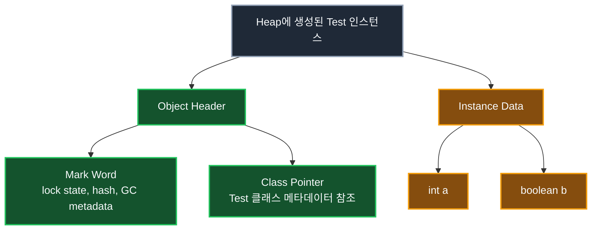
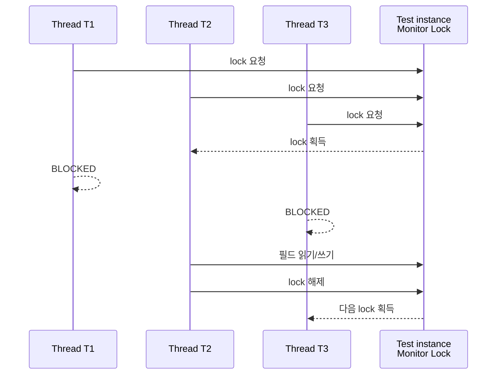
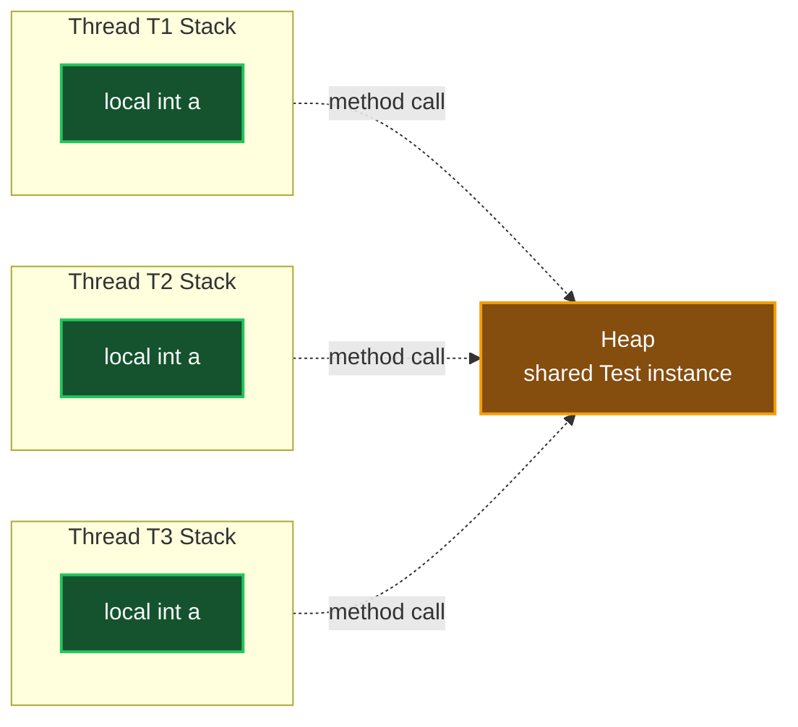
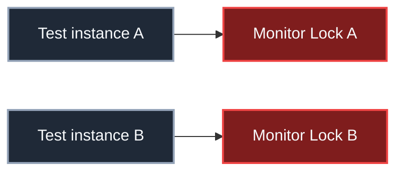

## 1. 개요: 객체는 데이터만 가지고 있지 않다

Java에서 `new` 연산자로 객체를 생성하면 해당 인스턴스는 기본적으로 Heap 영역에 만들어진다. 예를 들어 다음과 같은 클래스가 있다고 하자.

```java
class Test {
    private int a;
    private boolean b;
}
```

`new Test()`를 실행하면 Heap에는 `a`, `b` 같은 인스턴스 필드가 저장될 공간이 잡힌다. 그런데 실제 객체 메모리에는 필드 데이터만 있는 것이 아니다. JVM이 객체를 관리하기 위해 사용하는 메타데이터도 함께 존재한다. 이 메타데이터가 들어가는 대표적인 영역이 **Object Header**다.

Object Header에는 객체의 해시 코드, GC 관련 정보, 클래스 메타데이터를 찾기 위한 정보, 그리고 동기화와 관련된 락 상태 정보가 포함될 수 있다. 이 글에서는 동기화와 관련된 객체의 락 상태를 이해하기 위한 개념적 표현으로 **Lock flag**라는 말을 사용한다.

> **주의:** 실제 HotSpot JVM 구현에서는 단순한 `true/false` 필드 하나가 객체마다 붙어 있는 형태라기보다, Object Header의 Mark Word 안에 락 상태를 표현하는 비트들이 들어간다고 이해하는 것이 더 정확하다. 다만 동기화의 개념을 이해할 때는 "객체마다 락 상태를 나타내는 플래그가 있다"라고 생각하면 흐름을 잡기 쉽다.
{: .prompt-info }

## 2. 객체 메모리 레이아웃

객체 하나를 단순화해서 보면 다음과 같이 나눌 수 있다.



인스턴스 필드는 개발자가 클래스에 선언한 내용만 봐도 어느 정도 예측할 수 있다. `int a`, `boolean b`가 있으면 그 값이 저장될 공간이 필요하다는 사실은 명확하다. 반면 Object Header는 개발자가 직접 선언하지 않았지만 JVM이 객체를 관리하기 위해 붙이는 정보다.

이 글에서 집중할 부분은 Object Header 안의 동기화 관련 정보다. 여러 스레드가 같은 인스턴스에 동시에 접근하려고 할 때 JVM은 이 정보를 이용해서 누가 먼저 객체의 락을 획득했는지 판단한다.

## 3. Lock flag와 Monitor Lock

멀티스레드 환경에서 여러 스레드가 같은 객체의 필드에 접근할 수 있다. 예를 들어 `Thread T1`, `Thread T2`, `Thread T3`가 모두 같은 `Test` 인스턴스의 멤버에 접근하려고 한다고 하자.

이때 중요한 기준은 **어떤 객체의 락을 획득했는가**다. Java에서는 객체마다 동기화에 사용할 수 있는 락이 있고, 이 락을 흔히 **Monitor Lock**이라고 부른다. Lock flag는 이 Monitor Lock의 획득 여부와 락 상태를 떠올리기 위한 개념적 표현이다.



만약 `T2`가 아주 근소한 차이로 먼저 Monitor Lock을 획득했다면, `T1`과 `T3`는 같은 객체에 대한 동기화 영역에 들어가지 못하고 `BLOCKED` 상태가 된다. 이후 `T2`가 작업을 마치고 락을 해제하면, JVM과 OS 스케줄링에 따라 대기 중이던 스레드 중 하나가 다시 락 획득을 시도한다.

화장실 비유로 생각하면 쉽다. 한 칸짜리 화장실에 누군가 들어가 문을 잠그면, 밖에 있는 사람들은 문이 열릴 때까지 기다려야 한다. 이때 문을 잠그는 행위가 락 획득이고, 문이 열리는 순간이 락 해제다. 동시에 여러 사람이 같은 공간을 사용하지 못하도록 제한하는 장치가 바로 락이다.

> `BLOCKED`와 `WAITING`은 구분해야 한다. `synchronized` Monitor Lock을 얻지 못해 진입하지 못하는 상태는 일반적으로 `BLOCKED`다. 반면 `Object.wait()`나 `Thread.join()` 등 특정 대기 동작으로 멈춘 상태는 `WAITING` 계열로 볼 수 있다.
{: .prompt-warning }

## 4. synchronized가 사용하는 락

Java에서 Monitor Lock을 가장 직접적으로 사용하는 문법은 `synchronized`다.

```java
class MyCounter {
    private int counter = 0;

    public void incCounter() {
        synchronized (this) {
            ++counter;
        }
    }

    public int getCounter() {
        return counter;
    }
}
```

위 코드에서 `synchronized (this)`는 현재 `MyCounter` 인스턴스의 Monitor Lock을 획득한 뒤 블록 내부로 진입하겠다는 뜻이다. 여러 스레드가 같은 `MyCounter` 객체를 공유하고 `incCounter()`를 동시에 호출하더라도, `synchronized (this)` 블록 안에는 한 번에 하나의 스레드만 들어갈 수 있다.

```java
MyCounter counter = new MyCounter();

Thread t1 = new Thread(() -> {
    for (int i = 0; i < 100000; i++) {
        counter.incCounter();
    }
});

Thread t2 = new Thread(() -> {
    for (int i = 0; i < 100000; i++) {
        counter.incCounter();
    }
});
```

여기서 `t1`과 `t2`는 서로 다른 스레드지만 같은 `counter` 인스턴스를 공유한다. 따라서 두 스레드는 같은 Monitor Lock을 두고 경쟁한다. 한 스레드가 `synchronized (this)` 안에 들어가 있는 동안 다른 스레드는 같은 블록에 들어갈 수 없다.

> **Tip:** `++counter`는 한 줄로 보이지만 내부적으로는 읽기, 증가, 쓰기 과정으로 나뉜다. 여러 스레드가 동시에 실행하면 값이 누락될 수 있으므로 공유 상태를 변경할 때는 동기화가 필요하다.
{: .prompt-tip }

## 5. 지역 변수는 왜 보통 안전한가

다음과 같은 메서드가 있다고 하자.

```java
class Test {
    public void testFunction() {
        int a = 0;
        a++;
    }
}
```

여러 스레드가 같은 `Test` 인스턴스의 `testFunction()`을 동시에 호출할 수는 있다. 이 말은 **메서드를 호출할 때 사용하는 대상 객체가 같다**는 뜻이지, 메서드 내부의 지역 변수까지 공유한다는 뜻은 아니다. 메서드 내부의 지역 변수 `a`는 일반적으로 각 스레드의 Stack 영역에 따로 만들어진다.



이름은 모두 `a`로 같지만 실제 저장 위치는 스레드마다 다르다. `T1`의 `a`, `T2`의 `a`, `T3`의 `a`는 서로 다른 Stack Frame 안에 존재한다. 그래서 이런 지역 변수 자체는 보통 race condition의 대상이 되지 않는다.

따라서 `testFunction()`이 지역 변수 `a`만 사용한다면, 같은 인스턴스에 대해 동시에 호출되더라도 `a` 때문에 동기화 문제가 생기지는 않는다. 문제가 되는 쪽은 여러 스레드가 실제로 공유하는 데이터다. 대표적으로 같은 인스턴스 안의 필드, 정적 필드, 공유 컬렉션 등이 여기에 해당한다.

## 6. 인스턴스 락과 정적 락은 다르다

Object Header의 Monitor Lock은 기본적으로 **인스턴스마다 따로** 존재한다. 같은 클래스에서 만든 객체라도 인스턴스가 다르면 락도 다르다.

```java
Test a = new Test();
Test b = new Test();
```

`a`와 `b`는 모두 `Test` 클래스의 인스턴스지만 서로 다른 객체다. 따라서 `a`의 Monitor Lock과 `b`의 Monitor Lock도 별개다.



따라서 다음 두 코드는 서로 다른 락을 사용한다.

```java
synchronized (a) {
    // a 인스턴스의 Monitor Lock 사용
}

synchronized (b) {
    // b 인스턴스의 Monitor Lock 사용
}
```

반면 정적 메서드에 `synchronized`를 붙이면 인스턴스 락이 아니라 해당 클래스의 `Class` 객체에 대한 락을 사용한다.

```java
class Main {
    private static int counter = 0;

    public synchronized static void incCounter() {
        ++counter;
    }
}
```

위 코드는 개념적으로 다음과 비슷하다.

```java
class Main {
    private static int counter = 0;

    public static void incCounter() {
        synchronized (Main.class) {
            ++counter;
        }
    }
}
```

정적 멤버는 특정 인스턴스에 속하지 않고 클래스 수준에서 공유된다. 그래서 정적 동기화는 인스턴스의 Object Header가 아니라 `Main.class`라는 Class 객체의 Monitor Lock을 기준으로 동작한다고 이해하면 된다.

## 7. 경량 락, 중량 락, 스핀 락

Lock flag를 이해했다면 자연스럽게 경량 락과 중량 락의 차이도 함께 살펴볼 수 있다. 이 주제는 JVM 내부 구현과 OS 수준 동기화가 함께 맞물려 있다.

- **경량 락**: 커널 수준의 무거운 동기화 객체를 바로 사용하지 않고, 사용자 모드에서 비교적 가볍게 처리하려는 락 전략이다.
- **중량 락**: OS 커널의 동기화 메커니즘까지 사용하는 더 무거운 락이다. 경쟁이 심해지면 스레드가 실제로 블록되고 스케줄링 비용이 커질 수 있다.
- **스핀 락**: 락을 얻을 때까지 짧은 루프를 돌며 계속 확인하는 방식이다. 객체라기보다 "반복적으로 확인하는 전략"에 가깝다.

간단한 스핀 락은 다음처럼 CAS(Compare-And-Set)를 이용해 구현할 수 있다.

```java
import java.util.concurrent.atomic.AtomicBoolean;

class SpinLock {
    private final AtomicBoolean locked = new AtomicBoolean(false);

    public void lock() {
        while (!locked.compareAndSet(false, true)) {
            // lock을 얻을 때까지 짧게 반복
        }
    }

    public void unlock() {
        locked.set(false);
    }
}
```

스핀 락은 락 대기 시간이 매우 짧을 때는 문맥 전환 비용을 줄일 수 있다. 하지만 오래 기다려야 하는 상황에서 계속 CPU를 사용하며 반복하면 오히려 비효율적이다. 따라서 어떤 락이 항상 좋다기보다, 경쟁 정도와 대기 시간에 따라 적절한 방식이 달라진다.

## 8. 정리

Java 객체는 Heap에 생성되며, 인스턴스 필드 외에도 JVM이 관리하는 Object Header를 가진다. 이 Object Header에는 동기화와 관련된 락 상태 정보가 들어갈 수 있고, 이를 개념적으로 Lock flag라고 이해할 수 있다.

Java의 `synchronized`는 객체의 Monitor Lock을 획득한 뒤 임계 영역에 진입한다. 같은 인스턴스를 공유하는 여러 스레드는 같은 Monitor Lock을 두고 경쟁하지만, 서로 다른 인스턴스는 서로 다른 락을 가진다. 정적 동기화는 인스턴스가 아니라 클래스 객체의 락을 기준으로 동작한다.

결국 기억해야 할 핵심은 하나다. **Monitor Lock은 클래스 전체가 아니라 객체 인스턴스 단위의 동기화 기준이다.** 이 사실을 이해해야 이후 `synchronized`, `wait()`, `notify()`, `ReentrantLock`, 스핀 락 같은 동기화 개념을 추상적으로 외우지 않고 실제 동작 흐름으로 이해할 수 있다.

---

## Quiz: 학습 내용 확인하기

**Q1. `new Test()`를 두 번 호출해 `Test a`, `Test b`를 만들었다. `a`와 `b`는 같은 Monitor Lock을 공유하는가?**

<details>
<summary>정답 확인</summary>
<div>
공유하지 않는다. 두 객체는 같은 클래스에서 만들어졌지만 서로 다른 인스턴스이므로 각각 별도의 Object Header와 Monitor Lock을 가진다.
</div>
</details>

**Q2. `synchronized (this)`는 어떤 락을 기준으로 동작하는가?**

<details>
<summary>정답 확인</summary>
<div>
현재 인스턴스, 즉 `this`가 가리키는 객체의 Monitor Lock을 기준으로 동작한다.
</div>
</details>

**Q3. 메서드 내부 지역 변수는 왜 일반적으로 여러 스레드 사이에서 race condition이 잘 발생하지 않는가?**

<details>
<summary>정답 확인</summary>
<div>
지역 변수는 보통 각 스레드의 Stack Frame에 따로 생성된다. 이름이 같아도 스레드마다 별도의 저장 공간을 사용하므로, 그 지역 변수 자체는 공유 상태가 아니다.
</div>
</details>
