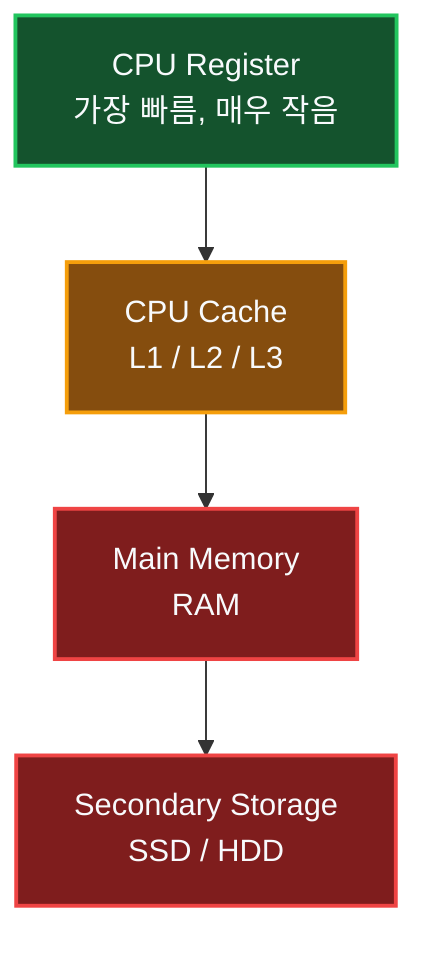
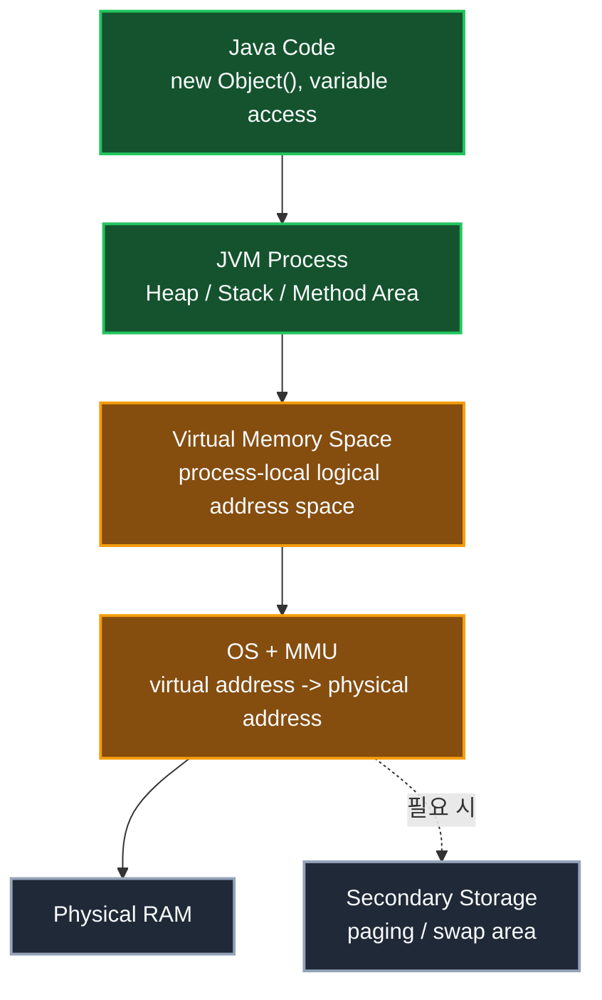
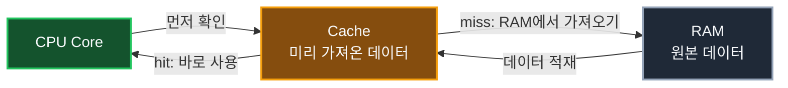
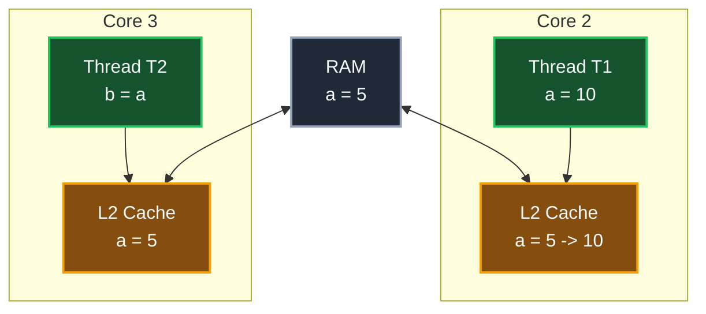
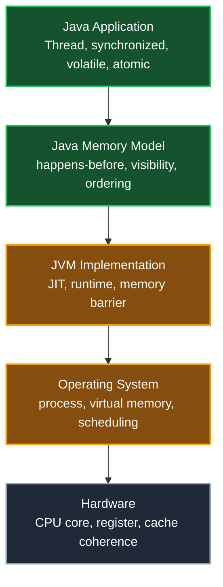

## 1. 개요: 메모리는 하나처럼 보이지만 계층적이다

프로그램에서 변수를 사용한다는 것은 결국 메모리를 사용한다는 뜻이다. 다만 우리가 코드에서 보는 메모리와 실제 하드웨어가 사용하는 메모리는 같은 층위의 개념이 아니다.

컴퓨터의 메모리는 보통 다음과 같은 계층 구조로 설명한다.



위로 갈수록 CPU에 가깝고 빠르지만 용량이 작다. 아래로 내려갈수록 느려지지만 용량은 커진다. 레지스터는 몇 바이트, 혹은 몇 비트 단위로 이야기할 만큼 작고 CPU 내부에 직접 포함된다. 캐시는 KB, MB 단위로 존재하고, RAM은 GB 단위, SSD나 HDD 같은 보조 저장 장치는 TB 단위까지 확장된다.

이 계층 구조가 필요한 이유는 단순하다. CPU는 매우 빠르지만 RAM이나 디스크는 상대적으로 느리다. CPU가 매번 느린 장치에서 데이터를 가져오면 계산 장치가 대부분의 시간을 대기 상태로 보내게 된다. 그래서 CPU 가까이에 작은 고속 저장 공간을 두고, 자주 사용할 것 같은 데이터를 미리 가져다 놓는다. 이것이 캐시의 기본 역할이다.

## 2. 유저 모드 애플리케이션은 물리 메모리를 직접 다루지 않는다

일반적인 Windows, Linux 같은 범용 운영체제에서 우리가 작성하는 Java 프로그램은 유저 모드 애플리케이션으로 실행된다. 따라서 애플리케이션이 RAM의 절대 주소를 직접 지정해서 읽고 쓰는 방식으로 동작하지 않는다.

운영체제는 RAM과 보조 저장 장치를 묶어 하나의 논리적인 메모리 공간처럼 보이게 만든다. 이를 가상 메모리 공간(Virtual Memory Space, VMS)이라고 한다. JVM도 예외가 아니다. JVM 역시 운영체제 위에서 실행되는 하나의 유저 모드 프로세스이므로, 운영체제가 제공하는 VMS 안에서 동작한다.

> Java 코드에서 변수를 선언하고 객체를 생성한다고 해서 물리 RAM의 특정 위치를 직접 제어하는 것은 아니다. Java 개발자가 다루는 것은 JVM이 제공하는 추상화된 메모리 모델이다.
{: .prompt-info }

### 2.1 VMS는 RAM 그 자체가 아니다

VMS를 이해할 때 중요한 점은 "프로세스가 보는 주소"와 "실제 물리 메모리 주소"가 다르다는 것이다. Java 코드에서 어떤 객체가 Heap에 생성됐다고 말할 때, 그 Heap은 JVM 프로세스에 할당된 가상 주소 공간 안의 Heap이다. 이 주소가 곧바로 물리 RAM의 절대 위치를 의미하지 않는다.

운영체제는 각 프로세스에 독립적인 가상 주소 공간을 제공한다. 프로세스는 자신이 매우 큰 연속 메모리 공간을 가진 것처럼 동작하지만, 실제로는 운영체제와 CPU의 메모리 관리 장치(MMU)가 가상 주소를 물리 주소로 변환한다. 필요한 경우 일부 페이지는 RAM에 있고, 일부는 보조 저장 장치를 이용한 페이징 영역과 연결될 수도 있다.



이 그림은 Java 코드가 물리 RAM을 직접 다루지 않는다는 점을 보여주기 위한 계층도다. 위에서 아래로 내려갈수록 개발자가 작성한 코드에서 멀어지고, 운영체제와 하드웨어에 가까워진다.

- `Java Code`: 개발자가 작성한 코드다. `new Object()`로 객체를 만들거나 변수를 읽고 쓰는 위치다.
- `JVM Process`: Java 프로그램을 실행하는 JVM 프로세스다. JVM은 내부적으로 Heap, Stack 같은 런타임 데이터 영역을 관리한다.
- `Virtual Memory Space`: 운영체제가 JVM 프로세스에 제공한 논리적 주소 공간이다. JVM의 Heap도 결국 이 가상 주소 공간 안에 잡힌다.
- `OS + MMU`: 운영체제와 CPU의 메모리 관리 장치가 가상 주소를 실제 물리 주소로 변환한다.
- `Physical RAM`: 실제 메모리 칩에 저장된 데이터가 있는 곳이다.
- `Secondary Storage`: RAM이 부족하거나 페이지가 밀려났을 때 일부 메모리 내용을 보관할 수 있는 페이징/스왑 영역이다.

즉 Java 코드에서 객체를 생성하면 "JVM Heap에 객체가 생겼다"고 말할 수는 있지만, 그 말이 "RAM의 특정 물리 주소에 개발자가 직접 값을 썼다"는 뜻은 아니다. Java 코드는 JVM이 관리하는 Heap을 보고, JVM 프로세스는 운영체제가 제공한 VMS 안에서 동작하며, 실제 물리 RAM 접근은 운영체제와 MMU가 가상 주소를 변환한 뒤 처리한다.

또한 오른쪽 아래의 `Secondary Storage`는 항상 거쳐 가는 경로가 아니다. RAM 공간이 부족하거나 운영체제가 어떤 페이지를 당장 RAM에 둘 필요가 없다고 판단할 때, 해당 페이지가 페이징 파일이나 스왑 영역으로 이동할 수 있다는 의미다.

따라서 Java에서 다음과 같은 표현을 사용할 때는 층위를 분명히 해야 한다.

- "객체가 Heap에 있다": JVM 프로세스의 런타임 데이터 영역 관점
- "변수가 메모리를 사용한다": JVM이 관리하는 가상 주소 공간 관점
- "RAM의 몇 번지에 접근한다": 일반 Java 애플리케이션이 직접 다루지 않는 물리 메모리 관점

이 구분이 중요한 이유는 동시성 문제를 설명할 때도 마찬가지다. Java 스레드가 공유 객체를 읽고 쓰는 문제는 JVM이 제공하는 메모리 모델 안에서 설명해야 한다. 반면 CPU 캐시와 물리 메모리 사이의 일관성은 그 아래 하드웨어 계층에서 처리되는 문제다.

> 운영체제의 가상 메모리 시스템, 페이지 인/페이지 아웃, 프로세스별 가상 주소 공간에 대한 자세한 내용은 [운영체제 가상 메모리 시스템](/posts/가상메모리/) 글에서 따로 정리했다.
{: .prompt-tip }

## 3. 캐시는 왜 필요한가

캐시는 CPU와 RAM 사이의 속도 차이를 줄이기 위한 장치다. 비유하면 교수의 책상과 조교, 도서관의 관계로 볼 수 있다.

- 교수의 책상: CPU 레지스터
- 조교가 미리 가져다 둔 책: CPU 캐시
- 도서관 전체 서가: RAM 또는 더 느린 저장 장치

교수가 연구하다가 특정 책이 필요할 때마다 직접 도서관에 가면 시간이 오래 걸린다. 눈치 빠른 조교가 교수가 곧 필요로 할 책을 미리 가져다 두면 훨씬 빠르게 연구를 이어갈 수 있다. 이때 교수가 찾은 책이 조교에게 이미 있으면 캐시 히트(cache hit), 없으면 캐시 미스(cache miss)다.



캐시가 잘 맞으면 CPU는 느린 메모리에 접근하지 않고 빠르게 계산을 이어갈 수 있다. 반대로 예측이 빗나가면 RAM에서 다시 데이터를 가져와야 하므로 시간이 더 걸린다.

## 4. 멀티코어 환경에서는 캐시 일관성이 문제가 된다

단일 CPU 코어만 생각하면 캐시는 단순해 보인다. 하지만 CPU 코어가 여러 개이고 각 코어가 자신만의 캐시를 갖는 순간 문제가 생긴다.

예를 들어 공유 변수 `a`가 있고, 처음 값이 `5`라고 가정하자.

```java
class SharedData {
    int a = 5;
    int b = 0;

    void testA() {
        a = 10;
    }

    void testB() {
        b = a;
    }
}
```

`Thread T1`은 `testA()`를 실행해서 `a`에 `10`을 쓴다. `Thread T2`는 `testB()`를 실행해서 `a`를 읽고 `b`에 저장한다. 두 스레드가 서로 다른 CPU 코어에서 실행되고, 각 코어의 캐시에 `a`의 값이 따로 올라와 있다면 어떤 일이 생길 수 있을까?



`T1`이 `a`를 `10`으로 바꾸는 순간, 다른 코어의 캐시가 여전히 `a = 5`라고 알고 있다면 `T2`는 오래된 값을 읽을 수 있다. 즉 같은 변수 `a`의 값이 캐시마다 다르게 보이는 문제가 생길 수 있다.

이 문제를 해결하기 위해 하드웨어는 캐시 일관성(cache coherence)을 유지하는 프로토콜을 사용한다. 대표적으로 MESI 계열의 프로토콜이 있고, 핵심은 한 코어가 어떤 캐시 라인의 값을 변경했을 때 다른 코어들이 오래된 값을 계속 사용하지 못하도록 상태를 맞추는 것이다.

> 여기서 말하는 캐시 일관성은 CPU와 캐시가 처리하는 하드웨어 수준의 문제다. Java 코드에서 직접 L1, L2, L3 캐시를 제어하는 것이 아니다.
{: .prompt-warning }

## 5. 원자성과 캐시 일관성은 같은 말이 아니다

동시성 문제를 설명할 때 원자성(atomicity)이라는 말이 자주 등장한다. 원자성은 어떤 연산이 중간에 끼어들 수 없는 하나의 단위처럼 수행되는 성질을 말한다.

예를 들어 `a = 10` 같은 단순 대입은 코드 한 줄로 보인다. 하지만 실제 하드웨어와 JVM 실행 관점에서는 값을 읽고, 계산하고, 쓰고, 필요하다면 캐시나 메모리 상태를 맞추는 여러 과정이 엮인다. 더 복잡한 예인 `count++`는 훨씬 분명하다.

```java
count++;
```

위 코드는 한 줄이지만 개념적으로는 다음 단계로 나뉜다.

1. `count` 값을 읽는다.
2. 값을 1 증가시킨다.
3. 증가된 값을 다시 저장한다.

여러 스레드가 동시에 이 과정을 수행하면 각 스레드가 같은 이전 값을 읽고 각자 증가시킨 뒤 저장할 수 있다. 이 경우 최종 값이 기대보다 작아진다. 이것은 Java 코드 수준에서 관찰되는 race condition이다.

다만 이것을 곧바로 "CPU 캐시 일관성이 깨졌다"라고 설명하면 부정확해진다. 하드웨어 캐시 일관성은 CPU가 처리하는 영역이고, Java 개발자가 다루는 동시성 보장은 Java Memory Model과 `synchronized`, `volatile`, `AtomicInteger` 같은 언어 및 라이브러리 수준의 도구를 통해 이해해야 한다.

## 6. 참조형은 결국 주소를 따라가는 구조다

Java의 참조형 변수는 객체 자체를 담는 것이 아니라 객체를 가리키는 참조 값을 담는다. C나 C++의 포인터와 완전히 같은 문법은 아니지만, "어딘가에 있는 객체를 참조해서 멤버에 접근한다"는 관점에서는 포인터 역참조와 유사한 면이 있다.

```java
class Counter {
    int value;
}

class CounterService {
    void increase(Counter counter) {
        counter.value++;
    }
}
```

`counter.value++`는 코드상으로는 간단해 보이지만 실제로는 다음 흐름을 포함한다.

1. `counter` 참조가 가리키는 객체를 찾는다.
2. 객체 안의 `value` 필드 위치를 찾는다.
3. 현재 값을 읽는다.
4. 값을 증가시킨다.
5. 다시 저장한다.

여러 스레드가 같은 `Counter` 인스턴스를 공유하고 `increase()`를 동시에 호출하면 `value++`는 안전하지 않다. 이 문제는 하드웨어 캐시 프로토콜을 직접 제어해서 해결하는 문제가 아니라, Java 동시성 도구를 사용해 임계 영역을 보호하거나 원자적 연산을 사용해야 하는 문제다.

```java
class SafeCounter {
    private int value;

    public synchronized void increase() {
        value++;
    }

    public synchronized int getValue() {
        return value;
    }
}
```

또는 단순 카운터라면 `AtomicInteger`를 사용할 수도 있다.

```java
import java.util.concurrent.atomic.AtomicInteger;

class AtomicCounter {
    private final AtomicInteger value = new AtomicInteger();

    public void increase() {
        value.incrementAndGet();
    }

    public int getValue() {
        return value.get();
    }
}
```

## 7. JVM과 CPU 캐시 일관성은 층위를 나누어 이해해야 한다

중요한 결론은 이것이다. CPU 캐시 일관성은 하드웨어 수준의 문제이고, Java Memory Model은 Java 프로그램이 멀티스레드 환경에서 값을 어떻게 읽고 쓸 수 있는지 정의하는 언어 수준의 규칙이다.

물론 실제 JVM은 결국 특정 CPU와 운영체제 위에서 실행된다. 따라서 JVM 구현체와 JIT 컴파일러는 각 하드웨어의 메모리 모델을 고려해 적절한 명령어와 메모리 배리어를 사용한다. 하지만 Java 애플리케이션 개발자가 동시성 문제를 설명할 때 CPU의 L1, L2 캐시를 직접 기준으로 삼으면 추상화 계층이 섞인다.



이 그림은 Java 동시성 문제를 어느 계층에서 바라봐야 하는지 정리한 것이다. 위쪽 두 박스는 Java 개발자가 코드로 직접 다루는 영역이고, 아래쪽으로 갈수록 JVM 구현체, 운영체제, 하드웨어가 책임지는 영역이다.

- `Java Application`: 개발자가 작성하는 코드다. `Thread`, `synchronized`, `volatile`, `AtomicInteger`, `Lock` 같은 도구를 사용해 공유 데이터 접근을 제어한다.
- `Java Memory Model`: Java 언어가 스레드 간 메모리 접근을 어떻게 해석할지 정한 규칙이다. 어떤 쓰기 결과가 다른 스레드에 보이는지, 어떤 실행 순서가 보장되는지, 어떤 관계가 `happens-before`를 만드는지가 여기에 속한다.
- `JVM Implementation`: 실제 JVM 구현 영역이다. JIT 컴파일러, 런타임, 메모리 배리어 같은 장치로 Java Memory Model의 규칙을 실제 CPU 명령어 수준에 맞게 구현한다.
- `Operating System`: JVM 프로세스를 실행하고, 스레드를 스케줄링하며, 가상 메모리 공간을 관리한다.
- `Hardware`: 실제 CPU 코어, 레지스터, 캐시가 있는 계층이다. CPU 캐시 일관성은 이 계층에서 처리된다.

따라서 Java 코드에서 공유 변수 값이 예상과 다르게 보일 때, 첫 번째로 확인해야 할 것은 "L1 캐시가 어긋났는가?"가 아니다. 먼저 `synchronized`, `volatile`, atomic 클래스, `Lock` 등을 통해 Java Memory Model이 요구하는 가시성(visibility)과 순서(ordering)를 제대로 만들었는지 확인해야 한다.

예를 들어 `volatile`은 CPU 캐시를 직접 비우는 문법이 아니다. Java 코드 관점에서 해당 변수의 읽기와 쓰기에 가시성 및 순서 제약을 부여하는 키워드다. JVM은 이 규칙을 만족시키기 위해 필요한 경우 메모리 배리어 같은 하위 계층의 장치를 사용한다.

Java 개발자는 다음처럼 구분해서 이해하는 것이 좋다.

- CPU 캐시 일관성: 여러 CPU 코어의 캐시가 같은 메모리 값을 일관되게 보도록 맞추는 하드웨어 수준의 문제
- Java Memory Model: 여러 Java 스레드가 공유 변수의 값을 어떤 순서와 가시성으로 관찰할 수 있는지 정의하는 규칙
- Java 동기화 도구: `synchronized`, `volatile`, `Lock`, `AtomicInteger`처럼 JMM 위에서 올바른 동시성 코드를 작성하게 해주는 수단

## 8. 정리

CPU는 RAM보다 훨씬 빠르기 때문에 레지스터와 캐시를 이용해 데이터를 가까이에 두고 계산한다. 멀티코어 CPU에서는 각 코어가 가진 캐시의 값이 서로 어긋나지 않도록 하드웨어 수준에서 캐시 일관성을 유지한다.

하지만 Java 애플리케이션을 작성할 때 이 문제를 직접 다루지는 않는다. JVM은 운영체제 위에서 실행되는 유저 모드 프로세스이고, Java 코드는 JVM이 제공하는 메모리 추상화 안에서 동작한다. 따라서 Java의 동시성 문제는 CPU 캐시 프로토콜이 아니라 Java Memory Model, 공유 객체, 원자성, 가시성, happens-before 관계를 기준으로 이해해야 한다.

결국 핵심은 층위를 분리하는 것이다. CPU 캐시 일관성은 하드웨어가 다루는 문제이고, Java 개발자는 JMM과 Java 동기화 도구를 통해 스레드 간 메모리 공유 문제를 다룬다.

---

## Quiz: 학습 내용 확인하기

**Q1. CPU 캐시는 왜 필요한가?**

<details>
<summary>정답 확인</summary>
<div>
CPU와 RAM 사이의 속도 차이를 줄이기 위해 필요하다. CPU가 곧 사용할 가능성이 높은 데이터를 가까운 캐시에 미리 가져다 두면 느린 RAM 접근을 줄일 수 있다.
</div>
</details>

**Q2. Java 애플리케이션이 RAM의 절대 주소를 직접 읽고 쓰는가?**

<details>
<summary>정답 확인</summary>
<div>
일반적인 Java 애플리케이션은 유저 모드 프로세스로 실행되며, 운영체제가 제공하는 가상 메모리 공간 위에서 동작한다. 따라서 물리 RAM의 절대 주소를 직접 제어하지 않는다.
</div>
</details>

**Q3. Java 동시성 문제를 설명할 때 주로 기준으로 삼아야 하는 모델은 무엇인가?**

<details>
<summary>정답 확인</summary>
<div>
Java Memory Model이다. CPU 캐시 일관성은 하드웨어 수준의 문제이고, Java 코드에서는 JMM의 가시성, 순서, happens-before 관계와 `synchronized`, `volatile`, atomic 클래스 등을 기준으로 동시성을 이해해야 한다.
</div>
</details>
