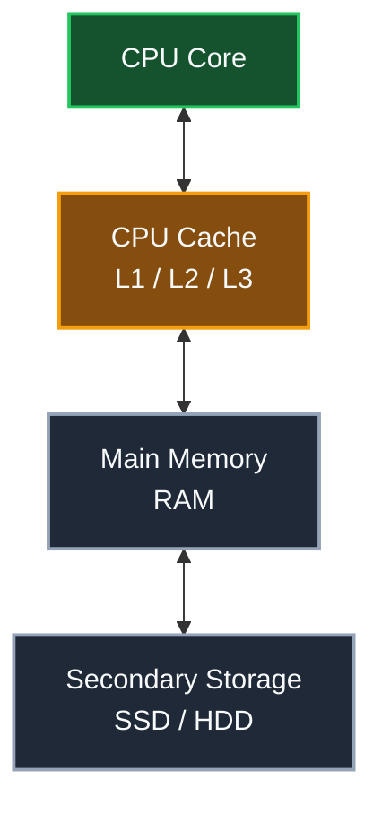
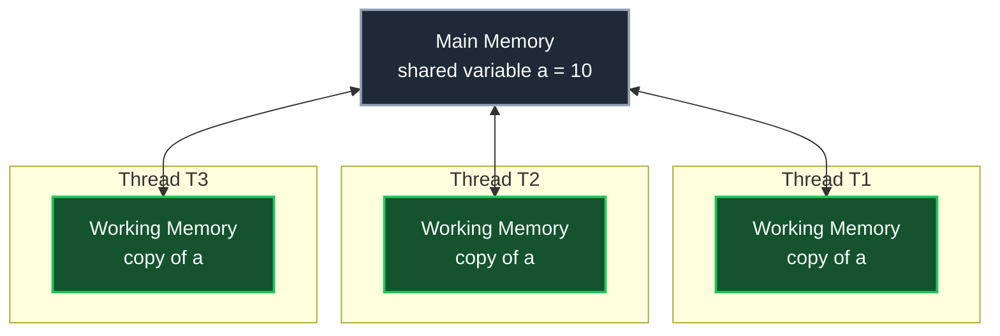
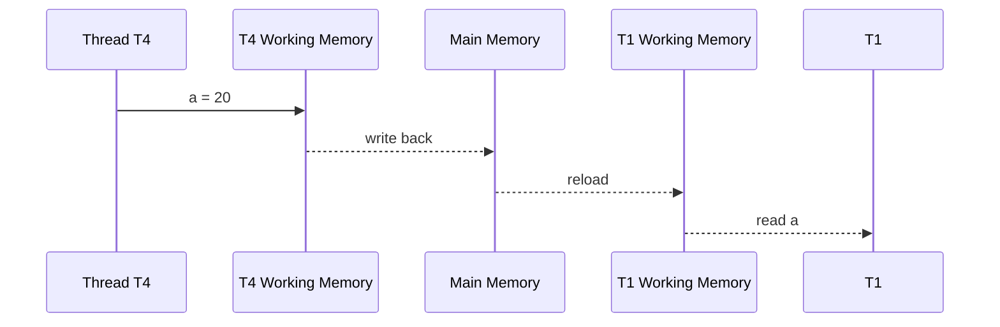
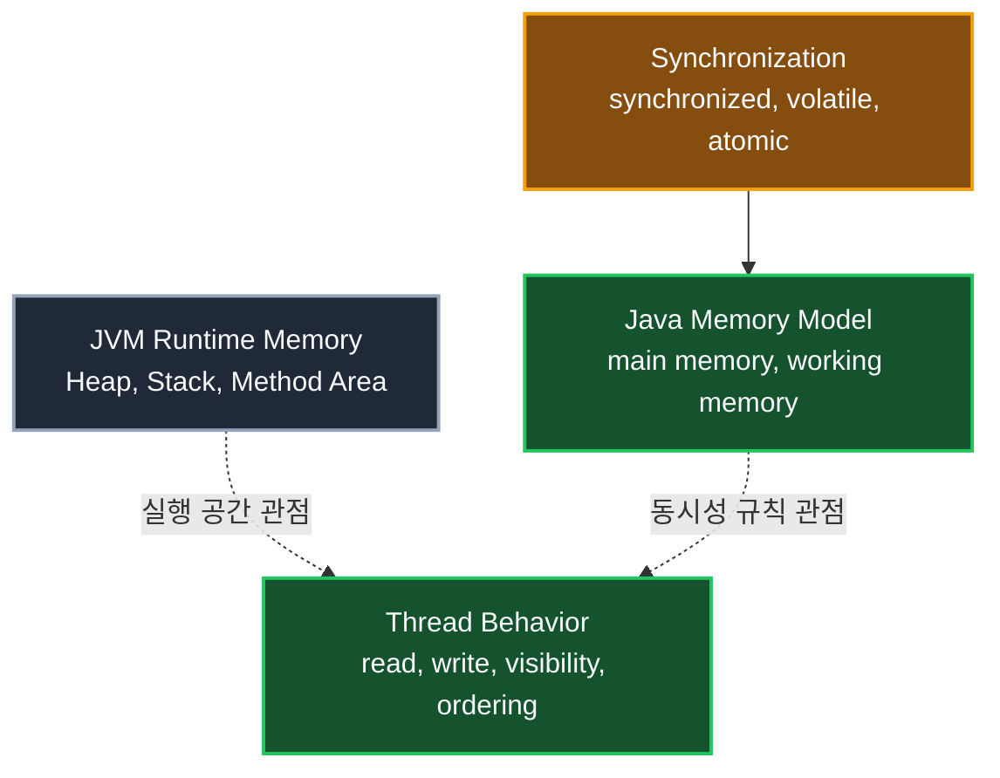

## 1. 개요: JVM은 하드웨어를 직접 드러내지 않는다

JVM은 운영체제 위에서 실행되는 하나의 사용자 모드 애플리케이션 프로세스다. Java 프로그램은 JVM 위에서 실행되며, JVM은 운영체제와 하드웨어의 차이를 감추는 추상화 계층 역할을 한다.

그래서 Java 애플리케이션을 작성할 때 일반적으로 특정 CPU의 레지스터, L1/L2/L3 캐시, 물리 메모리 주소를 직접 다루지 않는다. 그런 영역은 JVM 구현체, 운영체제, 하드웨어가 협력해서 처리한다. Java 개발자는 대신 JVM이 정의하는 실행 규칙과 Java 언어 차원의 메모리 규칙을 기준으로 코드를 작성한다.

멀티스레드 환경에서 특히 중요한 규칙이 **Java Memory Model**, 줄여서 **JMM**이다. JMM은 여러 스레드가 공유 데이터를 읽고 쓸 때 값이 언제 보이고, 어떤 순서가 보장되는지를 정의한다.

> JMM은 "Heap은 어디에 있고 Stack은 어디에 있다" 같은 JVM 런타임 메모리 구조 설명과 같은 관점이 아니다. JMM은 멀티스레드 환경에서 변수의 읽기, 쓰기, 가시성, 순서를 설명하기 위한 규칙 모델이다.
{: .prompt-info }

## 2. 하드웨어 캐시와 JMM의 추상화

실제 컴퓨터는 CPU와 RAM 사이의 속도 차이를 줄이기 위해 캐시를 사용한다. CPU 코어는 자주 쓰는 값을 가까운 캐시에 가져와서 빠르게 읽고 쓴다.



문제는 CPU 코어가 여러 개일 때 생긴다. 각 코어가 자기 캐시에 같은 메모리 위치의 값을 따로 가지고 있으면, 어느 순간에는 한 코어가 보는 값과 다른 코어가 보는 값이 다를 수 있다. 하드웨어는 캐시 일관성 프로토콜을 통해 이 문제를 다루지만, Java 개발자가 CPU 캐시 프로토콜을 직접 제어하지는 않는다.

JMM은 이런 하드웨어 차이를 그대로 개발자에게 노출하지 않고, Java 스레드 관점에서 **메인 메모리**와 **작업 메모리**라는 모델로 설명한다.

## 3. 메인 메모리와 작업 메모리

JMM의 기본 모델은 다음처럼 이해할 수 있다.

- **메인 메모리(Main Memory)**: 여러 스레드가 공유하는 변수의 원본 값이 있다고 보는 논리적 공간
- **작업 메모리(Working Memory)**: 각 스레드가 사용하는 변수의 사본이 있다고 보는 논리적 공간



각 스레드는 공유 변수를 사용할 때 메인 메모리의 값을 매번 직접 읽고 쓰는 것처럼 동작하지 않는다. 개념적으로는 메인 메모리의 값을 자기 작업 메모리로 가져와서 사용하고, 변경한 값을 다시 메인 메모리에 반영한다.

여기서 중요한 점은 작업 메모리가 Java 코드로 직접 접근할 수 있는 메모리 영역이 아니라는 것이다. 개발자가 `workingMemory.load(a)` 같은 코드를 호출해서 작업 메모리를 제어하는 방식은 없다. 작업 메모리는 JMM을 설명하기 위한 논리적 모델이며, 실제 구현은 JVM, JIT 컴파일러, CPU, 운영체제의 동작과 연결된다.

> 지역 변수와 매개변수는 일반적으로 스레드마다 독립적인 Stack Frame에 존재하므로 다른 스레드와 직접 공유되지 않는다. JMM에서 주로 문제가 되는 것은 인스턴스 필드, 정적 필드, 배열 요소처럼 여러 스레드가 공유할 수 있는 값이다.
{: .prompt-tip }

## 4. 읽기와 쓰기는 사본을 거칠 수 있다

공유 변수 `a`의 값이 메인 메모리에 `10`으로 있다고 가정하자. 여러 스레드가 이 값을 읽으면 각 스레드의 작업 메모리에는 `a`의 사본이 들어간다.

```java
class SharedData {
    static int a = 10;
}
```

어떤 스레드가 `a`를 `20`으로 변경했다고 해서, 다른 모든 스레드가 즉시 `20`을 보리라고 단정할 수 없다. 변경한 스레드의 작업 메모리에는 새 값이 반영되었지만, 그 값이 메인 메모리에 언제 반영되는지, 다른 스레드의 작업 메모리가 언제 새 값을 다시 읽는지는 동기화 규칙에 따라 달라진다.



위 흐름이 항상 한 번에 원자적으로 끝나는 것은 아니다. `T4`가 자기 작업 메모리에서 값을 변경하는 시점, 변경된 값이 메인 메모리에 반영되는 시점, `T1`이 새 값을 다시 읽는 시점 사이에는 간격이 생길 수 있다.

이 간격 때문에 멀티스레드 프로그램에서는 다음과 같은 문제가 발생한다.

- 한 스레드가 바꾼 값을 다른 스레드가 한동안 보지 못한다.
- 여러 스레드가 같은 값을 읽고 각각 갱신한 뒤 덮어써서 일부 변경이 사라진다.
- 코드상 순서와 다른 순서로 값이 관찰되는 것처럼 보인다.

## 5. race condition 예제

가장 흔한 예제는 공유 카운터다.

```java
class Counter {
    private int value = 0;

    public void increase() {
        value++;
    }

    public int getValue() {
        return value;
    }
}
```

`value++`는 한 줄이지만 실제 의미는 하나의 동작이 아니다.

1. `value`를 읽는다.
2. 읽은 값에 1을 더한다.
3. 계산한 값을 다시 저장한다.

두 스레드가 동시에 `increase()`를 호출하면 둘 다 같은 기존 값을 읽을 수 있다. 예를 들어 `value`가 `10`일 때 `T1`과 `T2`가 모두 `10`을 읽고 각각 `11`을 저장하면, 두 번 증가했는데 최종 값은 `12`가 아니라 `11`이 될 수 있다. 이런 상황을 **race condition**이라고 한다.

```java
public class RaceConditionExample {
    static class Counter {
        private int value = 0;

        void increase() {
            value++;
        }

        int getValue() {
            return value;
        }
    }

    public static void main(String[] args) throws InterruptedException {
        Counter counter = new Counter();

        Thread t1 = new Thread(() -> {
            for (int i = 0; i < 100_000; i++) {
                counter.increase();
            }
        });

        Thread t2 = new Thread(() -> {
            for (int i = 0; i < 100_000; i++) {
                counter.increase();
            }
        });

        t1.start();
        t2.start();
        t1.join();
        t2.join();

        System.out.println(counter.getValue());
    }
}
```

기대값은 `200000`이지만, 실제 실행 결과는 그보다 작게 나올 수 있다. `value++`가 원자적이지 않고, 여러 스레드가 공유 값을 동시에 읽고 쓰기 때문이다.

## 6. 동기화는 필요할 때 강제해야 한다

JMM에서 중요한 핵심은 **언제 동기화가 일어나는가**다. 모든 변수 접근마다 모든 스레드의 작업 메모리를 즉시 동기화하면 정확성은 좋아 보일 수 있지만 성능은 크게 떨어진다. 그래서 JVM은 항상 모든 값을 즉시 동기화하지 않는다.

대신 Java는 개발자가 동기화가 필요한 지점을 표현할 수 있는 문법과 라이브러리를 제공한다.

대표적인 도구는 다음과 같다.

- `synchronized`
- `volatile`
- `java.util.concurrent.locks.Lock`
- `AtomicInteger` 같은 atomic 클래스
- `ConcurrentHashMap` 같은 동시성 컬렉션

### 6.1 synchronized

`synchronized`는 임계 영역에 한 번에 하나의 스레드만 들어가도록 제한한다. 또한 lock을 획득하고 해제하는 과정에서 JMM의 happens-before 관계가 만들어져 가시성도 함께 확보된다.

```java
class SafeCounter {
    private int value = 0;

    public synchronized void increase() {
        value++;
    }

    public synchronized int getValue() {
        return value;
    }
}
```

이제 여러 스레드가 같은 `SafeCounter` 인스턴스를 공유하더라도 `increase()`는 한 번에 하나의 스레드만 실행된다. `value++`의 읽기, 증가, 쓰기 과정이 다른 스레드와 섞이지 않도록 보호된다.

### 6.2 volatile

`volatile`은 특정 변수의 읽기와 쓰기에 대해 가시성 보장을 제공한다. 한 스레드가 `volatile` 변수에 쓴 값은 다른 스레드가 그 변수를 읽을 때 볼 수 있도록 보장된다.

```java
class StopFlag {
    private volatile boolean running = true;

    public void stop() {
        running = false;
    }

    public void runLoop() {
        while (running) {
            // 작업 수행
        }
    }
}
```

`running`이 `volatile`이 아니면 한 스레드가 `stop()`에서 `false`로 바꾸어도, 루프를 돌고 있는 다른 스레드가 그 변경을 즉시 보지 못할 수 있다. `volatile`을 사용하면 변경된 값의 가시성을 확보할 수 있다.

다만 `volatile`은 `value++` 같은 복합 연산의 원자성을 보장하지 않는다. 읽고, 계산하고, 다시 쓰는 전체 과정을 하나의 원자적 작업으로 만들어 주지는 않는다.

> `volatile`은 "CPU 캐시를 직접 비운다"는 문법이 아니다. Java 언어 차원에서 해당 변수의 가시성과 순서 제약을 부여하고, JVM이 그 규칙을 만족하도록 구현한다고 이해해야 한다.
{: .prompt-warning }

### 6.3 AtomicInteger

단순 카운터처럼 하나의 값을 원자적으로 갱신해야 한다면 atomic 클래스를 사용할 수 있다.

```java
import java.util.concurrent.atomic.AtomicInteger;

class AtomicCounter {
    private final AtomicInteger value = new AtomicInteger();

    public void increase() {
        value.incrementAndGet();
    }

    public int getValue() {
        return value.get();
    }
}
```

`AtomicInteger`는 내부적으로 CAS(Compare-And-Set) 같은 원자적 연산을 사용해 여러 스레드가 동시에 값을 갱신해도 변경이 사라지지 않도록 돕는다.

## 7. Heap, Stack과 JMM을 섞어 이해하지 않기

JVM 메모리 구조를 설명할 때는 Heap, Stack, Method Area 같은 용어가 나온다. JMM을 설명할 때는 메인 메모리와 작업 메모리라는 용어가 나온다. 두 설명은 서로 관련은 있지만 같은 분류 기준이 아니다.



Heap과 Stack은 JVM이 프로그램 실행 중 데이터를 배치하는 런타임 메모리 영역을 설명한다. 반면 메인 메모리와 작업 메모리는 여러 스레드가 공유 변수의 값을 어떻게 관찰할 수 있는지를 설명하는 규칙 모델이다.

예를 들어 인스턴스 필드는 Heap에 있는 객체 내부에 저장된다고 설명할 수 있다. 동시에 JMM 관점에서는 그 필드 값이 메인 메모리에 있고, 각 스레드가 작업 메모리에 사본을 가져와 사용할 수 있다고 설명할 수 있다. 두 표현은 관점이 다르다.

## 8. 정리

JMM은 Java 멀티스레드 프로그램에서 공유 변수의 읽기, 쓰기, 가시성, 순서를 설명하기 위한 규칙이다. 이 모델에서는 여러 스레드가 공유하는 원본 값이 있는 논리적 공간을 메인 메모리라고 보고, 각 스레드가 사용하는 사본이 있는 논리적 공간을 작업 메모리라고 본다.

작업 메모리는 스레드마다 독립적으로 존재한다고 이해하면 된다. 스레드가 공유 변수를 읽거나 쓸 때는 이 사본을 거칠 수 있으므로, 한 스레드의 변경이 다른 스레드에 즉시 보인다고 단정하면 안 된다. 그래서 공유 상태를 다루는 코드는 `synchronized`, `volatile`, atomic 클래스, 동시성 컬렉션 같은 도구로 동기화 규칙을 명확히 만들어야 한다.

결국 핵심은 단순하다. 여러 스레드가 같은 값을 공유하고, 그 값 중 적어도 하나가 변경된다면 동기화가 필요하다. 그렇지 않으면 작업 메모리의 사본, 가시성 지연, 원자성 부족 때문에 코드상으로는 맞아 보이는 프로그램도 실제 실행에서는 다른 결과를 낼 수 있다.

---

## Quiz: 학습 내용 확인하기

**Q1. JMM에서 작업 메모리는 무엇인가?**

<details>
<summary>정답 확인</summary>
<div>
각 스레드가 사용하는 변수의 사본이 있다고 보는 논리적 메모리 공간이다. Java 코드로 직접 접근하는 실제 API나 명시적 메모리 영역은 아니며, JMM을 설명하기 위한 모델이다.
</div>
</details>

**Q2. `volatile`만 사용하면 `count++`가 항상 안전한가?**

<details>
<summary>정답 확인</summary>
<div>
아니다. `volatile`은 주로 가시성을 보장하지만, `count++`처럼 읽기, 계산, 쓰기로 나뉘는 복합 연산 전체의 원자성을 보장하지 않는다. 이런 경우에는 `synchronized`나 `AtomicInteger` 같은 도구가 필요하다.
</div>
</details>

**Q3. Heap/Stack과 JMM의 메인 메모리/작업 메모리는 같은 분류인가?**

<details>
<summary>정답 확인</summary>
<div>
같은 분류가 아니다. Heap과 Stack은 JVM 런타임 메모리 구조를 설명하는 관점이고, 메인 메모리와 작업 메모리는 멀티스레드 환경에서 공유 변수의 가시성과 동기화 규칙을 설명하는 JMM 관점이다.
</div>
</details>
