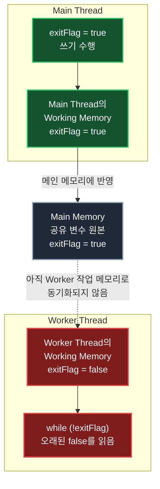

## 1. 개요: 값이 바뀌었는데 다른 스레드가 못 볼 수 있다

Java Memory Model, 즉 JMM에서는 여러 스레드가 공유 변수를 사용할 때 **메인 메모리**와 **작업 메모리**라는 논리적 모델로 값을 설명한다. 메인 메모리에는 공유 변수의 원본 값이 있다고 보고, 각 스레드는 자기 작업 메모리에 그 값의 사본을 가져와 사용할 수 있다.

여기서 특히 중요한 점은 **작업 메모리가 스레드마다 하나씩 존재한다고 본다**는 것이다. 스레드가 3개라면 각 스레드마다 독립적인 작업 메모리가 있고, 공유 변수 `exitFlag`를 사용하더라도 각 스레드는 자기 작업 메모리에 있는 사본을 읽을 수 있다. 따라서 메인 메모리의 값과 어떤 스레드의 작업 메모리 값이 순간적으로 서로 다를 수 있다.

문제는 한 스레드가 값을 변경했다고 해서 다른 스레드의 작업 메모리가 즉시 갱신된다고 단정할 수 없다는 점이다. 어떤 스레드가 자기 작업 메모리에서 공유 변수 값을 읽고 계속 루프를 돌고 있다면, 다른 스레드가 메인 메모리 쪽 값을 바꾸었더라도 그 변경을 한동안 보지 못할 수 있다.



위 그림처럼 스레드마다 자기 작업 메모리가 따로 있다. 메인 스레드는 자기 흐름에서 `exitFlag`를 `true`로 바꾸고 그 값이 메인 메모리에 반영되었다고 볼 수 있다. 하지만 작업자 스레드의 작업 메모리가 아직 갱신되지 않았다면, 작업자 스레드는 여전히 오래된 `false` 사본을 읽고 루프를 계속 돌 수 있다. 이것이 작업 메모리 동기화 문제의 핵심이다.

> 공유 변수의 변경을 다른 스레드가 반드시 보아야 한다면, 코드에 동기화 규칙을 명시해야 한다. "시간이 지나면 JVM이 알아서 맞춰 주겠지"라는 가정으로 코드를 작성하면 안 된다.
{: .prompt-warning }

## 2. 동기화가 일어나는 대표적인 시점

JMM은 모든 변수 접근마다 항상 메인 메모리와 작업 메모리를 즉시 동기화하도록 강제하지 않는다. 그렇게 하면 멀티스레드 프로그램의 성능이 크게 떨어질 수 있기 때문이다.

대신 Java는 특정한 문법과 라이브러리 사용을 통해 스레드 사이의 가시성과 순서를 보장한다. 대표적인 동기화 지점은 다음과 같다.

- `synchronized` 블록이나 메서드에 진입하고 빠져나갈 때
- `volatile` 변수에 쓰고 읽을 때
- `Thread.start()`로 새 스레드를 시작할 때
- `Thread.join()`으로 스레드 종료를 기다릴 때
- `AtomicInteger`, `AtomicBoolean` 같은 atomic 클래스를 사용할 때
- 클래스 로딩과 정적 초기화가 수행될 때

특히 `Thread.start()`와 `Thread.join()`은 스레드 사이의 실행 순서를 이해할 때 중요하다. 두 메서드는 단순히 스레드를 시작하거나 기다리는 기능만 하는 것이 아니라, **어느 시점까지의 작업이 다른 스레드에 보여야 하는지**를 정해 주는 기준점이 된다.

먼저 `Thread.start()`를 보자. 어떤 스레드가 새 스레드를 만들고 `start()`를 호출하면, `start()` 호출 전에 이미 수행한 작업은 새로 시작된 스레드에서 볼 수 있어야 한다.

```java
public class StartVisibilityExample {
    private static int number = 0;

    public static void main(String[] args) {
        number = 10; // 1: 새 스레드를 시작하기 전에 값 준비

        Thread t = new Thread(() -> {
            System.out.println(number); // 2: 10을 볼 수 있어야 한다
        });

        t.start(); // 3: 이 지점을 기준으로 새 스레드가 시작된다
    }
}
```

위 코드에서 메인 스레드는 `t.start()`를 호출하기 전에 `number = 10`을 먼저 실행했다. 그러면 새로 시작된 `t` 스레드는 `number`의 초기값 `0`이 아니라, `start()` 이전에 준비된 값인 `10`을 볼 수 있어야 한다. 즉 `start()`는 "이제 새 스레드가 출발해도 된다. 출발 전에 준비한 값은 새 스레드에게 보여야 한다"는 경계 역할을 한다.

반대로 `Thread.join()`은 종료된 스레드가 수행한 작업을 기다리는 쪽에서 볼 수 있게 해 주는 경계다.

```java
public class JoinVisibilityExample {
    private static int result = 0;

    public static void main(String[] args) throws InterruptedException {
        Thread t = new Thread(() -> {
            result = 100; // 1: 작업자 스레드가 결과를 만든다
        });

        t.start();
        t.join(); // 2: 작업자 스레드가 끝날 때까지 기다린다

        System.out.println(result); // 3: 100을 볼 수 있어야 한다
    }
}
```

메인 스레드가 `t.join()`에서 정상적으로 빠져나왔다는 것은 `t` 스레드가 종료되었다는 뜻이다. 이때 `t` 스레드가 종료되기 전에 수행한 작업, 즉 `result = 100`은 `join()` 이후의 메인 스레드 코드에서 볼 수 있어야 한다. 그래서 `join()`은 "저 스레드가 끝났음을 확인했고, 그 스레드가 끝나기 전에 만든 결과를 이제 확인할 수 있다"는 경계 역할을 한다.

정리하면 `start()`는 **시작 전 준비한 값을 새 스레드가 볼 수 있게 하는 방향**의 동기화이고, `join()`은 **종료된 스레드가 만든 값을 기다린 스레드가 볼 수 있게 하는 방향**의 동기화다.

> `start()`와 `join()`이 있다고 해서 모든 공유 변수 접근이 항상 안전해지는 것은 아니다. 스레드가 실행 중인 동안 서로 같은 값을 계속 읽고 쓰는 구조라면 여전히 `volatile`, `synchronized`, atomic 클래스 같은 동기화 도구가 필요하다.
{: .prompt-info }

다만 이것을 "스레드를 하나 새로 만들면 모든 기존 스레드의 작업 메모리가 전부 안정적으로 동기화된다"는 뜻으로 이해하면 안 된다. 새 스레드 생성은 동기화 관계를 만드는 중요한 지점이지만, 일반적인 공유 변수 가시성 문제를 해결하기 위해 스레드를 반복해서 만들거나 디버거 동작에 기대는 것은 좋은 방법이 아니다.

## 3. 문제가 되는 예제

다음 예제는 작업자 스레드가 `exitFlag` 값을 보고 루프를 계속 돌지 결정하는 코드다.

```java
public class WorkingMemorySyncIssue {
    private static boolean exitFlag = false;

    public static void main(String[] args) throws InterruptedException {
        Thread t1 = new Thread(() -> {
            int counter = 0;

            while (!exitFlag) {
                counter++;
            }

            System.out.println("worker stopped. counter = " + counter);
        });

        t1.start();

        Thread.sleep(1000);
        exitFlag = true;

        Thread.sleep(2000);
        System.out.println("main exitFlag = " + exitFlag);
    }
}
```

코드만 보면 메인 스레드가 1초 뒤 `exitFlag`를 `true`로 바꾸므로 작업자 스레드의 루프도 곧 끝날 것처럼 보인다. 하지만 실제로는 끝나지 않을 수 있다.

흐름을 단계별로 보면 다음과 같다.

1. `exitFlag`의 초기값은 `false`다.
2. `t1` 스레드가 시작되고 `while (!exitFlag)` 루프에 들어간다.
3. 메인 스레드는 1초 뒤 `exitFlag = true`를 실행한다.
4. 작업자 스레드가 여전히 오래된 `false` 값을 보고 있으면 루프를 계속 돈다.
5. 메인 스레드가 `main exitFlag = true`를 출력하고 종료되어도 작업자 스레드는 끝나지 않을 수 있다.

이 현상은 메인 스레드가 값을 바꾸지 않아서 생기는 문제가 아니다. 메인 스레드 입장에서는 분명히 `true`로 바꾸었다. 문제는 그 변경이 작업자 스레드의 읽기에 대해 가시적으로 보장되지 않았다는 데 있다.

## 4. 지역 변수 연산은 공유 변수 동기화를 보장하지 않는다

예제의 루프 안에서는 `counter++`가 계속 실행된다.

```java
while (!exitFlag) {
    counter++;
}
```

`counter`는 `run` 흐름 안에서만 사용하는 지역 변수다. 지역 변수는 각 스레드의 Stack Frame에 속하며 다른 스레드와 직접 공유되지 않는다. 따라서 `counter` 값이 계속 바뀐다고 해서 공유 정적 변수인 `exitFlag`의 최신 값을 반드시 다시 읽어야 하는 것은 아니다.

JIT 컴파일러는 이런 루프를 최적화할 수 있다. 코드상으로 `exitFlag`를 루프 안에서 변경하지 않고, 동기화 동작도 없다면 작업자 스레드가 오래된 값을 계속 사용해도 JMM 관점에서 문제가 없는 코드가 된다. 애초에 프로그램이 스레드 간 가시성을 보장하는 코드를 작성하지 않았기 때문이다.

> 여러 스레드가 같은 변수에 접근하고, 그중 하나라도 값을 변경한다면 동기화가 필요하다. 단순히 읽기만 하는 쪽 코드라도 다른 스레드의 쓰기 결과를 보아야 한다면 가시성 보장이 필요하다.
{: .prompt-info }

## 5. println을 넣으면 왜 멈추는 것처럼 보일까

초보자가 이 문제를 더 헷갈려하는 이유가 있다. 루프 안에 `System.out.println()`을 넣으면 문제가 사라지는 것처럼 보일 수 있다.

```java
while (!exitFlag) {
    counter++;
    System.out.println(counter);
}
```

이렇게 하면 작업자 스레드가 `exitFlag = true`를 보고 루프를 빠져나오는 경우가 많다. 그렇다고 `println()`이 올바른 해결책인 것은 아니다.

`System.out.println()` 내부 구현에는 동기화가 포함된다. 출력 스트림은 여러 스레드가 동시에 사용해도 출력이 심하게 섞이지 않도록 내부적으로 `synchronized`를 사용한다. 이 과정에서 메모리 동기화 효과가 생기기 때문에 작업자 스레드가 최신 `exitFlag` 값을 보게 될 수 있다.

디버거에서 루프 안에 브레이크포인트를 걸었을 때도 비슷한 일이 생길 수 있다. 디버거가 스레드를 멈추고 상태를 관찰하는 과정은 일반 실행과 다르며, 그 과정에서 값이 다시 보이는 것처럼 나타날 수 있다.

하지만 이런 현상에 기대면 안 된다.

- 콘솔 출력은 매우 느리고 프로그램 동작을 크게 바꾼다.
- 디버그 모드와 일반 실행 모드는 최적화와 실행 타이밍이 다를 수 있다.
- 내부 구현의 부수 효과에 의존하는 코드는 JVM 구현이나 실행 환경이 바뀌면 다시 깨질 수 있다.

따라서 공유 플래그를 이용해 스레드를 멈추려면 의도적으로 동기화 도구를 사용해야 한다.

## 6. volatile로 해결하기

이 예제에서 가장 간단한 해결책은 `exitFlag`를 `volatile`로 선언하는 것이다.

```java
public class WorkingMemorySyncIssueSolved {
    private static volatile boolean exitFlag = false;

    public static void main(String[] args) throws InterruptedException {
        Thread t1 = new Thread(() -> {
            int counter = 0;

            while (!exitFlag) {
                counter++;
            }

            System.out.println("worker stopped. counter = " + counter);
        });

        t1.start();

        Thread.sleep(1000);
        exitFlag = true;

        t1.join();
        System.out.println("main exitFlag = " + exitFlag);
    }
}
```

`volatile`로 선언된 변수는 읽기와 쓰기에 대해 가시성 보장을 제공한다. 한 스레드가 `volatile` 변수에 값을 쓰면, 다른 스레드가 같은 변수를 읽을 때 그 쓰기 결과를 볼 수 있어야 한다.

이 예제에서는 메인 스레드가 `exitFlag = true`를 실행하고, 작업자 스레드가 루프 조건에서 `exitFlag`를 다시 읽는다. `exitFlag`가 `volatile`이므로 작업자 스레드는 오래된 사본만 계속 사용하는 방식으로 동작할 수 없다. 결과적으로 루프는 정상적으로 종료된다.

또한 예제에서는 `Thread.sleep(2000)` 대신 `t1.join()`을 사용했다. "2초 정도 기다리면 끝났겠지"라고 추측하는 것보다, 작업자 스레드가 실제로 종료될 때까지 기다리는 편이 정확하다.

## 7. volatile이 해결하는 것과 해결하지 않는 것

`volatile`은 가시성 문제를 해결할 때 유용하다. 특히 다음처럼 하나의 플래그 값을 통해 스레드 종료 여부를 알리는 코드에 잘 맞는다.

```java
class Worker implements Runnable {
    private volatile boolean running = true;

    public void stop() {
        running = false;
    }

    @Override
    public void run() {
        while (running) {
            doWork();
        }
    }

    private void doWork() {
        // 반복 작업
    }
}
```

하지만 `volatile`이 모든 동시성 문제를 해결하는 것은 아니다. 예를 들어 다음 코드는 안전하지 않다.

```java
class Counter {
    private volatile int count = 0;

    public void increase() {
        count++;
    }

    public int getCount() {
        return count;
    }
}
```

`count`가 `volatile`이면 최신 값을 읽고 쓰는 가시성은 좋아진다. 그러나 `count++`는 하나의 원자적 연산이 아니다. 내부적으로는 값을 읽고, 1을 더하고, 다시 저장하는 복합 연산이다. 여러 스레드가 동시에 `increase()`를 호출하면 같은 값을 읽고 각각 증가시킨 뒤 덮어쓸 수 있다.

이런 경우에는 `synchronized`나 atomic 클래스를 사용해야 한다.

```java
import java.util.concurrent.atomic.AtomicInteger;

class SafeCounter {
    private final AtomicInteger count = new AtomicInteger();

    public void increase() {
        count.incrementAndGet();
    }

    public int getCount() {
        return count.get();
    }
}
```

정리하면 `volatile`은 주로 **가시성**과 **순서 제약**을 다루는 도구이고, `count++` 같은 복합 연산의 **원자성**까지 자동으로 보장하지는 않는다.

## 8. synchronized로도 해결할 수 있다

같은 문제는 `synchronized`로도 해결할 수 있다. `synchronized`는 lock 획득과 해제 과정에서 happens-before 관계를 만들기 때문에 가시성을 보장한다.

```java
public class SynchronizedStopFlag {
    private static boolean exitFlag = false;

    private static synchronized boolean isExitFlag() {
        return exitFlag;
    }

    private static synchronized void requestExit() {
        exitFlag = true;
    }

    public static void main(String[] args) throws InterruptedException {
        Thread t1 = new Thread(() -> {
            int counter = 0;

            while (!isExitFlag()) {
                counter++;
            }

            System.out.println("worker stopped. counter = " + counter);
        });

        t1.start();

        Thread.sleep(1000);
        requestExit();

        t1.join();
        System.out.println("main exitFlag = " + isExitFlag());
    }
}
```

이 방식은 읽기와 쓰기 모두 같은 lock을 통해 수행한다는 점이 중요하다. 쓰는 쪽만 `synchronized`를 사용하고 읽는 쪽은 그냥 읽는 식으로 섞으면 가시성 보장을 제대로 얻을 수 없다.

단순 종료 플래그라면 `volatile boolean`이 더 간단하다. 반면 여러 필드를 함께 보호해야 하거나, 읽기-수정-쓰기 전체를 임계 영역으로 묶어야 한다면 `synchronized`나 `Lock`이 더 적절하다.

## 9. 실무에서 기억할 기준

작업 메모리 동기화 문제는 이론처럼 보이지만 실제 코드에서 충분히 발생할 수 있다. 특히 다음 조건이 겹치면 위험하다.

- 여러 스레드가 같은 필드나 정적 변수를 공유한다.
- 한 스레드는 값을 쓰고, 다른 스레드는 그 값을 읽는다.
- 읽는 쪽이 루프 안에서 같은 값을 반복해서 확인한다.
- `volatile`, `synchronized`, `Lock`, atomic 클래스 같은 동기화 도구가 없다.
- 디버그 모드나 `println()`을 넣었을 때만 문제가 사라진다.

이런 코드는 우연히 동작할 수는 있지만 올바른 멀티스레드 코드라고 보기 어렵다. 공유 상태를 기준으로 스레드 흐름을 제어한다면 동기화 수단을 명확하게 선택해야 한다.

기준은 다음처럼 잡으면 된다.

- 단순 종료 플래그처럼 최신 값만 보이면 되는 경우: `volatile`
- 읽기-수정-쓰기 전체가 하나의 단위여야 하는 경우: `synchronized`, `Lock`, atomic 클래스
- 여러 필드를 함께 일관되게 보호해야 하는 경우: `synchronized` 또는 `Lock`
- 스레드 종료를 기다려야 하는 경우: 임의의 `sleep()`이 아니라 `join()`

## 10. 정리

JMM에서 작업 메모리는 각 스레드가 공유 변수의 사본을 사용할 수 있다는 점을 설명하기 위한 모델이다. 한 스레드가 공유 변수 값을 변경해도 다른 스레드의 작업 메모리가 즉시 갱신된다고 보장되지 않는다. 그래서 `exitFlag` 같은 단순한 종료 플래그도 동기화 없이 사용하면 작업자 스레드가 영원히 루프를 돌 수 있다.

루프 안에 `println()`을 넣거나 디버거로 브레이크포인트를 걸었을 때 문제가 사라지는 것은 올바른 해결책이 아니다. 그런 코드는 실행 환경의 부수 효과에 기대는 코드다.

공유 변수의 변경을 다른 스레드가 반드시 봐야 한다면 `volatile`, `synchronized`, atomic 클래스, `Lock` 같은 도구로 동기화 규칙을 명시해야 한다. 멀티스레드 코드에서 중요한 것은 "언젠가는 보이겠지"가 아니라 "어떤 규칙 때문에 반드시 보이는가"를 코드로 표현하는 것이다.

---

## Quiz: 학습 내용 확인하기

**Q1. 메인 스레드가 `exitFlag = true`를 실행했는데 작업자 스레드가 루프를 빠져나오지 않을 수 있는 이유는 무엇인가?**

<details>
<summary>정답 확인</summary>
<div>
작업자 스레드가 자기 작업 메모리의 오래된 `false` 값을 계속 보고 있을 수 있기 때문이다. 동기화 도구가 없으면 메인 스레드의 쓰기 결과가 작업자 스레드의 읽기에 대해 즉시 보인다고 보장할 수 없다.
</div>
</details>

**Q2. `System.out.println()`을 루프 안에 넣으면 문제가 사라지는 것처럼 보일 수 있는 이유는 무엇인가?**

<details>
<summary>정답 확인</summary>
<div>
`System.out.println()` 내부에는 동기화가 포함될 수 있고, 그 과정에서 메모리 동기화 효과가 생길 수 있기 때문이다. 하지만 출력의 부수 효과에 기대는 것은 올바른 해결책이 아니다.
</div>
</details>

**Q3. `volatile`은 `count++`의 원자성을 보장하는가?**

<details>
<summary>정답 확인</summary>
<div>
보장하지 않는다. `volatile`은 주로 가시성을 보장하지만, `count++`처럼 읽기, 계산, 쓰기로 나뉘는 복합 연산 전체를 원자적으로 만들어 주지는 않는다.
</div>
</details>
