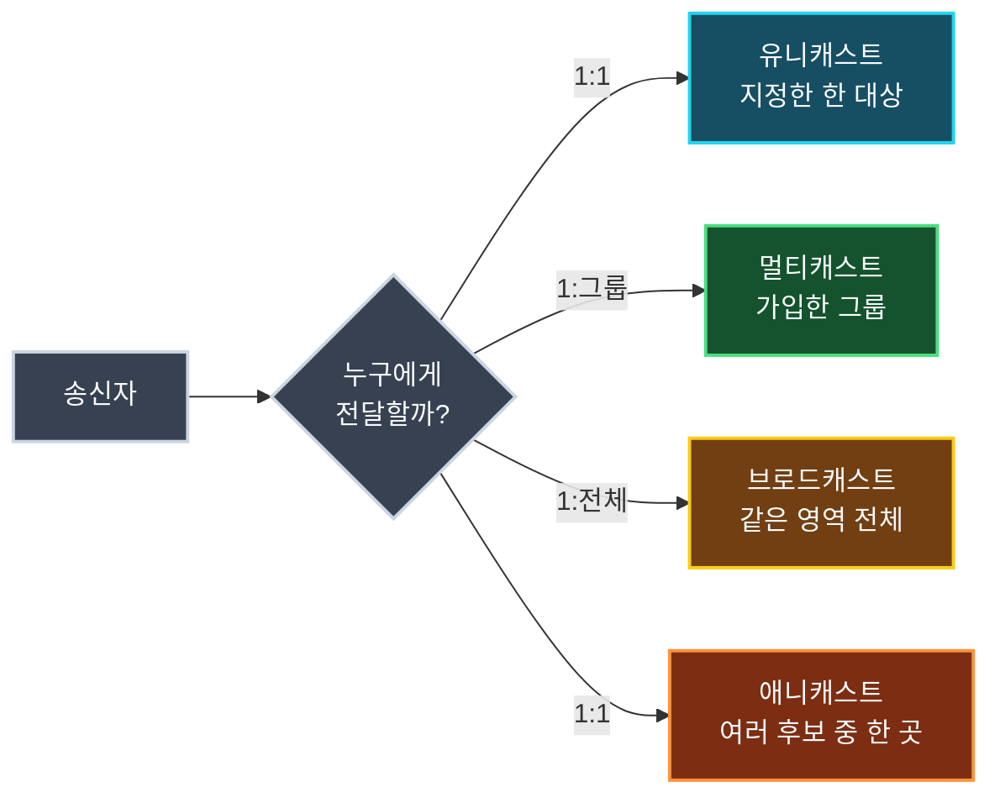
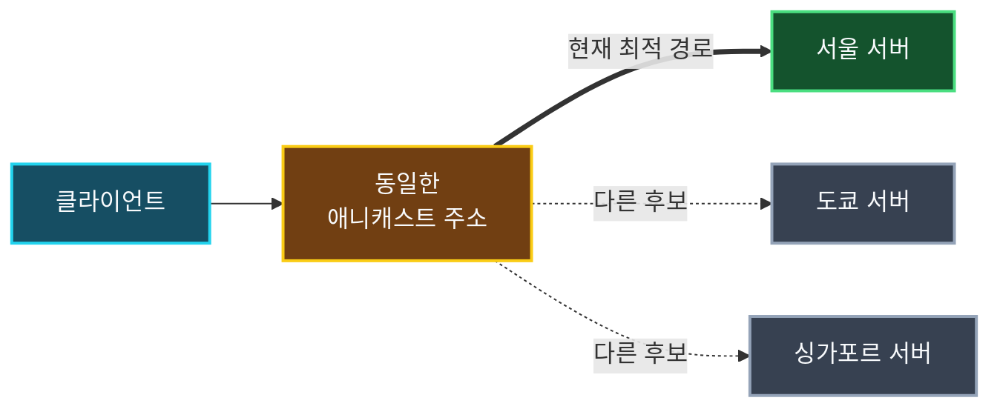

네트워크에서는 데이터를 누구에게 전달할지에 따라 통신 방식이 달라진다. 한 장치에 보내는 유니캐스트, 특정 그룹에 보내는 멀티캐스트, 같은 영역의 모든 장치에 보내는 브로드캐스트, 같은 주소를 사용하는 여러 후보 중 라우팅상 적합한 한 곳에 보내는 애니캐스트가 대표적이다.

이 용어들은 모두 `cast`, 즉 데이터를 특정 대상으로 보낸다는 의미를 공유한다. 하지만 단순히 `1:1`, `1:다수`만 외우면 멀티캐스트와 브로드캐스트의 범위, 유니캐스트와 애니캐스트의 차이를 놓치기 쉽다. **수신자를 어떤 기준으로 선택하는가**를 중심으로 비교해야 한다.

## 전달 대상에 따른 네 가지 통신 방식



| 방식 | 논리적인 전달 관계 | 수신자 선택 기준 | 대표 사례 |
| :--- | :--- | :--- | :--- |
| 유니캐스트 | `1:1` | 지정한 하나의 목적지 주소 | 웹 요청, 이메일 송수신, 일반적인 `ping` |
| 멀티캐스트 | `1:그룹` | 멀티캐스트 그룹에 참여한 수신자 | IPTV, 사내 영상 배포, 일부 라우팅 프로토콜 |
| 브로드캐스트 | `1:전체` | 같은 브로드캐스트 도메인의 모든 장치 | ARP Request, DHCP Discover |
| 애니캐스트 | `1:1` | 같은 주소를 제공하는 후보 중 라우팅상 선택된 한 곳 | DNS, CDN, 분산 엣지 서비스 |

## 유니캐스트: 지정한 한 대상에게 전송

**유니캐스트(Unicast)**는 하나의 송신지가 하나의 목적지 주소로 데이터를 보내는 방식이다. 웹 브라우저가 서버에 HTTP 요청을 보내거나 메일 클라이언트가 메일 서버와 통신하는 것처럼 대부분의 일반적인 인터넷 통신이 유니캐스트를 사용한다.

유니캐스트에서 `1:1`은 하나의 출발지 주소와 하나의 목적지 주소 사이의 논리적 전달 관계를 뜻한다. 패킷이 여러 라우터와 링크를 거치더라도 최종 목적지는 하나다. IP 패킷의 목적지 주소는 일반적으로 유지되지만, 각 링크에서 사용하는 Ethernet 프레임과 목적지 MAC 주소는 홉마다 달라질 수 있다.

동일한 영상을 천 명에게 유니캐스트로 전송한다면 서버는 각 사용자와 별도의 전송 흐름을 만든다. 사용자의 네트워크 상태에 맞춰 품질을 조절하기 쉽고 인터넷 어디서나 전달하기 좋지만, 같은 데이터를 여러 번 보내므로 서버와 회선의 부하가 증가한다. 일반적인 인터넷 동영상 서비스가 CDN과 여러 캐시 서버를 사용하는 이유 중 하나다.

## 멀티캐스트: 가입한 그룹에 전송

**멀티캐스트(Multicast)**는 하나의 송신지가 특정 멀티캐스트 그룹을 목적지로 데이터를 보내고, 그 그룹에 참여한 여러 수신자가 데이터를 받는 방식이다. 송신자가 수신자마다 같은 패킷을 따로 만들지 않아도 되며, 네트워크 장비가 경로가 갈라지는 지점에서 필요한 만큼 패킷을 복제한다.

IPv4에서는 `224.0.0.0/4`가 멀티캐스트 주소 범위다. 호스트는 **IGMP(Internet Group Management Protocol)**를 이용해 IPv4 멀티캐스트 그룹 참여 상태를 인접 라우터에 알린다. IPv6에서는 IGMP 대신 **MLD(Multicast Listener Discovery)**를 사용한다. 라우터 사이에서 멀티캐스트 경로를 구성할 때는 PIM 같은 별도의 라우팅 기술이 사용될 수 있다.

멀티캐스트는 다음과 같은 환경에서 유용하다.

- 통신사업자가 관리하는 IPTV 방송망
- 회사나 캠퍼스 내부의 실시간 영상·시세 정보 배포
- OSPF처럼 인접 라우터에게 제어 정보를 전달하는 일부 라우팅 프로토콜
- mDNS처럼 로컬 네트워크에서 서비스를 찾는 프로토콜

> 그룹 채팅은 멀티캐스트를 설명하기 좋은 비유지만, 실제 메신저가 IP 멀티캐스트를 사용한다는 뜻은 아니다. 대부분의 인터넷 메신저와 라이브 방송은 서버·CDN이 사용자별 유니캐스트 연결로 데이터를 전달한다. IP 멀티캐스트는 송신자와 수신자 사이의 네트워크 장비가 멀티캐스트 전달을 지원하고 적절히 구성되어야 한다.
{: .prompt-info }

## 브로드캐스트: 같은 영역의 모든 장치에 전송

**브로드캐스트(Broadcast)**는 하나의 송신지가 같은 브로드캐스트 도메인에 있는 모든 장치로 데이터를 보내는 방식이다. Ethernet에서는 목적지 MAC 주소 `FF:FF:FF:FF:FF:FF`를 사용하며, 모든 장치가 프레임을 받은 뒤 자신이 처리해야 할 내용인지 확인한다.

브로드캐스트의 `전체`는 인터넷 전체가 아니다. 일반적으로 같은 VLAN이나 같은 로컬 네트워크처럼 브로드캐스트가 도달할 수 있는 영역을 뜻한다. 라우터는 기본적으로 로컬 브로드캐스트를 다른 네트워크로 전달하지 않으므로 브로드캐스트 도메인의 경계를 만든다.

### ARP Request

IPv4 장치가 같은 LAN에 있는 목적지의 MAC 주소를 모르면 ARP Request를 Ethernet 브로드캐스트로 보낸다. 해당 IPv4 주소를 사용하는 장치는 자신의 MAC 주소를 담은 ARP Reply를 일반적으로 유니캐스트로 반환한다.

### DHCP Discover

네트워크에 처음 연결된 장치는 자신의 IPv4 주소와 DHCP 서버의 위치를 모른다. 따라서 DHCP Discover를 제한 브로드캐스트 주소 `255.255.255.255`와 Ethernet 브로드캐스트를 이용해 전송하고, 응답 가능한 DHCP 서버를 찾는다.

브로드캐스트가 많아지면 같은 영역의 모든 장치와 스위치가 불필요한 트래픽을 처리해야 한다. 그래서 큰 네트워크는 VLAN과 라우터를 이용해 브로드캐스트 도메인을 적절한 크기로 나눈다.

> IPv6에는 IPv4와 같은 브로드캐스트가 없다. 필요한 대상 전체에 데이터를 전달할 때 멀티캐스트를 사용하며, IPv4의 ARP에 해당하는 기능도 ICMPv6 기반 Neighbor Discovery와 멀티캐스트로 처리한다.
{: .prompt-tip }

## 애니캐스트: 여러 후보 중 라우팅상 한 곳에 전송

**애니캐스트(Anycast)**는 여러 서버나 네트워크 거점이 동일한 IP 주소를 제공하고, 라우팅 결과에 따라 그중 한 곳이 패킷을 받는 방식이다. 클라이언트 관점에서는 하나의 주소와 통신하므로 최종 전달 관계는 `1:1`이다.



애니캐스트를 설명할 때 흔히 “가장 가까운 서버”라고 표현하지만, 이는 물리적 거리가 가장 짧다는 뜻이 아니다. BGP를 비롯한 라우팅 프로토콜이 경로 길이, 사업자 정책, 연결 상태 등을 바탕으로 선택한 **라우팅 관점의 최적 경로**를 의미한다. 물리적으로 더 먼 서버가 선택될 수도 있다.

애니캐스트는 다음과 같은 서비스에 활용된다.

- 여러 지역에 배치된 DNS 리졸버와 루트 DNS 서버
- CDN과 엣지 네트워크의 진입점
- 트래픽을 여러 거점으로 분산하는 DDoS 방어 서비스

경로 장애나 라우팅 정책 변경이 발생하면 동일한 주소로 보낸 다음 패킷이 다른 거점에 도착할 수 있다. 따라서 애니캐스트 서비스는 상태를 여러 지역에서 공유하거나, 특정 서버의 로컬 상태에 과도하게 의존하지 않도록 설계해야 한다.

## 네 방식은 완전히 같은 계층의 개념일까

유니캐스트, 멀티캐스트, 브로드캐스트, 애니캐스트는 전달 범위를 비교하기 위한 용어지만 항상 동일한 계층과 주소 체계를 가리키는 것은 아니다.

- Ethernet은 유니캐스트, 멀티캐스트, 브로드캐스트 MAC 주소를 사용한다.
- IPv4는 유니캐스트, 멀티캐스트, 브로드캐스트 주소와 전달 방식을 제공한다.
- IPv6는 유니캐스트, 멀티캐스트, 애니캐스트를 사용하며 브로드캐스트는 사용하지 않는다.
- 애니캐스트 주소는 형식만 보면 일반 유니캐스트 주소와 같고, 여러 위치에서 같은 주소의 경로를 광고하는 라우팅 방식으로 구현된다.

따라서 패킷 분석이나 네트워크 설계에서는 “멀티캐스트인가?”만 묻기보다 Ethernet 프레임, IP 패킷, 라우팅 중 어느 관점의 전달 방식을 말하는지 함께 확인해야 한다.

## Windows에서 확인하기

현재 PC가 참여하고 있는 IPv4 멀티캐스트 그룹은 다음 명령으로 확인할 수 있다.

```powershell
netsh interface ipv4 show joins
```

ARP 통신을 통해 학습한 IPv4 주소와 MAC 주소의 대응 관계는 다음 명령으로 확인한다.

```powershell
arp -a
```

`arp -a`는 브로드캐스트로 전송된 ARP Request 자체를 보여주는 명령은 아니다. ARP 통신 결과로 운영체제가 저장한 캐시를 보여준다. 실제 브로드캐스트 프레임과 멀티캐스트 패킷의 목적지 주소를 확인하려면 Wireshark 같은 패킷 분석 도구가 필요하다.

## 정리

- 유니캐스트는 지정한 하나의 목적지와 통신하는 가장 일반적인 방식이다.
- 멀티캐스트는 그룹에 참여한 수신자에게 데이터를 전달하며, 네트워크가 필요한 경로에서 패킷을 복제한다.
- 인터넷 그룹 채팅과 라이브 방송이 반드시 IP 멀티캐스트를 사용하는 것은 아니다.
- 브로드캐스트는 같은 브로드캐스트 도메인의 모든 장치에 전달되며 일반적으로 라우터를 넘지 않는다.
- ARP Request와 DHCP Discover는 브로드캐스트를 사용하는 대표적인 사례다.
- IPv6는 브로드캐스트 대신 멀티캐스트를 사용한다.
- 애니캐스트는 같은 주소를 제공하는 여러 후보 중 라우팅상 선택된 한 곳으로 전달한다.
- 애니캐스트의 가장 가까운 서버는 물리적 거리가 아니라 라우팅 정책과 경로를 기준으로 결정된다.
- 네 가지 용어를 사용할 때는 Ethernet, IP, 라우팅 중 어느 계층과 관점인지 함께 확인해야 한다.

전달 대상을 기준으로 네 방식을 구분하면 ARP와 DHCP가 왜 브로드캐스트를 사용하는지, IPTV와 라우팅 프로토콜이 왜 멀티캐스트를 활용하는지, DNS와 CDN이 어떻게 여러 지역의 서버를 하나의 주소로 제공하는지 연결해서 이해할 수 있다.
