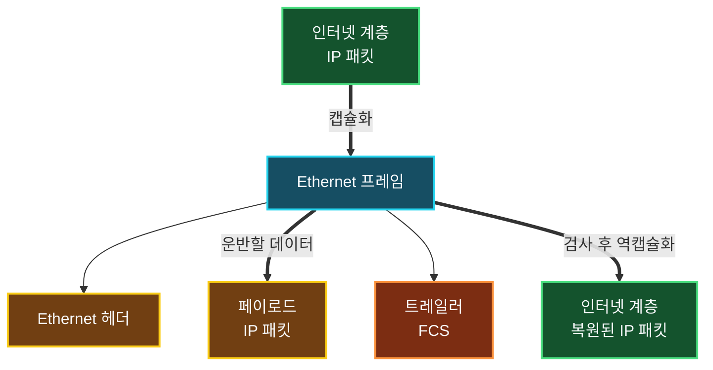

물리 계층은 비트열을 전기·광·무선 신호로 바꿔 전송하지만, 신호가 어느 장치를 향하는지 또는 복원한 비트열이 어떤 프로토콜의 데이터인지는 판단하지 않는다. 같은 링크에서 목적지를 식별하고, 비트열의 시작과 끝을 구분하며, 전송 중 오류가 발생했는지 확인하는 규칙이 추가로 필요하다.

OSI 모델의 **데이터 링크 계층(Data Link Layer)**은 이 문제를 해결한다. 네트워크 계층에서 받은 패킷을 프레임으로 캡슐화하고, MAC 주소를 이용해 같은 링크의 인접 장치로 전달한다. TCP/IP 모델에서는 물리 계층과 함께 네트워크 인터페이스 계층에 포함된다.

## 물리 계층에서 데이터 링크 계층으로

두 계층은 함께 동작하지만 바라보는 대상이 다르다.

| 구분 | 물리 계층 | 데이터 링크 계층 |
| :--- | :--- | :--- |
| 주된 관심사 | 신호를 매체로 전송하고 비트를 복원 | 비트를 프레임으로 구성하고 인접 장치에 전달 |
| 식별 정보 | 목적지 주소를 해석하지 않음 | MAC 주소 등 링크 계층 주소 사용 |
| 데이터 단위 | 비트 | 프레임 |
| 오류 처리 | 신호 품질과 비트 복원 | 프레임 단위 오류 검출, 기술에 따라 재전송 |
| 대표 구성 요소 | PHY, 트랜시버, 리피터, 더미 허브 | NIC의 MAC 기능, 브리지, 스위치 |

물리 계층이 통신의 도로와 신호 자체를 제공한다면, 데이터 링크 계층은 한 링크 안에서 프레임의 경계를 구분하고 어느 장치가 받아야 하는지 판단하는 전달 규칙을 제공한다.

## 데이터 링크 계층의 주요 역할

데이터 링크 계층이 담당하는 기능은 링크 기술에 따라 조금씩 다르지만 일반적으로 다음과 같이 정리할 수 있다.

- **프레이밍(Framing)**: 연속된 비트열의 시작과 끝을 구분해 프레임 단위로 구성한다.
- **물리 주소 지정**: 출발지와 목적지의 MAC 주소 같은 링크 계층 주소를 기록한다.
- **매체 접근 제어**: 여러 장치가 같은 매체를 사용할 때 송신 시점과 접근 방식을 조정한다.
- **오류 검출**: 전송 중 프레임이 손상되었는지 FCS 같은 값을 이용해 확인한다.
- **상위 프로토콜 식별**: 프레임의 페이로드가 IPv4, IPv6, ARP 중 무엇인지 구분한다.
- **인접 노드 전달**: 같은 링크 또는 한 홉 떨어진 다음 장치로 프레임을 전달한다.

여기서 말하는 인접 전달은 최종 목적지까지의 전체 경로를 찾는 라우팅과 다르다. 데이터 링크 계층은 현재 링크에서 다음 장치까지 프레임을 전달하고, 인터넷 계층은 IP 주소를 기준으로 여러 네트워크를 거치는 경로를 다룬다.

## LLC와 MAC 부계층

IEEE 802 계열 LAN에서는 데이터 링크 계층을 **LLC**와 **MAC**이라는 두 부계층으로 나누어 설명한다.

| 부계층 | 전체 이름 | 주요 역할 |
| :--- | :--- | :--- |
| LLC | Logical Link Control | 상위 계층과 MAC 부계층 사이의 인터페이스, 상위 프로토콜 식별과 논리적 링크 제어 |
| MAC | Media Access Control | 매체 접근 제어, MAC 주소 지정, 기술별 프레임 처리 |

MAC 부계층은 Ethernet과 Wi-Fi처럼 공유 매체에 접근하는 방식이 서로 다른 기술의 차이를 다룬다. LLC는 그 위에서 네트워크 계층 프로토콜과의 연결을 제공하는 역할로 설계되었다.

> 모든 데이터 링크 프로토콜이 IEEE 802의 LLC·MAC 구조를 그대로 사용하는 것은 아니다. PPP와 HDLC 같은 점대점 링크 프로토콜은 자체 프레임 형식과 제어 절차를 사용한다. LLC와 MAC은 특히 IEEE 802 LAN 구조를 이해하기 위한 구분으로 보는 것이 정확하다.
{: .prompt-info }

## 패킷을 프레임으로 만드는 캡슐화

송신 측 데이터 링크 계층은 인터넷 계층에서 받은 IP 패킷을 페이로드로 넣고, 현재 링크에서 전달하는 데 필요한 헤더와 트레일러를 추가해 프레임을 만든다. Ethernet을 단순화하면 다음과 같다.



- **Ethernet 헤더**에는 현재 링크에서 사용할 출발지·목적지 MAC 주소와 상위 프로토콜을 구분하는 정보가 들어간다.
- **페이로드**에는 인터넷 계층에서 전달받은 IP 패킷이나 ARP 메시지 등이 들어간다.
- **트레일러**에는 프레임 손상 여부를 확인하기 위한 FCS(Frame Check Sequence)가 들어간다.

Ethernet 이외의 Wi-Fi, PPP 같은 데이터 링크 기술도 프레임을 사용하지만 헤더 구성과 주소 필드, 오류 처리 방식은 서로 다르다. 따라서 모든 데이터 링크 프레임에 Ethernet 헤더가 붙는다고 일반화하면 안 된다.

## 수신 측의 역캡슐화

수신 장치는 물리 계층에서 복원된 비트열을 프레임으로 해석한 뒤 다음 과정을 수행한다.

1. 프레임의 경계와 형식이 올바른지 확인한다.
2. 목적지 MAC 주소를 보고 자신이 처리해야 하는 프레임인지 판단한다.
3. FCS를 다시 계산해 전송 중 프레임이 손상되었는지 검사한다.
4. 상위 프로토콜 식별 정보를 확인한다.
5. 헤더와 트레일러를 제거하고 페이로드를 IPv4, IPv6, ARP 등 알맞은 처리 대상으로 전달한다.

이 과정은 헤더와 트레일러를 무조건 제거하는 작업이 아니다. 주소와 오류 검사를 통과하고 상위 프로토콜을 식별한 뒤에야 페이로드가 다음 계층으로 전달된다.

## 오류 검출과 오류 수정은 구분해야 한다

데이터 링크 계층이 오류를 처리한다고 해서 모든 링크 기술이 손상된 프레임을 직접 수정하거나 재전송을 요청하는 것은 아니다.

일반적인 유선 Ethernet은 송신 측이 프레임 내용으로 CRC 값을 계산해 FCS에 넣고, 수신 측이 같은 계산을 수행해 값이 일치하는지 확인한다. 값이 다르면 전송 중 비트가 변한 것으로 판단해 프레임을 폐기한다. Ethernet 자체에는 해당 프레임을 다시 보내 달라는 확인 응답과 재전송 절차가 없다.

반면 Wi-Fi 같은 일부 데이터 링크 기술은 무선 환경의 손실을 보완하기 위해 링크 계층 확인 응답과 재전송을 제공한다. 오류 정정 코드로 일부 오류를 복구하는 물리·링크 기술도 있다. 최종적인 신뢰성은 TCP 같은 상위 계층이나 애플리케이션이 추가로 보장할 수 있다.

> Ethernet의 FCS는 오류가 발생했는지 높은 확률로 검출하기 위한 값이지, 손상된 원래 데이터를 복원하는 정보는 아니다. `오류 검출`, `오류 정정`, `재전송`은 서로 다른 기능이다.
{: .prompt-warning }

## MAC 주소와 인접 링크의 전달

MAC 주소는 네트워크 인터페이스를 링크 안에서 식별하기 위해 사용하는 주소다. Ethernet MAC 주소는 일반적으로 48비트이며 `00-1A-2B-3C-4D-5E`처럼 16진수 여섯 묶음으로 표현한다.

MAC 주소를 물리 주소라고도 부르지만 반드시 하드웨어에 영구적으로 고정되거나 전 세계에서 항상 유일하다고 가정할 수는 없다. 운영체제와 가상 머신이 주소를 변경할 수 있고, Wi-Fi 단말은 추적 방지를 위해 임의 주소를 사용하기도 한다.

또한 MAC 주소는 일반적으로 현재 로컬 링크에서만 사용된다. 패킷이 라우터를 통과해 다음 네트워크로 이동하면 라우터는 해당 링크에 맞는 새 프레임을 만들므로 출발지와 목적지 MAC 주소가 바뀐다. 반면 출발지와 목적지 IP 주소는 NAT 같은 변환이 없다면 종단 간 경로에서 유지된다.

## 스위치는 프레임을 어떻게 전달할까

스위치는 여러 네트워크 인터페이스를 연결하고 MAC 주소를 기준으로 Ethernet 프레임을 전달하는 대표적인 데이터 링크 계층 장비다.

- 수신한 프레임의 **출발지 MAC 주소**를 보고 해당 장치가 어느 포트에 있는지 학습한다.
- **목적지 MAC 주소**가 MAC 주소 테이블에 있으면 해당 포트로만 프레임을 전달한다.
- 목적지를 아직 모르는 유니캐스트 프레임은 수신 포트를 제외한 같은 VLAN의 포트로 플러딩한다.
- 브로드캐스트 프레임도 같은 브로드캐스트 도메인 안의 포트로 전달한다.

더미 허브가 목적지 주소를 해석하지 않고 신호를 모든 포트로 반복하는 것과 달리, 스위치는 프레임과 MAC 주소 테이블을 이용해 불필요한 전달을 줄인다.

## Windows에서 MAC 주소 확인하기

PowerShell에서는 네트워크 어댑터의 MAC 주소와 연결 상태를 함께 확인할 수 있다.

```powershell
Get-NetAdapter | Format-Table Name, Status, MacAddress, LinkSpeed
```

명령 프롬프트에서는 다음 명령을 사용할 수 있다.

```powershell
getmac /v
```

IPv4 주소와 MAC 주소의 대응 관계를 확인하려면 ARP 캐시를 조회한다.

```powershell
arp -a
```

`arp -a`는 현재 PC가 알고 있는 IP·MAC 주소 대응 관계를 보여주며, 스위치 내부의 MAC 주소 테이블을 보여주는 명령은 아니다. 관리형 스위치의 MAC 주소 테이블은 해당 장비의 관리 인터페이스나 명령줄에서 별도로 확인해야 한다.

## 정리

- 데이터 링크 계층은 비트열을 프레임으로 구성하고 같은 링크의 인접 장치로 전달한다.
- 프레이밍, MAC 주소 지정, 매체 접근 제어, 오류 검출, 상위 프로토콜 식별이 주요 역할이다.
- IEEE 802 LAN에서는 데이터 링크 계층을 LLC와 MAC 부계층으로 구분한다.
- 송신 측은 패킷에 링크 계층 헤더와 트레일러를 붙여 프레임으로 캡슐화한다.
- 수신 측은 주소와 FCS, 상위 프로토콜을 검사한 뒤 페이로드를 역캡슐화한다.
- 유선 Ethernet은 FCS로 손상을 검출하고 잘못된 프레임을 폐기하지만 자체 재전송은 제공하지 않는다.
- MAC 주소는 로컬 링크에서 사용되며 라우터를 지날 때 새 프레임의 주소로 바뀐다.
- 스위치는 출발지 MAC 주소를 학습하고 목적지 MAC 주소에 따라 프레임을 전달한다.
- 허브는 물리 신호를 반복하고, 스위치는 데이터 링크 계층에서 프레임을 해석한다.

데이터 링크 계층을 이해하면 물리 신호에서 복원한 비트열이 어떻게 프레임이 되고, 스위치가 어떤 정보를 보고 다음 장치로 전달하며, 손상된 프레임을 어디에서 걸러 내는지 연결해서 볼 수 있다.
