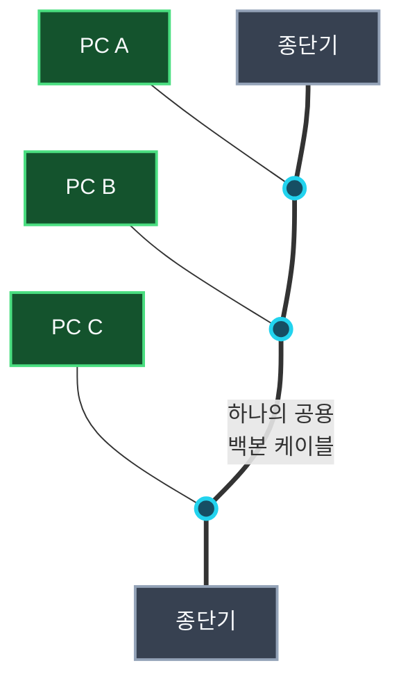
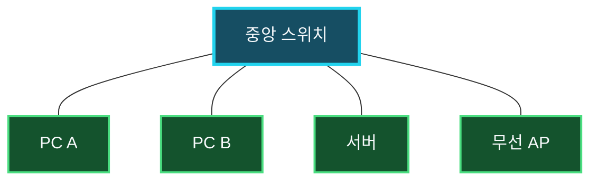
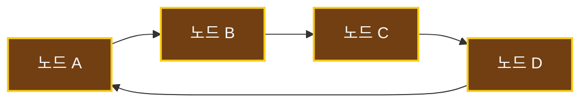
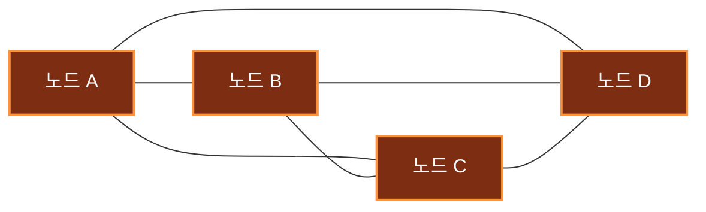

네트워크를 구축하려면 장치를 어떤 형태로 연결하고 데이터가 어느 경로로 흐르게 할지 결정해야 한다. 이 연결 구조를 **네트워크 토폴로지(Network Topology)**라고 한다. 토폴로지는 설치 비용뿐 아니라 장애 범위, 확장성, 성능과 유지보수 방법에도 영향을 준다.

대표적인 형태로 버스형, 스타형, 링형, 망형이 있다. 실제 네트워크는 한 가지 형태만 사용하기보다 계층형 스타나 부분 망처럼 여러 구조를 조합하는 경우가 많다.

## 물리 토폴로지와 논리 토폴로지

토폴로지는 무엇을 기준으로 보느냐에 따라 두 관점으로 나눌 수 있다.

- **물리 토폴로지**: 케이블, 포트, 무선 장치가 실제로 어떻게 연결되어 있는지 나타낸다.
- **논리 토폴로지**: 물리적인 배치와 별개로 데이터가 어떤 경로와 규칙으로 흐르는지 나타낸다.

예를 들어 과거 더미 허브를 중심으로 연결한 Ethernet은 케이블 배치만 보면 스타형이지만, 모든 장치가 하나의 매체를 공유하며 신호를 받으므로 논리적으로는 버스형에 가깝다. 반면 현대의 스위치 기반 Ethernet은 각 장치가 스위치 포트와 독립적인 전이중 링크를 구성한다.

> 토폴로지를 판단할 때는 장비 배치만 보지 말고, 실제 프레임이 어떤 링크를 거치며 어느 장치와 대역폭을 공유하는지도 함께 확인해야 한다.
{: .prompt-info }

## 버스형 토폴로지

**버스형(Bus Topology)**은 여러 장치가 하나의 공통 백본 케이블을 공유하는 구조다. 초기 Ethernet 규격인 `10BASE5`와 `10BASE2`가 대표적인 사례다.

하나의 케이블을 공유하므로 구조가 단순하고 필요한 케이블 양이 적다. 하지만 한 번에 한 장치만 안정적으로 송신할 수 있으며, 여러 장치가 동시에 전송하면 충돌이 발생한다. 공유 반이중 Ethernet에서는 **CSMA/CD(Carrier Sense Multiple Access with Collision Detection)**로 매체가 사용 중인지 확인하고 충돌을 감지해 재전송 시점을 조정했다.

백본 케이블이 끊기거나 종단 처리가 잘못되면 전체 세그먼트에 영향을 줄 수 있고, 장치가 많아질수록 충돌과 장애 지점 추적이 어려워진다. 다만 개별 단말 한 대의 고장이 언제나 전체 네트워크를 중단시키는 것은 아니다. 장애 영향은 공통 케이블이나 접속부를 손상했는지에 따라 달라진다.

> CSMA/CD는 보안 메커니즘이 아니라 공유 매체에서 발생하는 **충돌을 감지하고 처리하는 접근 제어 방식**이다. 스위치와 전이중 통신을 사용하는 현대 Ethernet 링크에서는 충돌이 발생하지 않으므로 사용하지 않는다.
{: .prompt-warning }

## 스타형 토폴로지

**스타형(Star Topology)**은 각 장치가 중앙의 허브, 스위치 또는 무선 액세스 포인트에 개별적으로 연결되는 구조다. 현대의 가정과 사무실 LAN에서 가장 흔히 볼 수 있다.

한 단말이나 해당 단말의 케이블에 장애가 발생해도 다른 링크는 계속 사용할 수 있고, 장치 추가와 장애 위치 파악이 비교적 쉽다. 스위치를 사용하면 포트마다 독립적인 전이중 링크를 제공하므로 충돌도 발생하지 않는다.

반면 모든 통신이 중앙 장비에 의존하므로 중앙 스위치나 전원에 장애가 생기면 연결된 네트워크 전체가 영향을 받는다. 장치마다 중앙까지 별도 케이블이 필요해 버스형보다 배선량도 많다. 실무에서는 핵심 스위치와 전원, 상향 링크를 이중화해 중앙 장애 위험을 줄인다.

Wi-Fi 단말이 하나의 액세스 포인트를 중심으로 연결된 모습도 물리적으로는 스타형으로 볼 수 있다. 다만 무선 단말은 같은 채널의 전파 자원을 공유하므로 유선 스위치의 독립 포트와 성능 특성까지 같지는 않다.

## 링형 토폴로지

**링형(Ring Topology)**은 각 장치가 양옆의 장치와 연결되어 전체 경로가 고리를 이루는 구조다. 프레임이나 전송 권한인 토큰이 정해진 방향으로 순환하는 IBM Token Ring이 대표적인 예다.

### 버스형과 링형은 무엇이 다를까

버스형과 링형은 여러 장치가 차례로 이어져 보여 비슷하게 느껴질 수 있다. 하지만 버스형은 **모든 장치가 하나의 공용 케이블에 접속하는 구조**이고, 링형은 **각 장치가 양옆의 장치와 연결되어 닫힌 경로를 만드는 구조**다.

| 구분 | 버스형 | 링형 |
| :--- | :--- | :--- |
| 전체 형태 | 양 끝이 있는 하나의 직선 | 시작과 끝이 연결된 고리 |
| 장치 연결 | 모든 장치가 공용 백본 케이블에 접속 | 각 장치가 양옆의 장치와 연결 |
| 데이터 전달 | 신호가 공용 케이블 전체로 퍼짐 | 데이터가 이웃 장치를 차례로 거쳐 순환 |
| 전송 제어 | 동시 전송 시 충돌할 수 있음 | 토큰 등으로 전송 순서를 제어할 수 있음 |
| 끝부분 | 신호 반사를 막는 종단기 필요 | 닫힌 경로이므로 종단기 불필요 |
| 주요 장애 | 백본 케이블 손상이 전체 세그먼트에 영향 | 단일 링의 노드·링크 단절이 순환 경로에 영향 |

버스형에서 PC A가 데이터를 보내면 공용 케이블을 따라 신호가 퍼지고, 연결된 모든 장치가 이를 수신한 뒤 목적지에 해당하는 장치만 처리한다. 반면 링형에서는 데이터가 `노드 A → 노드 B → 노드 C`처럼 이웃 장치를 거쳐 정해진 방향으로 전달된다.

> 버스형의 핵심은 **하나의 선을 함께 사용한다는 것**이고, 링형의 핵심은 **이웃 장치를 연결해 닫힌 전달 경로를 만든다는 것**이다.
{: .prompt-tip }

전송 순서를 제어하므로 공유 매체에서 충돌을 피하고 각 장치에 비교적 예측 가능한 전송 기회를 제공할 수 있다. 그러나 단일 링에서는 한 구간이나 장치의 장애가 고리를 끊어 전체 통신에 영향을 줄 수 있고, 노드를 추가하거나 제거할 때도 링을 재구성해야 한다.

모든 링이 한 번의 장애에 그대로 중단되는 것은 아니다. FDDI 같은 이중 링이나 현대의 산업·통신망에서 사용하는 자가 복구 링은 반대 방향 경로로 우회해 장애 내성을 높인다. 따라서 링형의 장애 특성은 단일 링인지, 이중화와 우회 기능이 있는지에 따라 달라진다.

## 망형 토폴로지

**망형(Mesh Topology)**은 장치 사이에 여러 경로를 구성하는 구조다. 한 경로가 끊겨도 다른 경로로 우회할 수 있어 높은 가용성이 필요한 WAN, 백본, 무선 메시 네트워크 등에 활용된다.

모든 노드가 서로 직접 연결된 형태를 **완전 망(Full Mesh)**이라고 한다. 노드가 `n`개라면 무방향 링크가 최대 `n(n-1)/2`개 필요하므로, 장치가 늘수록 포트와 회선 비용이 빠르게 증가한다. 일부 핵심 노드 사이에만 여러 경로를 두는 **부분 망(Partial Mesh)**이 실무에서 더 흔하다.

망형은 경로 중복 덕분에 장애 내성이 높지만, 설치 비용과 라우팅·운영 복잡도가 커진다. 장애 발생 시 대체 경로로 통신이 유지되어도 지연 시간이나 대역폭이 달라질 수 있으므로 경로 감시와 장애 원인 추적이 필요하다.

## 네 가지 토폴로지 비교

| 토폴로지 | 연결 방식 | 주요 장점 | 주요 단점 | 대표 사례 |
| :--- | :--- | :--- | :--- | :--- |
| 버스형 | 하나의 공통 케이블 공유 | 구조가 단순하고 케이블 사용량이 적음 | 충돌, 백본 장애 영향, 확장·진단의 어려움 | `10BASE5`, `10BASE2` |
| 스타형 | 모든 장치가 중앙 장비에 연결 | 단말 장애 격리, 확장과 관리가 쉬움 | 중앙 장비가 단일 장애 지점이 될 수 있음 | 스위치 기반 Ethernet LAN |
| 링형 | 장치가 고리 형태로 연결 | 전송 순서가 예측 가능하고 충돌을 제어하기 쉬움 | 단일 링의 장애 영향, 구성 변경의 어려움 | Token Ring, 일부 산업용 링 |
| 망형 | 장치 사이에 여러 경로 구성 | 우회 경로와 높은 가용성 | 회선 비용과 운영 복잡도 증가 | WAN 백본, 무선 메시 |

## 실제 네트워크는 구조를 조합한다

기업 LAN은 일반적으로 단말이 액세스 스위치에 연결되고, 여러 액세스 스위치가 상위 스위치로 모이는 **확장 스타형 또는 트리형** 구조를 사용한다. 중요한 서버와 네트워크 장비에는 두 개 이상의 링크를 두어 부분 망 구조를 추가하기도 한다.

토폴로지를 선택할 때는 모양보다 다음 조건을 먼저 따져야 한다.

- 어느 장치나 링크가 고장났을 때 영향을 받는 범위
- 필요한 대역폭과 지연 시간
- 장치와 지점을 추가할 때의 확장성
- 케이블, 포트, 장비와 회선 비용
- 경로 이중화와 장애 전환 시간
- 구성 관리와 장애 추적의 난이도

장애를 조사할 때도 토폴로지는 중요한 단서가 된다. 한 PC만 통신하지 못하면 해당 단말이나 액세스 링크를 먼저 확인하고, 같은 스위치의 여러 장치가 동시에 끊기면 중앙 장비와 상향 링크, 전원을 살펴본다. 여러 경로가 있는 망형에서는 현재 선택된 경로와 장애 후 우회 상태까지 확인해야 한다.

## 정리

- 네트워크 토폴로지는 장치와 링크의 연결 구조이며 물리적 관점과 논리적 관점으로 나눌 수 있다.
- 버스형은 공통 매체를 공유해 단순하지만 충돌과 백본 장애에 취약하다.
- 스타형은 단말 장애를 격리하고 관리하기 쉬우나 중앙 장비가 핵심 장애 지점이 된다.
- 링형은 정해진 순서로 데이터를 전달할 수 있지만 단일 링은 링크 단절에 취약하다.
- 망형은 여러 우회 경로를 제공하지만 비용과 운영 복잡도가 증가한다.
- 현대 네트워크는 확장 스타형을 기본으로 사용하고 중요한 구간에 부분 망과 이중화를 결합하는 경우가 많다.
- CSMA/CD는 공유 반이중 Ethernet의 충돌 감지 방식이며 현대의 스위치 기반 전이중 Ethernet에서는 사용하지 않는다.

토폴로지는 단순히 네트워크 모양을 외우는 개념이 아니다. 연결 구조를 알면 장애가 어디까지 확산되는지, 어느 링크를 이중화해야 하는지, 장치를 추가할 때 어떤 비용이 생기는지를 체계적으로 판단할 수 있다.
