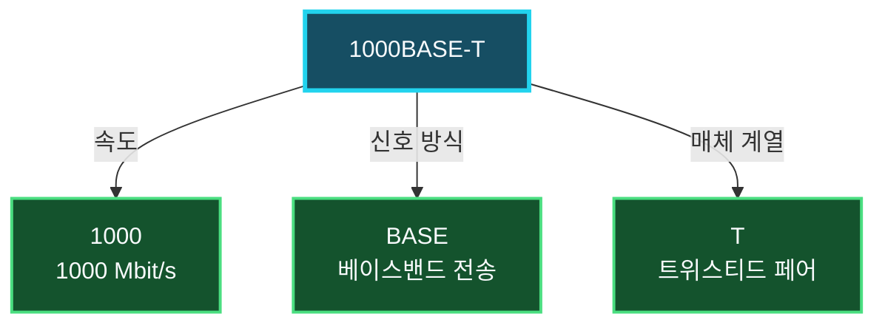

가정이나 사무실에서 PC를 랜 케이블로 공유기 또는 스위치에 연결하면 대부분 **Ethernet(이더넷)**을 사용하게 된다. Ethernet은 같은 LAN에 있는 장치가 프레임을 주고받는 방법과 이를 물리 매체로 전송하는 방법을 정의한 기술군이다.

Ethernet은 하나의 고정된 속도나 케이블을 뜻하지 않는다. `10BASE-T`부터 `1000BASE-T`, `10GBASE-SR`에 이르기까지 속도, 신호 방식, 전송 매체와 거리가 다른 여러 규격을 포함한다. 네트워크를 설계하거나 케이블과 장비를 선택하려면 각 규격의 이름이 무엇을 의미하는지 알아야 한다.

## Ethernet은 어떤 기술일까

Ethernet은 OSI 모델의 물리 계층과 데이터 링크 계층에 걸쳐 동작한다.

- **데이터 링크 계층**: Ethernet 프레임 형식, MAC 주소, 매체 접근과 프레임 전달 방법을 정의한다.
- **물리 계층**: 비트를 구리선이나 광섬유에서 어떤 신호로 표현할지, 어느 속도와 거리로 전송할지 정의한다.

TCP/IP 모델에서는 두 영역을 합쳐 네트워크 인터페이스 계층으로 설명한다. 송신 장치는 IP 패킷을 Ethernet 프레임의 페이로드에 넣고, Ethernet 헤더에는 현재 링크에서 사용할 출발지와 목적지 MAC 주소를 기록한다. 물리 계층은 완성된 프레임의 비트열을 선택한 매체에 맞는 신호로 바꾼다.

### Ethernet은 구리 케이블만 의미하지 않는다

Ethernet을 흔히 유선 LAN 기술이라고 설명하지만, 여기서 유선은 UTP 같은 구리 케이블만 뜻하지 않는다. 광섬유를 사용하는 `1000BASE-LX`나 `10GBASE-LR`도 Ethernet 규격이다.

| 전송 매체 | 신호 | 일반적인 사용 환경 |
| :--- | :--- | :--- |
| 트위스티드 페어 구리선 | 전기 신호 | PC와 액세스 스위치, 가정·사무실 배선 |
| 광섬유 | 광 신호 | 건물 간 연결, 스위치 상향 링크, 장거리·고속 백본 |

Wi-Fi는 Ethernet과 마찬가지로 LAN을 구성하고 MAC 주소와 프레임을 사용하지만 IEEE `802.11` 계열의 별도 무선 LAN 기술이다. Ethernet은 IEEE `802.3` 계열로 표준화되어 있으며 국제 표준인 ISO/IEC 8802-3으로도 채택되어 있다.

## Ethernet이 널리 사용되는 이유

Ethernet은 오랫동안 발전하면서 다양한 제조사의 장비가 함께 동작할 수 있는 표준과 생태계를 형성했다.

- 표준화된 프레임과 물리 규격으로 장비 간 호환성이 높다.
- 가정용부터 데이터 센터까지 다양한 속도와 전송 거리를 제공한다.
- 스위치 기반 전이중 통신으로 여러 링크를 동시에 사용할 수 있다.
- 구리 케이블은 설치 비용이 비교적 낮고 PoE로 전력도 함께 공급할 수 있다.
- 광섬유를 사용하면 긴 거리와 높은 대역폭, 전자기 간섭에 대한 내성을 확보할 수 있다.

유선 연결은 물리적으로 케이블에 접근해야 한다는 점에서 무선보다 접근 범위를 제한하기 쉽고 전파 간섭의 영향도 적다. 하지만 **유선이라는 이유만으로 통신이 안전해지는 것은 아니다.** 내부 장치의 도청, 잘못된 스위치 설정, 악성 단말과 물리 포트 무단 사용에 대비하려면 TLS, 포트 보안, `802.1X`, VLAN 같은 별도의 보안 대책이 필요하다.

## Ethernet 규격 이름 읽는 법

Ethernet 규격의 이름은 보통 `속도 + 신호 방식 + 매체·부호화 식별자`로 구성된다. `1000BASE-T`를 예로 들면 다음과 같다.



- **`1000`**: 초당 1000 Mbit, 즉 1 Gbit의 명목 전송 속도를 뜻한다.
- **`BASE`**: 하나의 채널이 매체의 대역을 사용하는 베이스밴드 전송을 뜻한다.
- **`T`**: 트위스티드 페어 구리 케이블을 사용하는 계열임을 뜻한다.

접미사는 단순히 케이블 재질 하나만 나타내지 않을 수 있다. `TX`, `SX`, `LX`, `SR`, `LR`처럼 사용 매체, 파장, 부호화 방식과 목표 거리를 함께 구분하는 이름도 있다. 따라서 접미사의 의미와 최대 거리는 해당 규격을 기준으로 확인해야 한다.

## 대표 규격은 읽을 수 있을 정도면 충분하다

Ethernet 규격을 하나씩 외울 필요는 없다. 숫자에서 속도를 파악하고, 접미사로 구리선인지 광섬유인지 구분한 다음 필요한 거리와 케이블 조건을 장비 사양에서 확인할 수 있으면 충분하다.

| 대표 규격 | 의미 |
| :--- | :--- |
| `100BASE-TX` | 100 Mbit/s 구리선 Ethernet |
| `1000BASE-T` | 1 Gbit/s 트위스티드 페어 Ethernet |
| `10GBASE-T` | 10 Gbit/s 구리선 Ethernet |
| `10GBASE-SR` | 10 Gbit/s 단거리 멀티모드 광 Ethernet |
| `10GBASE-LR` | 10 Gbit/s 장거리 싱글모드 광 Ethernet |

가정과 일반 사무실에서는 `1000BASE-T`가 흔하고, 더 높은 속도나 장거리 연결이 필요한 서버·스위치 상향 구간에서는 10 Gigabit 이상의 구리선 또는 광 규격을 사용한다. 그 밖의 2.5·5·25·40·100 Gigabit 규격은 필요할 때 찾아보면 된다.

구리선은 케이블 카테고리와 전체 배선 길이를 확인하고, 광섬유는 싱글모드·멀티모드, 광 모듈의 파장과 허용 거리를 확인해야 한다. 같은 속도라도 양쪽 장비와 매체 규격이 다르면 연결되지 않을 수 있다.

## 하위 속도와 항상 호환되는 것은 아니다

구리선 Ethernet 장비는 **자동 협상(Auto-Negotiation)**을 통해 양쪽이 공통으로 지원하는 속도와 전이중 방식을 선택하는 경우가 많다. 예를 들어 1 Gbit/s와 100 Mbit/s를 모두 지원하는 포트가 100 Mbit/s 장비와 연결되면 100 Mbit/s로 동작할 수 있다.

그러나 Ethernet이라는 이름이 같다고 모든 규격이 직접 호환되는 것은 아니다.

- `10GBASE-T` 포트가 반드시 1 Gbit/s 이하 속도까지 지원하는 것은 아니다.
- 구리선 포트와 광 포트는 케이블을 바꾸는 것만으로 직접 연결할 수 없다.
- `10GBASE-SR`과 `10GBASE-LR`은 속도가 같아도 사용하는 광 매체와 파장이 다르다.
- 자동 협상 지원 범위는 NIC, 스위치와 트랜시버의 사양에 따라 달라진다.

따라서 하위 호환 여부는 표준 이름만으로 단정하지 말고 양쪽 장비의 데이터시트에서 지원 속도와 매체를 확인해야 한다.

## 명목 링크 속도와 실제 처리량

`1 Gbit/s`라는 표시는 물리 링크의 명목 비트율이지 애플리케이션이 초당 1 Gbit의 파일 데이터를 그대로 전송한다는 뜻은 아니다. Ethernet 프레임 헤더와 프레임 간 간격, IP와 TCP 헤더, 확인 응답, 저장 장치와 CPU 성능 같은 오버헤드가 실제 처리량에 영향을 준다.

또한 인터넷 속도는 PC와 공유기 사이의 Ethernet 링크뿐 아니라 인터넷 회선, 라우터 성능, 상대 서버와 경로의 혼잡도에 의해 제한된다. PC의 링크가 1 Gbit/s로 연결되었더라도 인터넷 회선이 100 Mbit/s라면 외부 통신은 그보다 빨라질 수 없다.

Windows에서는 다음 명령으로 현재 어댑터의 협상 속도를 확인할 수 있다.

```powershell
Get-NetAdapter | Format-Table Name, Status, LinkSpeed, MacAddress
```

표시된 `LinkSpeed`가 예상보다 낮다면 양쪽 포트의 지원 속도, 케이블 카테고리와 결선 상태, 자동 협상 설정을 차례로 확인한다.

## 규격을 선택할 때 확인할 것

Ethernet 연결을 설계할 때는 속도 하나만 비교하지 말고 다음 조건을 함께 확인해야 한다.

- 양쪽 장비의 포트가 공통으로 지원하는 Ethernet 규격
- 구리선과 광섬유 중 적합한 전송 매체
- 케이블 카테고리 또는 광섬유 등급과 최대 전송 거리
- RJ45, LC와 같은 커넥터 및 광 모듈 호환성
- PoE 전력 공급이 필요한지 여부
- 스위치 상향 링크와 서버처럼 트래픽이 집중되는 구간의 대역폭
- 향후 장비 증가와 속도 확장을 고려한 배선 여유

짧은 사무실 배선에는 관리와 비용이 쉬운 구리선이 적합한 경우가 많고, 건물 간 연결이나 전자기 간섭이 큰 환경, 장거리 고속 백본에는 광섬유가 유리하다. 요구 거리와 전체 트래픽을 먼저 계산한 뒤 이를 만족하는 표준과 장비를 선택해야 한다.

## 정리

- Ethernet은 IEEE 802.3 계열의 유선 LAN 기술군으로, 프레임 전달과 물리 신호 전송 규격을 함께 정의한다.
- Ethernet은 트위스티드 페어 구리선뿐 아니라 광섬유도 사용할 수 있다.
- `1000BASE-T`의 숫자는 명목 속도, `BASE`는 베이스밴드, `T`는 트위스티드 페어 계열을 나타낸다.
- 표준 Ethernet, Fast Ethernet, Gigabit Ethernet과 10 Gigabit Ethernet 외에도 여러 중간·고속 규격이 존재한다.
- 케이블 카테고리, 거리, 포트, 커넥터와 광 모듈이 모두 규격에 맞아야 한다.
- 자동 협상은 공통 속도를 선택하지만 모든 Ethernet 규격이 서로 하위 호환되는 것은 아니다.
- 링크 속도는 실제 파일 전송 속도나 인터넷 속도와 같지 않다.
- 유선 연결도 그 자체로 보안을 보장하지 않으므로 별도의 암호화와 접근 제어가 필요하다.

Ethernet 규격을 읽을 수 있으면 단순히 더 높은 숫자의 장비를 선택하는 데서 벗어나, 필요한 속도와 거리, 기존 배선, 포트 호환성과 비용을 함께 고려해 적절한 네트워크를 구성할 수 있다.
