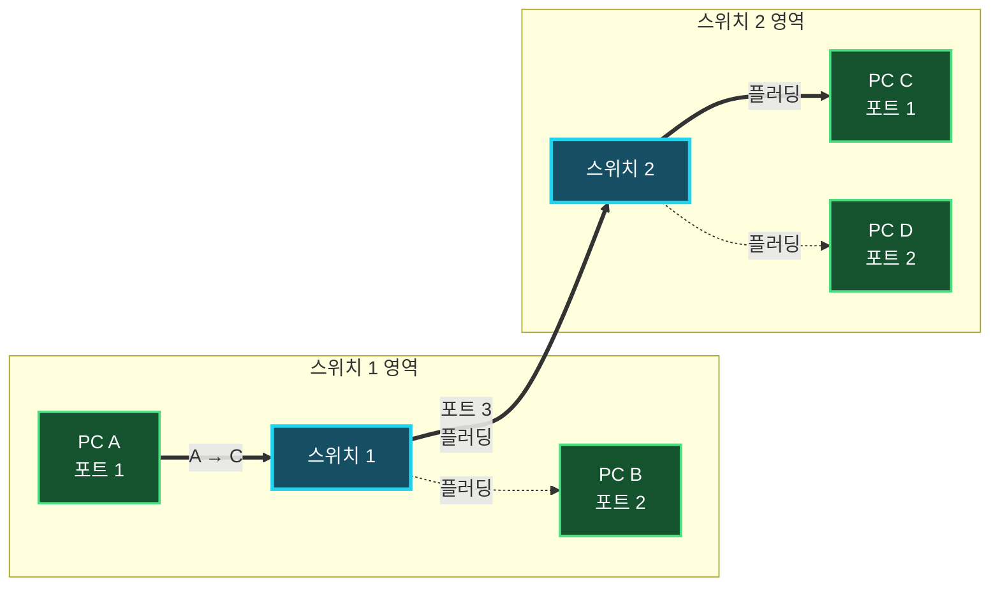
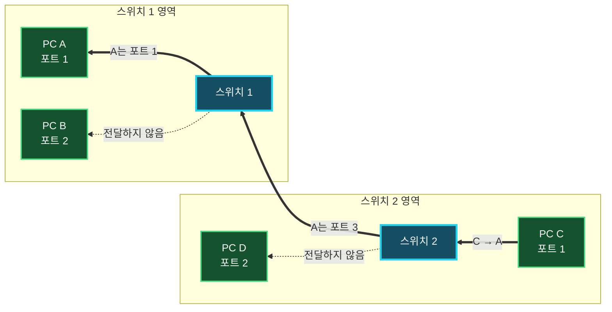

허브와 스위치는 여러 네트워크 장치를 연결하고 데이터를 중계한다. 외형은 비슷하지만 허브는 들어온 물리 신호를 다른 포트로 반복하고, 스위치는 Ethernet 프레임의 MAC 주소를 해석해 필요한 포트를 선택한다.

스위치가 처음부터 모든 장치의 위치를 아는 것은 아니다. 수신한 프레임의 출발지 주소를 학습하고, 목적지 주소를 모를 때는 플러딩하며, 학습이 끝난 뒤에는 필요한 포트로만 포워딩한다.

## 허브와 스위치는 무엇이 다를까

여기서 일반적으로 말하는 허브는 목적지 주소를 해석하지 않는 **더미 허브(Dummy Hub)**를 뜻한다. 스위치는 과거에 스위칭 허브라고도 불렸지만 현재는 보통 스위치라고 부른다.

| 구분 | 더미 허브 | 스위치 |
| :--- | :--- | :--- |
| 주된 동작 계층 | 물리 계층 | 데이터 링크 계층 |
| 전달 기준 | 주소를 확인하지 않고 신호 반복 | 목적지 MAC 주소와 MAC 주소 테이블 |
| 전달 포트 | 수신 포트를 제외한 모든 포트 | 목적지가 연결된 포트 또는 필요한 포트 |
| 대역폭 | 연결된 장치가 공유 | 일반적으로 포트마다 독립적으로 사용 |
| 통신 방식 | 반이중 | 일반적으로 전이중 |
| 충돌 도메인 | 허브 전체가 하나 | 포트마다 분리 |

더미 허브는 한 포트에서 받은 전기 신호를 정형화하거나 증폭해 나머지 모든 포트로 반복한다. 모든 장치가 같은 대역폭과 충돌 도메인을 공유하므로 동시에 송신하면 충돌이 발생하고, 장치가 많아질수록 사용할 수 있는 대역폭이 줄어든다.

> 허브가 신호를 모든 포트로 보내는 동작을 Ethernet **브로드캐스트 프레임**과 혼동하면 안 된다. 허브는 목적지 MAC 주소를 읽지 못하므로 유니캐스트인지 브로드캐스트인지 판단하지 않고 물리 신호를 복제한다.
{: .prompt-warning }

스위치는 수신한 비트열을 Ethernet 프레임으로 해석하고, MAC 주소를 기준으로 필요한 포트에 전달한다. 포트마다 충돌 도메인이 분리되고 전이중 통신을 사용할 수 있어 여러 장치가 동시에 송수신할 수 있다. 이 때문에 허브처럼 전체 대역폭을 모든 장치가 하나로 나눠 쓰지 않는다.

모든 스위치가 네트워크 관리 기능을 제공하는 것은 아니다. **비관리형 스위치**는 별도 설정 없이 기본적인 프레임 전달을 수행하고, **관리형 스위치**는 VLAN, STP, 포트 보안, 모니터링 같은 설정과 운영 기능을 제공한다.

## 스위치는 프레임을 어떻게 전달할까

스위치는 프레임을 받을 때마다 **출발지 MAC 주소를 학습**하고 **목적지 MAC 주소를 조회**한다. 여러 스위치가 연결되어 있다면 각 스위치는 자신이 직접 수신한 프레임을 바탕으로 별도의 MAC 주소 테이블을 관리한다.

PC A와 B는 스위치 1에, PC C와 D는 스위치 2에 연결되어 있다고 가정하자. 두 스위치를 잇는 링크는 각각 포트 3을 사용한다.

### 첫 번째 프레임: 학습과 플러딩

처음에는 두 스위치의 MAC 주소 테이블이 비어 있다. PC A가 출발지 A, 목적지 C인 프레임을 보내면 다음 과정이 일어난다.

1. 스위치 1은 포트 1로 프레임을 받고 출발지 주소를 보고 `A → 포트 1`을 학습한다.
2. 목적지 C를 테이블에서 찾지 못하므로 수신 포트 1을 제외한 포트 2와 3으로 프레임을 플러딩한다.
3. PC B는 목적지 주소가 자신의 MAC 주소가 아니므로 프레임을 폐기한다.
4. 스위치 2는 포트 3으로 프레임을 받고 `A → 포트 3`을 학습한다.
5. 스위치 2도 목적지 C를 아직 모르므로 포트 1과 2로 프레임을 플러딩한다.
6. PC D는 프레임을 폐기하고, 목적지인 PC C는 프레임을 받아 처리한다.

첫 번째 프레임이 C에 도착했을 때 각 스위치가 학습한 내용은 다음과 같다. 같은 포트 번호라도 어느 스위치의 포트인지에 따라 의미가 다르다.

| 스위치 | 학습된 MAC 주소 | 수신 포트 |
| :--- | :--- | :--- |
| 스위치 1 | A | 포트 1 |
| 스위치 2 | A | 포트 3, 스위치 1 방향 |

> MAC 주소 테이블은 단말이 물리적으로 직접 연결된 포트만 기록하는 표가 아니다. 스위치 2에서 A는 다른 스위치 너머에 있지만, A의 프레임이 포트 3으로 들어왔으므로 `A → 포트 3`으로 학습한다. 하나의 스위치 포트에 여러 MAC 주소가 학습될 수도 있다.
{: .prompt-info }

### 응답 프레임: 필터링과 포워딩

이제 PC C가 PC A에게 응답한다. 프레임의 출발지는 C이고 목적지는 A다. 앞선 플러딩 과정에서 두 스위치가 A의 위치를 이미 학습했으므로 이번에는 불필요한 포트로 프레임을 보내지 않는다.

1. 스위치 2는 포트 1로 응답 프레임을 받고 `C → 포트 1`을 학습한다.
2. 목적지 A가 포트 3에 있다는 기존 항목을 찾아 프레임을 포트 3으로만 포워딩한다.
3. 스위치 1은 포트 3으로 프레임을 받고 `C → 포트 3`을 학습한다.
4. 목적지 A가 포트 1에 있다는 항목을 찾아 프레임을 포트 1로만 포워딩한다.
5. PC B와 PC D가 연결된 포트에는 응답 프레임을 전달하지 않는다.

왕복 통신이 끝나면 스위치 1은 A가 포트 1, C가 포트 3 방향에 있음을 알고, 스위치 2는 C가 포트 1, A가 포트 3 방향에 있음을 안다. 이후 A와 C 사이의 유니캐스트 프레임은 플러딩 없이 두 장치를 잇는 포트로만 전달된다.

| 스위치 1 MAC 주소 테이블 | 포트 | 스위치 2 MAC 주소 테이블 | 포트 |
| :--- | :--- | :--- | :--- |
| A | 1 | C | 1 |
| C | 3 | A | 3 |

스위치가 목적지 주소에 해당하는 포트로 프레임을 보내는 것을 **포워딩(Forwarding)**이라고 한다. 목적지와 관계없는 포트로 프레임을 내보내지 않는 판단을 **필터링(Filtering)**이라고 한다. 더 엄밀하게는 목적지가 프레임을 수신한 포트 쪽에 있다고 학습되어 있을 때 다른 포트로 전달하지 않는 동작도 필터링이라고 부른다.

## 목적지를 아직 모르면 플러딩한다

**플러딩(Flooding)**은 목적지 MAC 주소가 테이블에 없을 때 프레임을 수신 포트를 제외한 같은 VLAN의 모든 포트로 보내는 동작이다. 스위치가 목적지에 따라 수행하는 동작은 다음과 같다.

| 목적지 조회 결과 | 스위치의 동작 |
| :--- | :--- |
| 목적지 MAC 주소와 포트를 알고 있음 | 해당 포트로만 전달 |
| 목적지 MAC 주소를 모름 | 수신 포트를 제외한 같은 VLAN의 포트로 플러딩 |
| 브로드캐스트 주소 | 수신 포트를 제외한 같은 VLAN의 포트로 플러딩 |
| 목적지가 수신 포트 쪽에 있음 | 다른 포트로 전달하지 않고 필터링 |

알 수 없는 유니캐스트를 플러딩한 뒤 목적지 장치가 응답하면, 스위치는 응답 프레임의 출발지 MAC 주소를 보고 해당 장치의 포트를 학습한다. 이후 같은 목적지로 보내는 프레임은 그 포트로만 전달할 수 있다.

스위치는 관리자가 장치 위치를 일일이 입력하지 않아도 수신 프레임의 출발지 MAC 주소를 보고 동적으로 테이블을 만든다. 일정 시간 동안 사용되지 않은 동적 항목은 에이징되어 삭제되며, 장치가 다른 포트로 이동하면 새로 수신한 프레임을 통해 위치를 다시 학습한다.

> 스위치는 유니캐스트 프레임을 항상 한 포트로만 보내는 장비가 아니다. 목적지를 아직 모르거나 브로드캐스트 프레임을 받으면 필요한 범위에 플러딩한다. VLAN은 이 플러딩과 브로드캐스트가 전파되는 논리적 범위를 나눈다.
{: .prompt-info }

## 정리

- 허브는 목적지 주소를 해석하지 않고 물리 신호를 다른 모든 포트로 반복한다.
- 허브 전체는 하나의 충돌 도메인과 대역폭을 공유하지만 스위치는 포트마다 충돌 도메인을 분리한다.
- 스위치는 프레임의 출발지 MAC 주소와 수신 포트를 학습한다.
- 목적지 주소를 모르면 수신 포트를 제외한 같은 VLAN의 포트로 플러딩한다.
- 목적지 포트를 알고 있으면 해당 포트로만 포워딩하고 관계없는 포트로는 전달하지 않는다.
- 여러 스위치가 연결되어 있으면 각 스위치가 독립적인 MAC 주소 테이블을 관리한다.
- 사용하지 않은 동적 MAC 주소 항목은 일정 시간이 지나면 에이징되어 삭제된다.

스위치의 학습, 플러딩, 필터링과 포워딩을 이해하면 첫 통신에서는 여러 포트로 프레임이 전달되지만 이후 통신은 필요한 경로로만 좁혀지는 이유를 설명할 수 있다.
