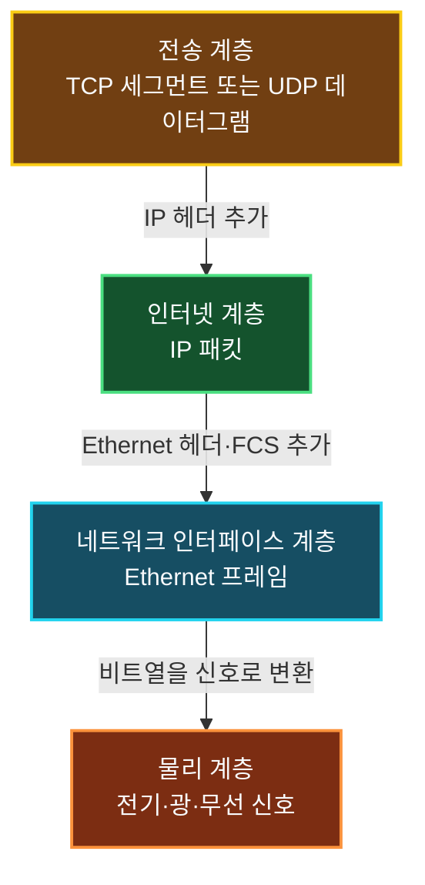

IP(Internet Protocol)는 서로 다른 네트워크 사이에서 패킷을 전달하는 인터넷 계층의 핵심 프로토콜이다. 출발지와 목적지 IP 주소를 패킷 헤더에 기록하고, 각 라우터가 목적지 주소를 바탕으로 다음 홉을 선택할 수 있게 한다.

IP는 가능한 경로로 패킷을 전달하지만 도착 여부나 순서를 보장하지 않는다. 통신 전에 연결을 설정하지도 않는다. 이러한 특성을 각각 **최선형 전달(Best Effort)**과 **비연결성(Connectionless)**이라고 한다.

## 최선형 전달은 무엇을 보장하지 않을까

IP는 패킷을 목적지로 보내기 위해 최선을 다하지만 다음 결과를 자체적으로 보장하지 않는다.

- 패킷이 목적지에 반드시 도착하는가
- 같은 패킷이 중복되지 않는가
- 보낸 순서대로 도착하는가
- 일정한 지연 시간 안에 도착하는가
- 손실된 패킷이 자동으로 재전송되는가

라우터의 큐가 가득 차거나 링크에 장애가 발생하면 패킷이 폐기될 수 있다. 여러 패킷이 서로 다른 경로를 지나면 도착 순서가 바뀔 수도 있다. IP는 이러한 상황을 복구하기 위한 확인 응답과 재전송 절차를 기본으로 제공하지 않는다.

그렇다고 IP가 무작위로 동작하거나 쓸 수 없는 프로토콜이라는 뜻은 아니다. 단순한 전달 기능에 집중한 덕분에 서로 다른 종류의 네트워크를 확장성 있게 연결할 수 있다. 신뢰성이 필요한 애플리케이션은 TCP 같은 전송 계층 프로토콜이나 애플리케이션 자체의 확인·재시도 기능으로 보완한다.

> `Best Effort`는 대충 보낸다는 뜻이 아니라, 패킷 전달을 시도하되 성공과 품질을 계약처럼 보장하지 않는다는 의미다.
{: .prompt-info }

## 비연결형은 연결 설정이 없다는 뜻이다

IP는 패킷을 보내기 전에 상대와 연결을 맺는 핸드셰이크를 수행하지 않는다. 각 패킷은 출발지와 목적지 주소를 포함하고 있으며 라우터는 패킷마다 독립적으로 전달 방향을 판단한다.

이 특성은 연결을 설정하고 상태를 유지하는 TCP와 대비된다. 다만 TCP 연결도 결국 IP 패킷을 이용해 데이터를 운반한다. 즉, TCP의 연결 지향성과 IP의 비연결성은 서로 모순되는 것이 아니라 서로 다른 계층에서 담당하는 기능이다.

| 구분 | IP | TCP |
| :--- | :--- | :--- |
| 계층 | 인터넷 계층 | 전송 계층 |
| 연결 설정 | 없음 | 연결 수립 과정 사용 |
| 전달 보장 | 제공하지 않음 | 확인 응답과 재전송으로 신뢰성 제공 |
| 순서 보장 | 제공하지 않음 | 바이트 스트림 순서 복원 |
| 주된 역할 | 네트워크 간 패킷 전달 | 프로세스 사이의 신뢰성 있는 전송 |

UDP도 IP처럼 전달 성공과 순서를 보장하지 않지만 전송 계층에서 포트 번호와 데이터그램 단위를 제공한다. `신뢰성 없음`이라는 공통점만으로 IP와 UDP를 같은 계층의 프로토콜로 보면 안 된다.

## IP 주소는 인터페이스의 논리 주소다

IP 헤더에는 출발지와 목적지의 IP 주소가 들어간다. 라우터는 목적지 IP 주소가 어느 네트워크 프리픽스에 포함되는지 확인해 패킷의 다음 경로를 결정한다.

IP 주소를 장치 전체에 영구적으로 붙는 번호로 보기보다 **네트워크 인터페이스에 설정되는 논리 주소**로 이해하는 편이 정확하다. 하나의 장치가 Ethernet과 Wi-Fi를 동시에 사용하거나 여러 네트워크에 연결되면 인터페이스마다 다른 IP 주소를 가질 수 있다.

또한 IP 프로토콜 자체가 장치에 주소를 자동으로 할당하는 것은 아니다.

- 관리자가 주소를 직접 설정할 수 있다.
- IPv4에서는 DHCP로 주소와 네트워크 설정을 받을 수 있다.
- IPv6에서는 SLAAC나 DHCPv6 등을 사용할 수 있다.

IP는 주소 형식과 패킷 전달 방식을 정의하고, 실제 주소 설정은 별도의 구성 방식과 프로토콜이 담당한다.

## 세그먼트가 IP 패킷이 되는 과정

인터넷 계층은 전송 계층에서 받은 데이터를 페이로드로 넣고 IP 헤더를 붙여 패킷을 만든다. 완성된 패킷은 다시 현재 링크의 프레임 안에 들어간다.

수신 측은 반대 순서로 프레임의 헤더와 트레일러를 검사·제거하고 IP 패킷을 꺼낸다. IP 헤더를 처리한 뒤 Protocol 또는 Next Header 정보를 확인해 페이로드를 TCP, UDP, ICMP 같은 다음 처리 대상으로 전달한다.

IP 패킷의 페이로드가 반드시 TCP 세그먼트인 것은 아니다. UDP 데이터그램이나 ICMP 메시지 등도 들어갈 수 있다.

### IP가 모든 데이터를 직접 나누는 것은 아니다

IP가 데이터를 패킷으로 나눈다고 간단히 표현하기도 하지만, 애플리케이션 데이터의 전송 단위를 조절하는 작업과 IP 단편화는 구분해야 한다. 일반적으로 TCP 같은 전송 계층과 운영체제의 네트워크 스택이 경로 MTU를 고려해 적절한 크기의 IP 패킷을 만든다.

IPv4에서는 조건에 따라 라우터가 패킷을 단편화할 수 있지만 성능과 복구 비용 때문에 가능하면 피한다. IPv6에서는 중간 라우터가 단편화하지 않으며 필요한 경우 송신지가 단편화 확장 헤더를 사용한다.

따라서 IP의 핵심 역할을 `데이터를 무조건 잘게 나누는 것`보다 **IP 헤더로 캡슐화한 패킷을 주소에 따라 네트워크 사이로 전달하는 것**으로 이해해야 한다.

## IP 헤더가 전달하는 주요 정보

IPv4와 IPv6 헤더의 세부 형식은 다르지만 다음과 같은 정보가 패킷 전달에 중요하다.

| 정보 | 역할 |
| :--- | :--- |
| 버전 | IPv4 또는 IPv6 구분 |
| 출발지·목적지 주소 | 송신 인터페이스와 최종 목적지 식별 |
| 길이 | 패킷 또는 페이로드 크기 표현 |
| TTL·Hop Limit | 패킷이 통과할 수 있는 홉 수 제한 |
| Protocol·Next Header | TCP, UDP, ICMP 등 상위 처리 대상 식별 |
| 단편화 정보 | 필요한 경우 단편의 식별과 재조립 지원 |

IP 헤더에는 TCP처럼 패킷의 전체 전달 순서를 복원하는 순서 번호가 없다. IPv4의 Identification과 Fragment Offset은 단편화된 하나의 패킷을 재조립하기 위한 값이지 여러 IP 패킷의 도착 순서를 보장하는 값이 아니다.

## IPv4와 IPv6

현재 인터넷에서는 IPv4와 IPv6를 함께 사용한다.

| 구분 | IPv4 | IPv6 |
| :--- | :--- | :--- |
| 주소 크기 | 32비트 | 128비트 |
| 표기 예 | `192.0.2.10` | `2001:db8::10` |
| 주소 공간 | 약 43억 개 | `2^128`개 |
| 기본 헤더 | 가변 길이 | 40바이트 고정 기본 헤더 |
| 헤더 체크섬 | 있음 | 없음 |
| 브로드캐스트 | 사용 | 사용하지 않고 멀티캐스트 활용 |
| 라우터 단편화 | 가능 | 불가능 |

IPv6는 IPv4 주소 부족 문제를 해결할 수 있는 거대한 주소 공간을 제공하고 헤더 처리 방식도 단순화했다. 하지만 IPv4 주소가 IPv6 주소로 한 번에 변환되는 것은 아니다. 실제 전환 과정에서는 두 프로토콜을 함께 사용하는 듀얼 스택, 터널링과 주소·프로토콜 변환 기술을 사용한다.

> IPv4와 IPv6는 주소 길이만 다른 같은 패킷 형식이 아니다. 헤더 구조와 주소 설정, 브로드캐스트 및 단편화 방식에도 차이가 있다.
{: .prompt-warning }

## 정리

- IP는 서로 다른 네트워크 사이에서 패킷을 전달하는 인터넷 계층 프로토콜이다.
- IP는 전달 성공, 중복 방지, 순서와 재전송을 보장하지 않는 최선형 프로토콜이다.
- IP는 통신 전에 연결을 설정하지 않고 각 패킷을 독립적으로 처리한다.
- IP 주소는 네트워크 인터페이스의 논리 주소이며 실제 할당은 DHCP, SLAAC나 수동 설정으로 이루어진다.
- 전송 계층 데이터에 IP 헤더를 붙이면 IP 패킷이 되고, 패킷은 다시 링크 계층 프레임에 들어간다.
- IP 패킷의 페이로드에는 TCP 세그먼트뿐 아니라 UDP 데이터그램과 ICMP 메시지도 들어갈 수 있다.
- IP의 핵심은 데이터를 무조건 분할하는 것이 아니라 주소에 따라 패킷을 네트워크 사이로 전달하는 것이다.
- IPv4는 32비트, IPv6는 128비트 주소를 사용하며 헤더와 브로드캐스트·단편화 방식도 다르다.

IP의 비연결성과 최선형 전달을 이해하면 패킷 손실과 순서 변경을 왜 전송 계층에서 보완해야 하는지, 라우터가 왜 각 패킷을 독립적으로 처리할 수 있는지 연결해서 볼 수 있다.
