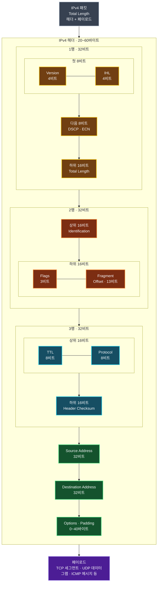

Ethernet 프레임의 헤더가 같은 링크 안에서 프레임을 전달하는 정보를 담는다면, IPv4 헤더는 패킷을 서로 다른 네트워크의 목적지까지 전달하는 정보를 담는다. 라우터는 목적지 IP 주소와 TTL 같은 필드를 읽고 패킷의 다음 경로와 처리 방법을 결정한다.

IPv4 헤더에는 주소뿐 아니라 패킷 길이, 상위 프로토콜, 단편화와 오류 검출에 필요한 정보도 들어 있다. 필드 이름을 외우는 것보다 **각 필드가 전달 과정의 어떤 문제를 해결하는지** 연결해서 이해하는 것이 중요하다.

## IPv4 패킷 전체 구조

IPv4 패킷은 가변 길이 헤더와 그 뒤에 이어지는 페이로드로 구성된다. 아래 그림에서 첫 세 행은 각각 `32비트`이며, 좁은 화면에서도 읽을 수 있도록 각 행을 상위·하위 16비트로 나누어 배치했다. 필드는 위에서 아래로, 같은 줄에서는 왼쪽에서 오른쪽으로 읽는다.



위에서 아래로 헤더 필드가 배치되고, 헤더가 끝난 지점부터 실제로 운반할 페이로드가 이어진다. `Options·Padding`은 선택 영역이므로 사용하지 않으면 기본 헤더는 처음 다섯 행, 즉 `20바이트`로 끝난다.

## IPv4 패킷의 크기

IPv4 패킷은 헤더와 페이로드로 구성된다.

```text
IPv4 패킷 = IPv4 헤더 + 페이로드
```

기본 헤더는 `20바이트`이며 옵션이 있으면 최대 `60바이트`까지 늘어난다. Total Length 필드가 16비트이므로 IPv4 패킷 전체의 이론상 최대 크기는 `65,535바이트`다.

| 구성 | 최소 크기 | 최대 크기 |
| :--- | ---: | ---: |
| IPv4 헤더 | 20바이트 | 60바이트 |
| IPv4 패킷 전체 | 20바이트 | 65,535바이트 |
| 페이로드 | 0바이트 | 헤더 크기에 따라 달라짐 |

헤더가 20바이트라면 페이로드는 최대 `65,515바이트`지만, 옵션 때문에 헤더가 커지면 그만큼 페이로드의 최댓값은 작아진다. 따라서 최대 패킷 크기를 `65,575바이트`로 더해서 계산하면 안 된다. Total Length는 이미 헤더와 페이로드를 모두 포함한 값이다.

실제 Ethernet에서는 MTU가 일반적으로 `1,500바이트`이므로 이론상 최대 크기의 IPv4 패킷을 한 프레임에 그대로 담을 수 없다. 송신 측은 보통 경로 MTU에 맞는 크기로 패킷을 만들며, 필요한 경우 IPv4 단편화가 일어날 수 있다.

## 헤더 필드 한눈에 보기

IPv4 기본 헤더는 다음 필드로 이루어진다.

| 필드 | 크기 | 핵심 역할 |
| :--- | ---: | :--- |
| Version | 4비트 | IP 버전 표시, IPv4는 값 `4` |
| IHL | 4비트 | IPv4 헤더 길이 |
| DSCP·ECN | 8비트 | 서비스 구분과 혼잡 알림 |
| Total Length | 16비트 | 헤더와 페이로드를 합한 전체 길이 |
| Identification | 16비트 | 같은 원본 데이터그램의 단편 식별 |
| Flags | 3비트 | 단편화 허용 여부와 후속 단편 존재 여부 |
| Fragment Offset | 13비트 | 원본 페이로드에서 단편이 시작하는 위치 |
| TTL | 8비트 | 패킷이 순환할 수 있는 홉 수 제한 |
| Protocol | 8비트 | 페이로드를 처리할 다음 프로토콜 식별 |
| Header Checksum | 16비트 | IPv4 헤더의 오류 검출 |
| Source Address | 32비트 | 출발지 IPv4 주소 |
| Destination Address | 32비트 | 목적지 IPv4 주소 |
| Options·Padding | 0~40바이트 | 선택 기능과 32비트 경계 정렬 |

이 표의 순서는 헤더에 배치되는 순서다. 각 필드는 역할에 따라 몇 개의 묶음으로 이해할 수 있다.

## 버전과 길이를 나타내는 필드

### Version

Version은 IP 헤더 형식을 구분하는 4비트 필드다. IPv4 헤더에서는 값이 `4`, 이진수로는 `0100`이다. IPv6 패킷의 별도 헤더에서는 값 `6`을 사용한다.

### IHL

IHL(Internet Header Length)은 IPv4 헤더의 길이를 **32비트 워드 단위**로 나타낸다. 옵션이 없는 기본 헤더는 20바이트이므로 다음과 같이 값 `5`가 들어간다.

```text
5 × 4바이트 = 20바이트
```

IHL의 최댓값은 `15`이므로 최대 헤더 크기는 `15 × 4 = 60바이트`다. IPv6 기본 헤더는 항상 40바이트로 고정되어 있어 IHL 필드가 없다.

### Total Length

Total Length는 IPv4 헤더와 페이로드를 합친 패킷 전체 크기를 바이트 단위로 나타낸다. IHL은 헤더만, Total Length는 패킷 전체를 나타낸다는 차이를 기억해야 한다.

## DSCP와 ECN

과거에 Type of Service라고 부르던 8비트 영역은 현재 DSCP 6비트와 ECN 2비트로 사용한다.

- **DSCP(Differentiated Services Code Point)**: 트래픽을 분류하고 네트워크 장비가 서로 다른 전달 정책을 적용할 수 있게 한다.
- **ECN(Explicit Congestion Notification)**: 패킷을 즉시 버리지 않고도 네트워크 혼잡을 종단 장치에 알릴 수 있게 한다.

음성 통화처럼 지연과 지터에 민감한 트래픽에는 높은 우선순위의 전달 정책을 적용할 수 있다. 다만 DSCP 값을 설정했다고 항상 우선 처리되는 것은 아니다. 경로상의 라우터와 스위치에 해당 값을 신뢰하고 처리할 QoS 정책이 구성되어 있어야 한다.

## 단편화를 위한 세 필드

IPv4 패킷이 다음 링크의 MTU보다 크면 조건에 따라 여러 단편으로 나뉠 수 있다. 이때 Identification, Flags, Fragment Offset이 함께 사용된다.

### Identification

Identification은 수신 측이 여러 단편이 어느 원본 데이터그램에서 나온 것인지 구분하는 값이다. 같은 데이터그램에서 나뉜 단편은 같은 Identification 값을 가진다.

이 값은 일반적인 패킷 전체의 순서 번호가 아니다. TCP처럼 여러 패킷의 전달 순서를 복원하거나 패킷마다 반드시 전역적으로 유일한 값을 제공하지도 않는다. 핵심 용도는 **단편 재조립**이다.

### Flags

Flags는 세 비트로 구성된다.

| 비트 | 이름 | 의미 |
| :--- | :--- | :--- |
| 첫 번째 | Reserved | 예약 비트이며 `0`으로 설정 |
| 두 번째 | DF(Don't Fragment) | `1`이면 단편화 금지 |
| 세 번째 | MF(More Fragments) | `1`이면 뒤에 단편이 더 있음 |

`MF=0`은 마지막 단편을 뜻할 수도 있고, 애초에 단편화되지 않은 패킷을 뜻할 수도 있다. 따라서 MF만 보고 단편화 여부를 단정하지 않고 Fragment Offset 등과 함께 확인해야 한다.

DF가 설정된 패킷이 다음 링크의 MTU보다 크면 라우터는 패킷을 단편화하지 않고 폐기한다. 일반적인 IPv4 환경에서는 송신 측에 ICMP `Fragmentation Needed` 메시지를 보내 경로 MTU를 조정할 단서를 제공한다.

### Fragment Offset

Fragment Offset은 해당 단편의 페이로드가 원본 페이로드의 어느 위치에서 시작하는지 나타낸다. 값의 단위는 바이트가 아니라 **8바이트 블록**이다. 첫 단편은 시작 위치가 처음이므로 오프셋이 `0`이다.

20바이트 헤더와 MTU 1,500바이트를 가정하고 4,000바이트의 원본 페이로드를 단편화하면 다음처럼 표현할 수 있다.

| 단편 | 데이터 크기 | Fragment Offset | MF | 전체 길이 |
| :--- | ---: | ---: | :---: | ---: |
| 1 | 1,480바이트 | `0` | `1` | 1,500바이트 |
| 2 | 1,480바이트 | `185` | `1` | 1,500바이트 |
| 3 | 1,040바이트 | `370` | `0` | 1,060바이트 |

두 번째 단편은 원본 페이로드의 1,480번째 바이트부터 시작하므로 오프셋은 `1,480 ÷ 8 = 185`다. 세 번째 단편도 같은 방식으로 `2,960 ÷ 8 = 370`이 된다. 세 단편의 Identification은 모두 같고, 마지막 단편만 `MF=0`이다.

> 단편 하나라도 손실되면 원본 데이터그램 전체를 재조립할 수 없다. 그래서 현대 네트워크에서는 경로 MTU 탐색 등을 이용해 중간 라우터의 단편화를 가급적 피한다.
{: .prompt-warning }

## TTL로 라우팅 루프 막기

TTL(Time To Live)은 패킷이 네트워크에서 무한히 순환하지 않도록 수명을 제한하는 8비트 필드다. 라우터는 패킷을 전달할 때 TTL을 최소 1 감소시키며, 전달 과정에서 값이 0이 되면 패킷을 폐기한다.

라우터는 일반적으로 출발지에 ICMP Time Exceeded 메시지를 보낸다. `tracert`나 `traceroute`는 TTL 값을 단계적으로 늘려 이 동작을 경로 탐색에 활용한다.

```powershell
tracert example.com
```

운영체제마다 초기 TTL의 흔한 기본값은 있지만 설정과 구현에 따라 달라질 수 있다. 관측한 TTL 하나만으로 상대 운영체제를 확정해서는 안 된다.

> IPv6에서 TTL에 대응하는 필드는 `Hop Limit`이다. `Next Hop`은 라우팅 과정에서 다음으로 전달할 라우터나 인터페이스를 가리키는 개념이지 IPv6 헤더 필드명이 아니다.
{: .prompt-info }

## Protocol 필드와 역다중화

Protocol 필드는 IPv4 페이로드를 어떤 프로토콜 처리기로 넘길지 지정한다. 수신 호스트는 이 값을 보고 IP 헤더를 제거한 데이터를 TCP, UDP, ICMP 등에 전달한다. 이를 **역다중화(Demultiplexing)**라고 한다.

| 번호 | 프로토콜 |
| ---: | :--- |
| `1` | ICMP |
| `2` | IGMP |
| `6` | TCP |
| `17` | UDP |
| `89` | OSPF |

이 번호는 TCP와 UDP의 포트 번호와 다르다. Protocol은 IP 위에서 처리할 **프로토콜**을 고르고, 포트 번호는 TCP나 UDP가 데이터를 전달할 **프로세스**를 구분한다.

IPv6에서는 같은 목적의 필드를 Next Header라고 부르며, 전송 계층 프로토콜뿐 아니라 이어지는 IPv6 확장 헤더를 나타낼 수도 있다.

## 헤더 체크섬

Header Checksum은 IPv4 **헤더만** 대상으로 오류를 검출한다. 페이로드까지 보호하는 값은 아니다. 라우터를 지날 때 TTL이 바뀌므로 라우터는 체크섬도 다시 계산해야 한다.

IPv6 기본 헤더에는 헤더 체크섬이 없다. 링크 계층의 FCS와 TCP·UDP 등의 체크섬이 이미 오류 검출을 수행하며, 라우터의 처리 부담을 줄이기 위해 IPv6에서는 제거되었다.

체크섬이 일치하지 않으면 손상을 검출할 수 있지만, 체크섬 자체가 손상된 데이터를 복구하거나 재전송을 요청하는 것은 아니다. IPv4는 해당 패킷을 폐기하고 신뢰성 복구가 필요하면 전송 계층이나 애플리케이션이 담당한다.

## 출발지와 목적지 주소

Source Address와 Destination Address는 각각 32비트 IPv4 주소다. 라우터는 주로 목적지 주소와 라우팅 테이블을 비교해 다음 홉을 결정한다.

Ethernet 헤더와 IP 헤더에는 모두 출발지와 목적지 주소가 있지만 적용 범위가 다르다.

| 구분 | MAC 주소 | IPv4 주소 |
| :--- | :--- | :--- |
| 포함 위치 | Ethernet 헤더 | IPv4 헤더 |
| 주된 범위 | 현재 링크 | 서로 다른 네트워크를 포함한 종단 간 전달 |
| 라우터 통과 시 | 링크마다 변경 | 일반적으로 유지 |

라우터는 다음 링크로 패킷을 보낼 때 기존 프레임을 제거하고 새 MAC 주소로 프레임을 만든다. 반면 출발지와 목적지 IP 주소는 일반적으로 유지된다. NAT가 동작하는 경계에서는 IP 주소나 전송 계층 포트가 변경될 수 있다.

## Options와 Padding

Options는 기본 헤더에 없는 추가 기능을 넣는 가변 길이 영역이다. 옵션이 존재하면 IHL 값이 커지고, 헤더가 32비트 경계에 맞도록 Padding을 추가한다.

IPv4 옵션은 라우터 처리 비용을 늘릴 수 있어 일반적인 패킷에서는 거의 사용하지 않는다. IPv6는 선택 기능을 기본 헤더에 계속 덧붙이는 대신 별도의 확장 헤더로 분리했다.

## Wireshark에서 확인하기

Wireshark의 표시 필터에 다음 값을 입력하면 IPv4 패킷만 확인할 수 있다.

```text
ip
```

패킷의 `Internet Protocol Version 4` 항목을 펼치면 다음 필드를 직접 비교할 수 있다.

- `Version`, `Header Length`, `Total Length`
- `Differentiated Services Field`
- `Identification`, `Flags`, `Fragment Offset`
- `Time to Live`, `Protocol`, `Header Checksum`
- `Source Address`, `Destination Address`

단편화된 패킷을 찾을 때는 다음 필터를 사용할 수 있다.

```text
ip.flags.mf == 1 or ip.frag_offset > 0
```

## 정리

- IPv4 헤더는 기본 20바이트이고 옵션을 포함하면 최대 60바이트다.
- Total Length는 헤더와 페이로드를 포함하며 최댓값은 65,535바이트다.
- IHL은 32비트 워드 단위로 IPv4 헤더 길이를 나타낸다.
- DSCP와 ECN은 트래픽 처리 정책과 혼잡 알림에 사용된다.
- Identification, Flags, Fragment Offset은 IPv4 단편화와 재조립에 사용된다.
- Fragment Offset은 8바이트 단위이며 MF가 0인 패킷이 항상 단편인 것은 아니다.
- TTL은 라우팅 루프를 막으며 IPv6에서는 Hop Limit이 같은 역할을 한다.
- Protocol 필드는 TCP, UDP, ICMP 같은 다음 처리 대상을 식별한다.
- Header Checksum은 IPv4 헤더만 검사하며 라우터가 TTL을 변경할 때 다시 계산한다.
- MAC 주소는 링크별 전달에, IP 주소는 네트워크 간 전달에 사용된다.

IPv4 헤더를 읽을 수 있으면 패킷이 왜 폐기되었는지, 단편이 어떻게 재조립되는지, 수신 데이터가 어떤 상위 프로토콜로 전달되는지 패킷 캡처에서 직접 추적할 수 있다.
