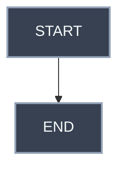

# Blog Guide

이 문서는 다음 작업 세션에서 블로그 구조를 빠르게 파악하고, 글 수정/작성/편집을 이어가기 위한 간단한 안내서다.

## 1. 프로젝트 개요

이 저장소는 Jekyll 기반의 GitHub Pages 블로그이며, Chirpy 테마 구조를 사용한다.

실제 Git 저장소 루트는 다음 경로다.

```text
C:\Dev\01_Project\Tech-Blog\kang-hyesung.github.io
```


## 2. 주요 경로

```text
_config.yml
```

블로그 전체 설정 파일이다. 사이트 제목, 언어, URL, 테마 옵션, 플러그인 설정 등을 관리한다.

```text
_posts/
```

블로그 글이 들어가는 핵심 폴더다. Java, Project, Cert 등 주제별 하위 폴더로 나뉘어 있다.

```text
assets/img/
```

게시글에서 사용하는 이미지가 들어가는 폴더다. GitHub Pages에서 이미지가 깨질 때는 게시글 기준 상대 경로와 실제 파일 위치를 함께 확인해야 한다.

```text
_sass/
```

블로그 스타일을 제어하는 SCSS 파일들이 있다. 본문 폭, 패널, 사이드바, 다크모드 색상 등을 수정할 때 확인한다.

```text
_layouts/
```

페이지 레이아웃 템플릿이 있다. Chirpy 기본 구조에서는 `default.html`, `post.html`, `page.html` 등이 중요하다.

```text
docs/
```

블로그 운영이나 작업 참고용 문서를 두는 위치다. 이 문서도 여기에 둔다.

## 3. 글 작성과 수정

게시글은 `_posts/` 아래에 Markdown 파일로 작성한다. 파일명은 보통 다음 형식을 따른다.

```text
YYYY-MM-DD-title.md
```

Java처럼 강의/시리즈 순서가 있는 글은 카테고리 폴더와 파일명에 2자리 순서 번호를 유지한다.

```text
_posts/java/01-basic-syntax/
_posts/java/02-array-structure/
_posts/java/03-memory-management/

2025-11-11-01-Java-에서-char-자료형-크기가-2바이트인-이유.md
2025-11-12-02-Java-인코딩-규칙.md
```

새 글을 추가할 때는 같은 카테고리 안의 기존 번호 흐름을 확인하고 다음 번호를 사용한다. 이미 번호가 붙은 기존 글의 번호는 요청 없이 바꾸지 않는다.

게시글 상단에는 front matter가 필요하다.

```yaml
---
title: 글 제목
date: 2026-05-21 20:00 +0900
author: hyesung
mermaid: true
categories: JAVA 13-스레드_제어_및_기초적_동기화
---
```

Mermaid 다이어그램을 사용하는 글은 front matter에 `mermaid: true`를 넣는다.

Chirpy의 카테고리는 front matter의 `categories` 값을 공백 기준으로 나누어 depth를 만든다.

```yaml
categories: JAVA 13-스레드_제어_및_기초적_동기화
```

위 예시는 블로그에서 다음과 같은 계층으로 잡힌다.

```text
JAVA
└── 13-스레드_제어_및_기초적_동기화
```

따라서 카테고리 이름 안에서 depth를 나누고 싶지 않은 부분은 공백 대신 `_` 또는 `-`를 사용한다.

태그는 front matter의 `tags` 값으로 관리한다. 태그는 개별 글의 세부 색인어가 아니라 여러 글을 묶는 공통 주제로 사용한다.

```yaml
tags:
  - 메모리
  - JVM
  - 기본 문법
```

태그 작성 기준은 다음과 같다.

- 한국어 글에서는 한국어 태그를 우선 사용한다.
- `JVM`, `GC`처럼 약어 자체가 더 자연스러운 기술명은 그대로 사용한다.
- `기본 문법`, `내부 클래스`, `타입 변환`, `클래스 로딩`처럼 띄어쓰기가 자연스러운 태그는 공백을 사용한다.
- 한 글에만 쓰일 지나치게 세부적인 태그보다 여러 글을 묶을 수 있는 태그를 우선한다.

글을 블로그에 보이지 않게 하려면 front matter에 다음 값을 추가한다.

```yaml
published: false
```

## 4. Mermaid 작성 주의점

이 블로그는 다크모드를 사용하므로 Mermaid 색상은 어두운 배경에서도 읽히게 지정하는 편이 좋다.

예시:



주의할 점:

- `classDef` 스타일 속성은 쉼표로 구분한다.
- `stroke-width:2px;color:#f8fafc`처럼 세미콜론으로 연결하면 `color:#f8fafc`가 노드처럼 렌더링될 수 있다.
- 화살표 라벨에 `1. 설명` 형태를 쓰면 Mermaid가 Markdown 목록으로 오해해 `Unsupported markdown: list`를 표시할 수 있다.
- 순서 표기는 `1: 설명`처럼 쓰는 편이 안전하다.
- `end`는 Mermaid에서 예약어처럼 쓰일 수 있으므로 class 이름으로 쓰지 않는 편이 좋다. 예를 들어 `terminal` 같은 이름을 사용한다.

## 5. 이미지 경로 주의점

게시글에서 이미지를 넣을 때는 실제 GitHub Pages 빌드 기준 경로를 고려해야 한다.

예시:

```md

```

이미지가 깨지면 다음을 확인한다.

- 이미지 파일이 실제로 `assets/img/` 아래에 있는지
- 게시글에서 지정한 경로와 파일명이 정확히 일치하는지
- 한글 파일명, 공백, 특수문자가 URL 인코딩 문제를 만들지 않는지
- 로컬에서는 보이지만 GitHub Pages에서 깨지는 경우 대소문자 차이가 없는지

## 6. 자주 하는 작업

특정 문구 검색:

```powershell
rg "검색어" _posts
```

Mermaid 블록 검색:

```powershell
rg -n "```mermaid|classDef|style " _posts
```

특정 카테고리 글 확인:

```powershell
rg -n "categories:" _posts/java
```

숨김 처리된 글 확인:

```powershell
rg -n "published: false" _posts
```

변경 파일 확인:

```powershell
git status -sb
```

변경 요약 확인:

```powershell
git diff --stat
```

Markdown/공백 오류 확인:

```powershell
git diff --check
```

## 7. 로컬 검증

현재 사용자는 Docker Desktop으로 블로그 로컬 서버를 띄우고, 브라우저에서 다음 주소로 확인한다.

```text
http://127.0.0.1:4000
```

로컬 빌드와 화면 확인은 사용자가 직접 Docker Desktop 환경에서 수행한다. 따라서 Codex는 별도 요청이 없는 한 `bundle exec jekyll build` 같은 로컬 빌드 검증을 실행하지 않아도 된다.

## 8. Git 작업 흐름

작업 전에는 항상 상태를 먼저 확인한다.

```powershell
git status -sb
```

커밋 전에는 변경 범위를 확인한다.

```powershell
git diff --stat
git diff --check
```

커밋 예시:

```powershell
git add -- path/to/file.md
git commit -m "docs: update blog post"
```

푸쉬:

```powershell
git push origin main
```

작업 중 이미 수정되어 있는 파일은 사용자가 변경했을 가능성이 있으므로, 요청 없이 되돌리지 않는다.

## 9. 다음 세션에서 Codex에게 알려주면 좋은 내용

새 세션에서 바로 이어서 작업하려면 아래처럼 알려주면 된다.

```text
이 저장소는 Jekyll/Chirpy 기반 GitHub Pages 블로그입니다.
repo root는 C:\Dev\01_Project\Tech-Blog\kang-hyesung.github.io 입니다.
먼저 docs/BLOG_GUIDE.md를 읽고 블로그 구조와 작업 규칙을 파악해주세요.
글은 _posts 아래에 있고, categories는 공백 기준으로 depth가 나뉩니다.
Mermaid는 front matter에 mermaid: true를 사용합니다.
사용자는 Docker Desktop으로 로컬 서버를 띄우고 http://127.0.0.1:4000 에서 확인합니다.
로컬 빌드 검증은 사용자가 직접 하므로 별도 요청이 없으면 실행하지 않아도 됩니다.
작업 전 git status -sb로 기존 변경분을 확인하고, 사용자 변경분은 되돌리지 말아주세요.
검증은 최소 git diff --check를 실행해주세요.
```
